# Weather AI Training Pipeline Flowchart

## Overview

This document describes the end-to-end training pipeline for the Singapore Weather AI model.

## Pipeline Flowchart

```mermaid
flowchart TB
    subgraph Phase1["📦 1. Data Source Identification"]
        direction TB
        S1[Start] --> DS1["🛰️ JAXA Satellite Data<br/>Himawari-8/9 NetCDF Files"]
        DS1 --> DS2["🌡️ NEA Government API<br/>Temperature/Humidity/PM2.5"]
        DS2 --> DS3["🌧️ NEA Rainfall Data<br/>5-min Real-time Readings"]
        DS3 --> DS4["📍 Weather Station Metadata<br/>Lat/Lon Coordinates"]
    end

    subgraph Phase2["🧹 2. Data Cleansing & Alignment"]
        direction TB
        C1["Identify Data Time Range"] --> C2["Check Data Completeness<br/>Missing Value Statistics"]
        C2 --> C3{"Timestamp Alignment<br/>Strategy"}
        C3 -->|"Satellite: 10-min intervals"| C4["Resample to Unified<br/>Frequency"]
        C3 -->|"NEA: 1-min intervals"| C4
        C4 --> C5["Geospatial Matching<br/>Nearest Station Mapping"]
        C5 --> C6["Outlier Handling<br/>Reasonable Range Filtering"]
        C6 --> C7["Generate Training Dataset<br/>rolling_window_data.csv"]
    end

    subgraph Phase3["🧠 3. Model Training"]
        direction TB
        T1["Load Preprocessed Data"] --> T2["Feature Engineering<br/>Satellite + Sensor Fusion"]
        T2 --> T3["Data Split<br/>Train/Val/Test"]
        T3 --> T4["WeatherFusionModel<br/>PyTorch Neural Network"]
        T4 --> T5["Training Loop<br/>100 Epochs per Batch"]
        T5 --> T6{"Early Stopping Check<br/>Validation Loss"}
        T6 -->|"No improvement x10"| T7["Save Best Model<br/>weather_fusion_model.pth"]
        T6 -->|"Continue"| T5
        T7 --> T8["Upload to S3<br/>Sync to API Server"]
    end

    subgraph Phase4["🔮 4. Real-time Prediction"]
        direction TB
        P1["User Inputs Location"] --> P2["Find 3 Nearest Stations<br/>IDW Interpolation Weights"]
        P2 --> P3["Fetch Historical Data Window<br/>Past N Timesteps"]
        P3 --> P4["Model Inference<br/>10-min Rainfall Prediction"]
        P4 --> P5["Return Forecast Result<br/>Rainfall + Weather Description"]
    end

    subgraph Phase5["📊 5. Accuracy Assessment"]
        direction TB
        A1["Collect Previous Day<br/>Predictions"] --> A2["Fetch Actual Observations<br/>NEA Real Rainfall"]
        A2 --> A3["Calculate Metrics"]
        A3 --> A4["MAE: Mean Absolute Error"]
        A3 --> A5["RMSE: Root Mean Square Error"]
        A3 --> A6["Classification Accuracy<br/>Rain vs No Rain"]
        A4 & A5 & A6 --> A7["Generate Evaluation Report<br/>Training History Record"]
    end

    subgraph Phase6["💡 6. Model Improvement Suggestions"]
        direction TB
        I1{"Analyze Error Patterns"} --> I2["Temporal Dimension<br/>High errors at specific times?"]
        I1 --> I3["Spatial Dimension<br/>High errors in specific areas?"]
        I1 --> I4["Weather Type<br/>Poor heavy rain prediction?"]
        I2 & I3 & I4 --> I5["Improvement Strategies"]
        I5 --> I6["Increase Training Data"]
        I5 --> I7["Adjust Model Architecture"]
        I5 --> I8["Optimize Feature Engineering"]
        I5 --> I9["Introduce Ensemble Learning"]
    end

    Phase1 --> Phase2
    Phase2 --> Phase3
    Phase3 --> Phase4
    Phase4 --> Phase5
    Phase5 --> Phase6
    Phase6 -.->|"Iterative Optimization"| Phase2

    style Phase1 fill:#e3f2fd,stroke:#1976d2
    style Phase2 fill:#fff3e0,stroke:#f57c00
    style Phase3 fill:#e8f5e9,stroke:#388e3c
    style Phase4 fill:#fce4ec,stroke:#c2185b
    style Phase5 fill:#f3e5f5,stroke:#7b1fa2
    style Phase6 fill:#e0f7fa,stroke:#00838f
```



---

## Detailed Process Description

| Phase | Step | Description |
|-------|------|-------------|
| **1. Data Source Identification** | JAXA Satellite | Himawari-8/9 satellite NetCDF files, 10-min intervals, covering Singapore region |
| | NEA API | Government open data: temperature, humidity, PM2.5, rainfall |
| | Station Metadata | Station ID, name, latitude/longitude coordinates |
| **2. Data Cleansing** | Time Alignment | Unify different sampling frequencies to 10-minute intervals |
| | Spatial Alignment | Map satellite grid data to nearest weather station |
| | Outlier Filtering | Remove obviously erroneous data (negative rainfall, extreme temperatures, etc.) |
| **3. Model Training** | Rolling Window | One batch per day, incremental training (100 epochs/batch) |
| | Early Stopping | Stop if validation loss shows no improvement for 10 consecutive epochs |
| | Model Sync | Upload to S3 after training, API server auto-pulls latest model |
| **4. Real-time Prediction** | IDW Interpolation | Inverse Distance Weighting using 3 nearest stations |
| | Output | 10-minute rainfall forecast + weather description |
| **5. Accuracy Assessment** | MAE | Mean Absolute Error |
| | RMSE | Root Mean Square Error |
| **6. Improvement Suggestions** | See below | Optimization directions based on error analysis |

---

## Model Improvement Recommendations

| Optimization Area | Current State | Suggested Improvement |
|-------------------|---------------|----------------------|
| **Data Volume** | 3 days training data | Increase to 30-60 days to cover more weather patterns |
| **Feature Engineering** | Basic satellite + sensor features | Add temporal features (hour of day, day of week), lag features (1-3 hour trends) |
| **Model Architecture** | Simple MLP | Try LSTM/Transformer to capture temporal dependencies |
| **Spatial Modeling** | IDW interpolation | Introduce GNN (Graph Neural Network) to model inter-station spatial relationships |
| **Ensemble Learning** | Single model | Combine multiple models (RF + NN + XGBoost) with voting |
| **Loss Function** | MSE | Use weighted loss function, give higher weight to heavy rain events |
| **Validation Strategy** | Random split | Use time-series cross-validation to avoid data leakage |

---

## Data Sources

### 1. JAXA Satellite Data (Himawari-8/9)

| Property | Value |
|----------|-------|
| **Source** | ftp://ftp.ptree.jaxa.jp |
| **Format** | NetCDF (.nc) |
| **Resolution** | 10-minute intervals |
| **File Pattern** | `NC_H0[89]_YYYYMMDD_HHMM_R21_FLDK.*.nc` |
| **Coverage** | Full-disk (FLDK), cropped to Singapore region |

### 2. NEA Government API

| API Endpoint | Data Type | Update Frequency |
|--------------|-----------|------------------|
| `/environment/rainfall` | Rainfall (mm) | 5 minutes |
| `/environment/air-temperature` | Temperature (°C) | 1 minute |
| `/environment/relative-humidity` | Humidity (%) | 1 minute |
| `/environment/pm25` | PM2.5 (μg/m³) | 1 hour |

---

## Storage Architecture

```
S3: weather-ai-models-de08370c/
├── satellite/
│   └── YYYYMMDD/
│       ├── NC_H0[89]_*.nc
│       └── .complete
├── govdata/
│   └── {api}_{YYYY-MM-DD}.json
├── state/
│   └── training_state.json
├── history/
│   └── training_history.json
└── models/
    └── weather_fusion_model.pth
```

---

## Current Model Performance

| Metric | Value | Interpretation |
|--------|-------|----------------|
| **MAE** | ~0.1068 mm | Average prediction error per 10-min interval |
| **RMSE** | ~0.4778 mm | Sensitive to large errors (heavy rain events) |
| **Training Batches** | In progress | Rolling window training |
| **Epochs per Batch** | 100 | With early stopping |

---

## Version History

| Date | Version | Changes |
|------|---------|---------|
| 2026-01-29 | 1.0 | Initial documentation |
