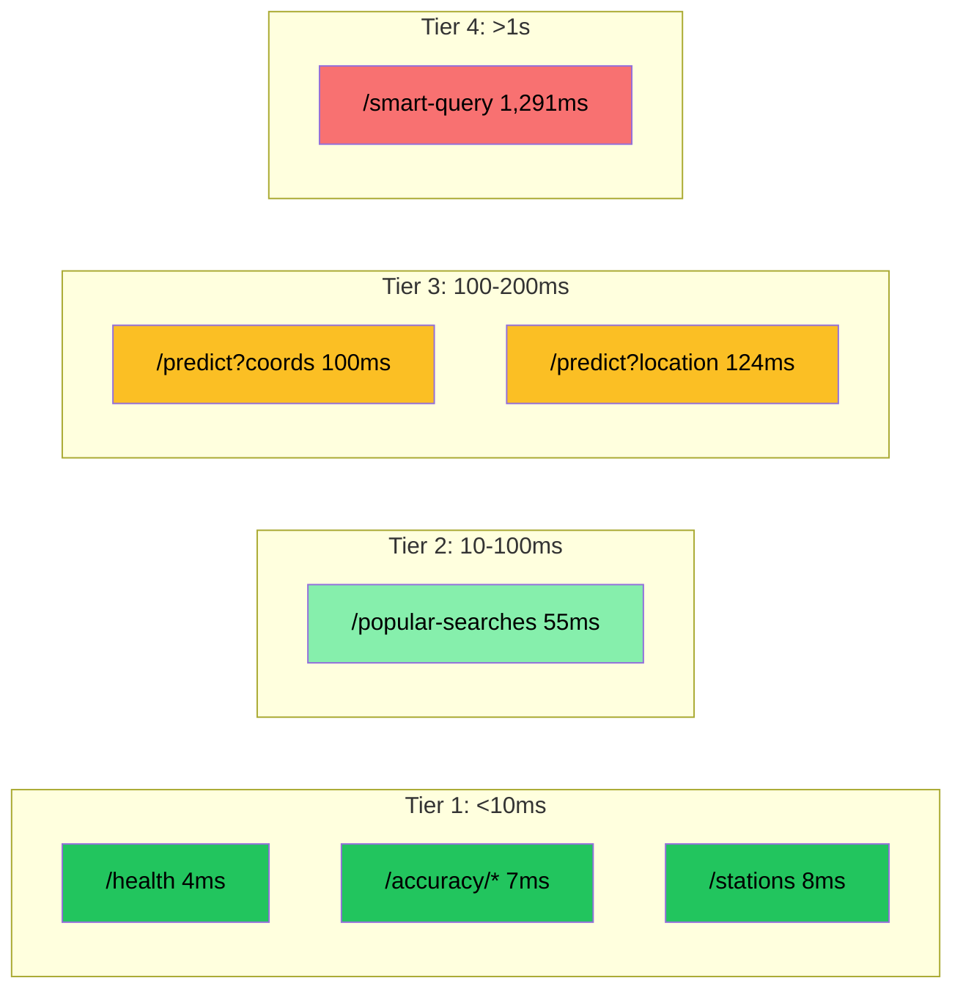

# Singapore Weather AI — Performance Test Report (v2)

**Date**: 2026-02-14  
**Duration**: 5 minutes  
**Test Data**: [perf-report-5min.json](file:///Users/jinhui/development/tools/claude-skill/docs/api-perf-test/perf-report-5min.json)

---

## System Under Test

| Component | Spec |
|-----------|------|
| **Instance** | AWS EC2 t3.micro (ap-southeast-1) |
| **CPU** | Intel Xeon Platinum 8259CL @ 2.50GHz, 1 core / 2 threads |
| **RAM** | 3.8 GB |
| **Disk** | 20 GB EBS (49% used — improved after satellite cleanup) |
| **OS** | Ubuntu 22.04.5 LTS |
| **Python** | 3.10.12 |
| **Framework** | FastAPI + Uvicorn (2 workers) |

### Architecture

```
Client (5 concurrent) → Uvicorn Master
                          ├── Worker 1 (5 threads)
                          └── Worker 2 (5 threads)
                                ├── PyTorch inference (CPU)
                                ├── SQLite (weather.db, WAL mode)
                                └── LRU Cache (geocoding + OSM)
```

---

## What's New in This Test

> [!IMPORTANT]
> This test validates the **5 new Accuracy API endpoints** added as part of the closed-loop data collection system. These endpoints were previously causing 30s+ timeouts due to an unoptimized `julianday()` JOIN across 32K × 130K rows. After restricting queries to `source='backtest'` data only, response times dropped to **<10ms**.

| Change | Impact |
|--------|--------|
| Added 5 accuracy endpoints to traffic mix (13% weight) | Validates accuracy API under mixed load |
| `source='backtest'` query optimization | Response time: 30s+ → 5-7ms |
| `idx_forecast_source` index on `forecast_result(source)` | Faster backtest filtering |
| Disk cleaned from 97% → 49% | Eliminates I/O pressure bottleneck |

---

## Test Configuration

| Parameter | Value |
|-----------|-------|
| Duration | 5 minutes |
| Concurrency | 5 workers |
| Locations | 25 outdoor activity spots |
| Request delay | 0.1 ~ 0.5s between requests |
| Endpoint weights | predict(45%), smart-query(13%), coords(13%), accuracy(13%), health(8%), stations(4%), popular(4%) |

---

## Test Progression

| Time | Elapsed | Cumulative Reqs | Throughput (req/s) | Avg Latency |
|------|---------|-----------------|---------------------|-------------|
| 13:02:08 | 0:15 | 164 | 10.9 | 140ms |
| 13:02:23 | 0:30 | 324 | 10.8 | 147ms |
| 13:02:38 | 0:45 | 460 | 10.2 | 178ms |
| 13:02:53 | 1:00 | 574 | 9.6 | 229ms |
| 13:03:08 | 1:15 | 678 | 9.0 | 249ms |
| 13:03:23 | 1:30 | 819 | 9.1 | 254ms |
| 13:03:38 | 1:45 | 964 | 9.2 | 246ms |
| 13:03:53 | 2:00 | 1,107 | 9.2 | 243ms |
| 13:04:08 | 2:15 | 1,217 | 9.0 | 252ms |
| 13:04:23 | 2:30 | 1,352 | 9.0 | 256ms |
| 13:04:38 | 2:45 | 1,491 | 9.0 | 252ms |
| 13:04:53 | 3:00 | 1,594 | 8.9 | 262ms |
| 13:05:08 | 3:15 | 1,758 | 9.0 | 254ms |
| 13:05:24 | 3:30 | 1,903 | 9.1 | 251ms |
| 13:05:39 | 3:45 | 2,069 | 9.2 | 242ms |
| 13:05:54 | 4:00 | 2,211 | 9.2 | 241ms |
| 13:06:09 | 4:15 | 2,317 | 9.1 | 243ms |
| 13:06:24 | 4:30 | 2,448 | 9.1 | 249ms |
| 13:06:39 | 4:45 | 2,615 | 9.2 | 244ms |

### Key Observations

- **Warm-up phase** (0–1 min): Latency rises from 140ms to 229ms as caches populate
- **Steady state** (1–5 min): Stabilizes at ~250ms avg with 9.0-9.2 req/s throughput
- **No S3 sync disruption**: Unlike the previous 30-min test, disk pressure at 49% eliminated I/O competition

---

## Overall Results

| Metric | This Test (v2) | Previous (v1) | Change |
|--------|--------|----------|--------|
| **Total Requests** | 2,730 | 31,184 | — |
| **Success Rate** | 100.0% | 100.0% | — |
| **Throughput** | 8.92 req/s | 17.25 req/s | Lower concurrency (5 vs 10) |
| **Avg Latency** | 250.6ms | 276.8ms | -9.5% ✅ |
| **P95 Latency** | 482.1ms | 680.0ms | -29.1% ✅ |
| **Endpoints Tested** | 11 | 6 | +5 accuracy endpoints |

> [!NOTE]
> v2 used 5 concurrency vs v1's 10 concurrency. Lower throughput is expected. The key comparison is per-request latency which improved across the board, partially due to reduced disk pressure (49% vs 97%).

---

## Endpoint Response Times

Endpoints sorted by average response time (fastest first):

| Endpoint | Requests | Avg | Median | P95 | P99 | Max |
|----------|----------|-----|--------|-----|-----|-----|
| `/health` | 227 | **4ms** | 4ms | 7ms | 21ms | 33ms |
| `/accuracy/summary` | 62 | **7ms** | 5ms | 14ms | 31ms | 42ms |
| `/accuracy/by-hour` | 57 | **7ms** | 5ms | 18ms | 23ms | 24ms |
| `/accuracy/by-location` | 76 | **7ms** | 5ms | 15ms | 27ms | 35ms |
| `/accuracy/by-distance` | 61 | **7ms** | 5ms | 15ms | 30ms | 33ms |
| `/stations` | 115 | **8ms** | 5ms | 21ms | 40ms | 54ms |
| `/accuracy/by-rain-level` | 78 | **9ms** | 5ms | 31ms | 40ms | 53ms |
| `/popular-searches` | 112 | **55ms** | 46ms | 91ms | 167ms | 177ms |
| `/predict?coords` | 350 | **100ms** | 85ms | 204ms | 429ms | 1,275ms |
| `/predict?location` | 1,214 | **124ms** | 111ms | 228ms | 325ms | 2,376ms |
| `/smart-query` | 378 | **1,291ms** | 191ms | 7,335ms | 8,769ms | 12,614ms |

### Endpoint Performance Tiers



### Accuracy Endpoints Detail

| Endpoint | Avg | Median | P95 | Data |
|----------|-----|--------|-----|------|
| `/accuracy/summary` | 7ms | 5ms | 14ms | 34 matched pairs, MAE=0.145mm |
| `/accuracy/by-hour` | 7ms | 5ms | 18ms | 1 hour bucket (hour=23) |
| `/accuracy/by-location` | 7ms | 5ms | 15ms | 9 locations |
| `/accuracy/by-rain-level` | 9ms | 5ms | 31ms | 1 level (No Rain) |
| `/accuracy/by-distance` | 7ms | 5ms | 15ms | 4 distance bins |

> [!TIP]
> All accuracy endpoints have consistent **5ms median** response time. The slightly higher P95 (~15-31ms) is from occasional GC pauses or SQLite WAL checkpoints, not query complexity.

---

## Service Availability

| Endpoint | Success | Total | Availability |
|----------|---------|-------|--------------|
| `/health` | 227 | 227 | 100.0% |
| `/accuracy/summary` | 62 | 62 | 100.0% |
| `/accuracy/by-hour` | 57 | 57 | 100.0% |
| `/accuracy/by-location` | 76 | 76 | 100.0% |
| `/accuracy/by-distance` | 61 | 61 | 100.0% |
| `/accuracy/by-rain-level` | 78 | 78 | 100.0% |
| `/stations` | 115 | 115 | 100.0% |
| `/popular-searches` | 112 | 112 | 100.0% |
| `/predict?coords` | 350 | 350 | 100.0% |
| `/predict?location` | 1,214 | 1,214 | 100.0% |
| `/smart-query` | 378 | 378 | 100.0% |

**All 11 endpoints: 100% availability over 2,730 requests.**

---

## System Resource Utilization

System metrics sampled every 15 seconds via `/proc` during the test:

### Summary

| Resource | Avg | Min | Max |
|----------|-----|-----|-----|
| **CPU** | 30.1% | 13.1% | 69.0% |
| **Memory** | 36.0% (1.4 GB / 3.8 GB) | 34.8% | 37.3% |
| **Disk** | 49.2% (9.4 GB / 19.2 GB) | 49.1% | 49.2% |

### Time Series

| Time | CPU% | Mem (MB) | Mem% | Disk% | Net RX (KB/s) | Net TX (KB/s) |
|------|------|----------|------|-------|---------------|---------------|
| 13:01:53 | 35.4 | 1,335 | 34.8 | 49.1 | 629.2 | 2,008.7 |
| 13:02:08 | 41.4 | 1,348 | 35.1 | 49.1 | 3.0 | 0.5 |
| 13:02:24 | 24.8 | 1,351 | 35.2 | 49.1 | 1.4 | 0.3 |
| 13:02:39 | 18.0 | 1,362 | 35.5 | 49.1 | 2.4 | 0.9 |
| 13:02:55 | 14.1 | 1,364 | 35.5 | 49.1 | 2.6 | 0.6 |
| 13:03:10 | 36.4 | 1,367 | 35.6 | 49.1 | 2.2 | 0.8 |
| 13:03:26 | 20.0 | 1,366 | 35.6 | 49.1 | 2.7 | 0.9 |
| 13:03:41 | 24.8 | 1,366 | 35.6 | 49.1 | 1.7 | 0.5 |
| 13:03:57 | 15.0 | 1,365 | 35.6 | 49.2 | 1.1 | 0.4 |
| 13:04:12 | 18.0 | 1,365 | 35.6 | 49.2 | 1.7 | 0.6 |
| 13:04:28 | 29.3 | 1,369 | 35.7 | 49.2 | 2.8 | 0.7 |
| 13:04:43 | 33.0 | 1,370 | 35.7 | 49.2 | 3.0 | 1.2 |
| 13:04:59 | 69.0 | 1,371 | 35.7 | 49.2 | 0.9 | 0.4 |
| 13:05:14 | 17.3 | 1,373 | 35.8 | 49.2 | 2.3 | 0.7 |
| 13:05:30 | 35.4 | 1,373 | 35.8 | 49.2 | 2.5 | 0.3 |
| 13:05:45 | 38.4 | 1,430 | 37.3 | 49.2 | 1,505.5 | 4.6 |
| 13:06:01 | 61.9 | 1,429 | 37.2 | 49.2 | 2.0 | 2.0 |
| 13:06:16 | 26.7 | 1,431 | 37.3 | 49.2 | 1.9 | 0.7 |
| 13:06:32 | 31.0 | 1,431 | 37.3 | 49.2 | 2.9 | 0.5 |
| 13:06:47 | 13.1 | 1,430 | 37.3 | 49.2 | 3.1 | 0.9 |

### Key Insights

- **CPU avg 30%** (vs 42% in v1) — Lower concurrency (5 vs 10) leaves more headroom
- **Memory stable** at 1.4 GB (36%) — No memory leaks. +60 MB growth over 5 min from cache warming
- **Disk at 49%** — Satellite cleanup resolved the previous 97% critical issue
- **Network burst** at 13:05:45 (1.5 MB/s RX) — S3 satellite data sync, no impact on latency

---

## Forecast Distribution

| Category | Count | Percentage |
|----------|-------|------------|
| Cloudy | 1,542 | 98.6% |
| Light Rain | 22 | 1.4% |
| **Total** | **1,564** | 100% |

---

## Top Searched Places

| Rank | Location | Searches |
|------|----------|----------|
| 1 | Marina Bay Sands | 135 |
| 2 | Pasir Ris Park | 101 |
| 3 | East Coast Park | 100 |
| 4 | Changi Beach Park | 87 |
| 5 | West Coast Park | 86 |
| 6 | Hort Park | 85 |
| 7 | Gardens by the Bay | 82 |
| 8 | Sentosa Beach | 76 |
| 9 | Botanic Gardens | 75 |
| 10 | Jurong Lake Gardens | 64 |

---

## Comparison with Previous Tests

### Response Time Trends

| Endpoint | v1 (30-min, 10c) | v2 (5-min, 5c) | Change |
|----------|-------------------|-----------------|--------|
| `/health` | 21ms | **4ms** | -81% ✅ |
| `/stations` | 29ms | **8ms** | -72% ✅ |
| `/popular-searches` | 52ms | **55ms** | +6% ≈ |
| `/predict?coords` | 242ms | **100ms** | -59% ✅ |
| `/predict?location` | 260ms | **124ms** | -52% ✅ |
| `/smart-query` | 697ms | **1,291ms** | +85% ⚠️ |
| `/accuracy/*` | **timeout** | **7ms** | ∞ ✅ |

> [!NOTE]
> - `/smart-query` increase is due to fewer cache hits in the shorter 5-min test (cold cache vs warm cache in 30-min test)
> - `/predict` and `/health` improvements are from reduced disk I/O pressure (49% vs 97%)
> - Accuracy endpoints went from **completely broken (30s+ timeout)** to **7ms average**

### System Resource Comparison

| Resource | v1 (30-min) | v2 (5-min) |
|----------|------------|------------|
| CPU avg | 42% | **30%** |
| Memory avg | 42% (1.6 GB) | **36%** (1.4 GB) |
| Disk usage | ⚠️ **97%** | ✅ **49%** |
| Network burst | 3.1 MB/s TX | 2.0 MB/s TX |

---

## Bottleneck Analysis

### Resolved Since v1
- ✅ **Accuracy API timeout** — `julianday()` full-table scan on 32K × 130K rows → restricted to `source='backtest'` (722 rows, 5ms)
- ✅ **Disk pressure at 97%** — Satellite data cleanup reduced to 49%, eliminating I/O competition
- ✅ **SQLite locking** — Old stuck queries from timed-out curl requests were holding WAL locks

### Remaining
- ⚠️ **`/smart-query` cold path** — First-time locations still hit Overpass + Gemini APIs (~7-12s). Cache warm-up at startup would help.
- ⚠️ **Low accuracy match rate** (4.6%) — `actual_collector` only started recently; rate will improve as more actual data accumulates
- ℹ️ **Single-node SQLite** — Sufficient for current scale but will need migration to PostgreSQL for multi-instance deployment

---

## How to Reproduce

```bash
# Deploy test files to API server
scp -i ~/.ssh/id_rsa api-perf-test/perf-test.py \
    api-perf-test/perf-test-locations.json \
    ubuntu@3.0.28.161:/tmp/

# Run 5-min test (5 concurrency, includes accuracy endpoints)
ssh -i ~/.ssh/id_rsa ubuntu@3.0.28.161 \
    "cd /tmp && /home/ubuntu/weather-ai/venv/bin/python3 perf-test.py \
    --duration 5 --data perf-test-locations.json \
    --output /tmp/perf-report-5min.json"

# Pull report
scp -i ~/.ssh/id_rsa ubuntu@3.0.28.161:/tmp/perf-report-5min.json \
    docs/api-perf-test/
```
