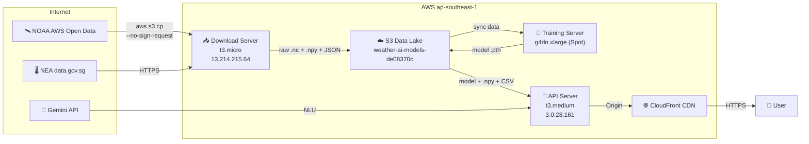
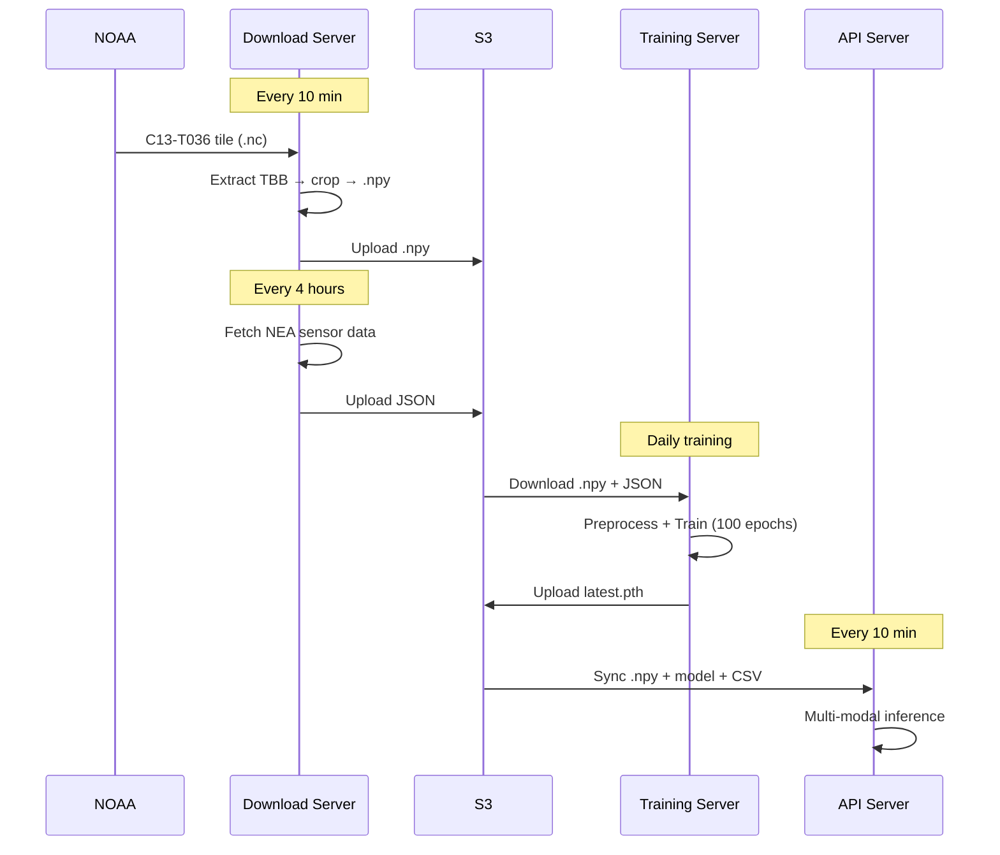
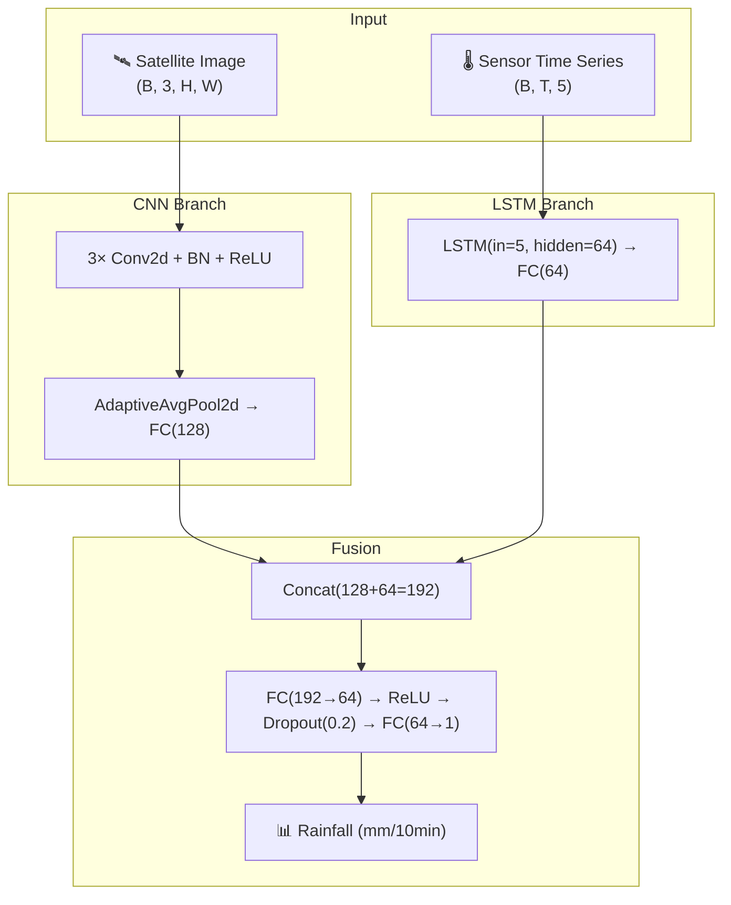

# Singapore Weather AI — Architecture & Design Considerations

> **Version**: 1.0 &nbsp; | &nbsp; **Consolidated**: 2026-02-16

---

## 1. System Architecture



> [!IMPORTANT]
> All AWS resources MUST be in the same region (`ap-southeast-1`) to ensure free EC2 ↔ S3 data transfer. Cross-region transfer of 20TB satellite data costs **$2,000+**.

---

## 2. Servers

### 2.1 Download Server — `13.214.215.64`

| Item | Value |
|------|-------|
| Instance | t3.micro (2 vCPU, 1GB RAM) |
| Disk | 8GB EBS |
| IAM Role | weather-ai-download-role |
| Service | `weather-download.service` (systemd, Restart=always) |

**Three-thread architecture**:

| Thread | Function | Interval |
|--------|----------|----------|
| RealTime | Latest 10-min satellite frame | Every 10 min |
| Backfill | 4-process parallel historical download | Continuous |
| GovData | NEA sensor data (temp/rain/humidity/PM2.5) | Every 4 hours |

### 2.2 Training Server

| Item | Value |
|------|-------|
| Instance | g4dn.xlarge (4 vCPU, 16GB, NVIDIA T4 GPU) |
| Disk | 200GB EBS |
| IAM Role | weather-ai-training-role |

> [!IMPORTANT]
> GPU instance requires pre-approved **"G and VT" vCPU quota** (default is 0). Request ≥ 4 vCPUs. Use **Spot Instance** for 70-90% cost savings.

### 2.3 API Server — `3.0.28.161`

| Item | Value |
|------|-------|
| Instance | t3.medium (2 vCPU, 4GB RAM) |
| Disk | 20GB EBS |
| IAM Role | weather-ai-api-role |
| Service | `weather-api.service` (port 8000) |
| Reverse Proxy | Nginx 80/443 → 8000 |

---

## 3. Data Source Evolution

### 3.1 Satellite Data: JAXA FTP → NOAA AWS Open Data

| Phase | Period | Source | Protocol |
|---|---|---|---|
| **v1 — JAXA FTP** | 2025-10 ~ 2026-02 | `ftp.ptree.jaxa.jp` | FTP over TLS |
| **v2 — NOAA S3** | 2026-02-16 ~ | `s3://noaa-himawari9/` | AWS S3 (`--no-sign-request`) |

#### Migration Rationale

| JAXA FTP Issue | NOAA S3 Solution |
|---|---|
| Requires JAXA account (username/password) | Public open data, no auth |
| FTP passive mode blocked by security groups | S3 HTTPS, works everywhere |
| ~6s/file download (slow backfill) | Same-AZ S3 transfer, ~2s/file |
| Full-disk NetCDF ~700MB each | Pre-tiled: T036 ~3MB for Singapore |
| `curl --ftp-ssl` occasionally hangs | `aws s3 cp` reliable with retries |

#### File Format Changes

| Property | JAXA (v1) | NOAA (v2) |
|---|---|---|
| File pattern | `NC_H09_YYYYMMDD_HHMM_R21_FLDK.*.nc` | `OR_HFD-005-B13-M1C13-T036_GH9_s*.nc` |
| File size | ~700MB (full disk) | ~3MB (pre-tiled) |
| Output resolution | 64×64 `.npy` | 128×128 `.npy` |

#### Code Files

| File | Role | Status |
|---|---|---|
| `download_jaxa_data.py` | JAXA FTP downloader (v1) | Legacy |
| `download_satellite.py` | JAXA FTP + S3 hybrid (v1.5) | Legacy |
| `noaa_satellite.py` | NOAA S3 downloader (v2) | **Active** |
| `download_manager.py` | Orchestrator | **Active** |

### 3.2 Sensor Data Evolution

| Phase | Data Types | Source |
|---|---|---|
| **v0.1** (2025-10) | Temperature, Humidity, Rainfall | `api.data.gov.sg/v1/environment/*` |
| **v0.5** (2026-01) | + PM2.5 | `api-open.data.gov.sg/v2/real-time/api/pm25` |
| **v0.7** (2026-02) | + Wind Speed, Wind Direction | `api-open.data.gov.sg/v2/real-time/api/wind-*` |
| **Planned** | + PSI (24-hour) | `api-open.data.gov.sg/v2/real-time/api/psi` |

#### NEA API v1 → v2

| Property | v1 | v2 |
|---|---|---|
| Base URL | `api.data.gov.sg/v1/environment/` | `api-open.data.gov.sg/v2/real-time/api/` |
| Auth | None | None |

#### Current Sensor Input (5 features → model)

| Feature | Frequency | Model Input |
|---|---|---|
| Temperature (°C) | 1 min | ✅ |
| Humidity (%) | 1 min | ✅ |
| Rainfall (mm) | 5 min | ✅ (target + input) |
| PM2.5 (μg/m³) | 1 hour | ✅ |
| Wind Speed (km/h) | 1 min | ✅ |

> [!NOTE]
> Wind direction is for **frontend visualization only** (particle animation) — NOT a model input.

---

## 4. Satellite Data Pipeline

### 4.1 Data Source: NOAA Himawari-9

| Property | Value |
|----------|-------|
| S3 Bucket | `s3://noaa-himawari9/` (free, `--no-sign-request`) |
| Product | `AHI-L2-FLDK-ISatSS` (Full Disk) |
| Band | Band 13 (C13) — 10.4μm IR brightness temperature |
| Tile | T036 — covers Singapore region |
| Resolution | 2km/pixel, cropped to 128×128 |
| Frequency | Every 10 minutes (144 frames/day) |

### 4.2 NOAA S3 Directory Structure

```
s3://noaa-himawari9/AHI-L2-FLDK-ISatSS/
└── YYYY/MM/DD/
    ├── 0000/   ← Full disk scan starts (north pole)
    ├── 0002/   ← Same scan, mid-latitude
    ├── 0005/   ← Same scan, near equator
    ├── 0007/   ← Same scan, Singapore latitude ⬅
    ├── 0010/   ← Next 10-min scan starts
    └── ...
```

> [!WARNING]
> **Directory names are NOT 10-min intervals** — they are the satellite's exact scan start time for each latitude band. Himawari-9 scans north-to-south in ~10 min. Each subdirectory has ~1408 files (16 bands × 88 tiles). We only download **1 file per scan**: the C13-T036 tile (~3MB).

### 4.3 Processing Flow

```
Download .nc → netCDF4 extract TBB → crop 128×128 → save .npy (~64KB)
```

**File naming convention** (SGT timezone):
```
SAT_128_20230101_0800.npy
 ↑   ↑      ↑       ↑
 |  size   date   SGT time (UTC+8)
satellite
```

> [!CAUTION]
> File names use **SGT (UTC+8)**. API cleanup and time comparison must subtract 8 hours for UTC.

### 4.4 Backfill Completeness

- `.complete` marker written to S3 after all 144 frames uploaded
- `check_s3_exists` checks for marker → skip completed days
- Interrupted days are automatically re-processed
- SNS email notification when crossing year boundaries

---

## 5. S3 Data Lake Structure

```
s3://weather-ai-models-de08370c/
├── processed/satellite/{YYYYMMDD}/  # Preprocessed .npy (~16KB each, 144/day)
├── satellite/{YYYYMMDD}/            # Raw .nc files (~5MB each)
│   └── .complete                    # Completeness marker
├── govdata/                         # NEA sensor JSON (rainfall/temp/humidity/pm25)
├── models/latest.pth                # Latest trained model (~50-100MB)
├── state/training_state.json        # Training scheduler state
├── history/training_history.json    # Training run history
├── logs/                            # download.log, training.log
└── archived/                        # Archived raw data
```

---

## 6. Technology Stack

### 6.1 Backend

| Technology | Purpose |
|---|---|
| **Python ≥ 3.10** | API, data processing, training |
| **FastAPI + Uvicorn** | REST API (100+ req/s) |
| **PyTorch** | Deep learning model |
| **xarray + netCDF4** | Satellite data parsing |
| **Boto3** | AWS SDK |
| **google-generativeai** | Gemini NLU integration |

### 6.2 Frontend

| Technology | Version | Purpose |
|---|---|---|
| **React** | 19.x | UI framework |
| **TypeScript** | ~5.9 | Type safety |
| **Vite** | 6.x | Build tool |
| **Leaflet + React-Leaflet** | 5.0 | Interactive map |

### 6.3 Infrastructure

| Tool | Purpose |
|---|---|
| **Terraform** (HCL) | Infrastructure as Code |
| **Docker / Docker Compose** | Containerized deployment |
| **Systemd** | Service management |
| **Nginx** | Reverse proxy |
| **CloudFront** | CDN + HTTPS |

---

## 7. Data Flow



---

## 8. Network & Security

### 8.1 Security Group Rules

| Port | Protocol | Source | Purpose |
|---|---|---|---|
| 22 | TCP | Whitelist IPs | SSH |
| 80 | TCP | 0.0.0.0/0 | HTTP |
| 443 | TCP | 0.0.0.0/0 | HTTPS |
| 8000 | TCP | 0.0.0.0/0 | FastAPI |

### 8.2 Credentials Management

| Variable | Purpose | Server |
|---|---|---|
| `JAXA_USER` / `JAXA_PASS` | JAXA FTP login | Download |
| `GEMINI_API_KEY` | Google Gemini API | API |
| `SENDER_EMAIL` / `SENDER_PASSWORD` | Gmail SMTP notifications | Training |

> [!CAUTION]
> Production credentials MUST use **AWS Secrets Manager** or **EC2 Instance Profile**. Never hardcode credentials. Sensitive files (`.env`, `*.pem`, `weather.db`) are in `.gitignore`.

### 8.3 IAM Roles

| Role | Policy | Resource |
|---|---|---|
| `weather-ai-download-role` | S3 PutObject + ListBucket | Download Server |
| `weather-ai-training-role` | S3 FullAccess (scoped) | Training Server |
| `weather-ai-api-role` | S3 ReadOnly | API Server |

---

## 9. ML Model Architecture — WeatherFusionNet



**Sensor features** (5): Temperature, Humidity, PM2.5, Rainfall, Wind Speed

---

## 10. Deployment

### 10.1 One-Command Deploy

```bash
./deploy-all.sh --full      # Backend + Frontend + Monitor
./deploy-all.sh --backend   # Backend only
./deploy-all.sh --frontend  # Frontend only
```

### 10.2 Cron Tasks

| Frequency | Server | Script | Purpose |
|---|---|---|---|
| Every 10 min | API | `fetch_latest_model.sh` | Sync latest model from S3 |
| Every 10 min | API | `fetch_and_process_gov_data.py` | Sync NEA sensor data |
| Every 1 min | Download | `push_download_log.sh` | Push logs to S3 |
| Continuous | Training | `training_scheduler.py` | Rolling window training |

### 10.3 SSH Access

```bash
ssh -i ~/.ssh/id_rsa ubuntu@13.214.215.64   # Download
ssh -i ~/.ssh/id_rsa ubuntu@3.0.28.161      # API
```
