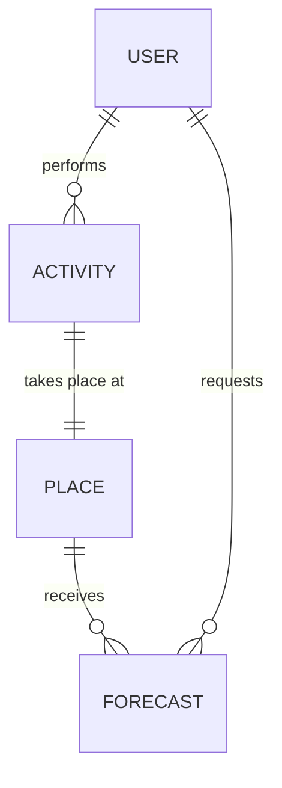

# Conceptual Data Model — Weather AI

> **Date**: 2026-02-20 | **Audience**: Business Stakeholders & Product Managers
> **Core Principle**: Pure business perspective. Describes the core business concepts and their relationships, stripping away all technical implementation details.

---

## 1. Core Business Concepts (Entities)

This system is built upon the following **4 core business concepts**:

1.  **User**: A person utilizing the weather forecast service to plan outdoor activities.
2.  **Activity**: The outdoor action the user intends to perform (e.g., cycling, walking, delivery).
3.  **Place**: The geographical area of interest where the activity will take place.
4.  **Forecast**: The weather prediction delivered to the user for the chosen place and activity.

---

## 2. Business Relationships

*   A **User** performs one or more **Activities**.
*   An **Activity** takes place at a **Place**.
*   A **Place** receives a **Forecast**.
*   A **User** requests a **Forecast**.

---

## 3. Key Metrics and Business Rules

The core business value proposition of this system is **"Accuracy"**. To define what "accurate" means, the business has established the following evaluation metrics:

*   **Hit Rate**: The percentage of times rain was forecasted and it actually rained.
*   **False Alarm Rate**: The percentage of times rain was forecasted but it did not actually rain.
*   **Time Error**: The deviation between the forecasted rain start time and the actual rain start time.
