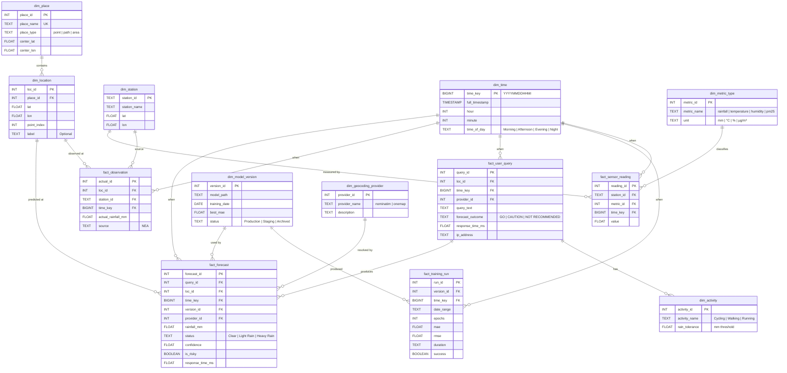

# Logical Data Model — Weather AI

> **Date**: 2026-02-13 | **Source**: [data-storage-er-diagram.md](file:///Users/jinhui/development/tools/claude-skill/docs/data-storage-er-diagram.md) | **Target Platform**: Databricks / Snowflake

---

## 1. Fact, Dimension & Measurement Definitions

### 1.1 Fact Tables

Fact tables capture **business events** — each row represents something that happened at a specific time.

| Fact Table | Grain (每行代表) | Source Entity | Event Type |
|---|---|---|---|
| **fact_forecast** | One prediction at one location at one time | `forecast_result` | Transactional |
| **fact_observation** | One actual weather reading at one location at one time | `actual_result` | Transactional |
| **fact_user_query** | One user search or smart-query request | `user_activity` + `search_history` | Transactional |
| **fact_training_run** | One model training batch completion | `TrainingHistoryItem` | Periodic Snapshot |
| **fact_sensor_reading** | One sensor metric reading at one station at one time | `SensorData` | Periodic Snapshot |

### 1.2 Dimension Tables

Dimension tables provide **descriptive context** for slicing and filtering facts.

| Dimension | Source Entity | Role | Type |
|---|---|---|---|
| **dim_time** | Derived | When the event occurred | Role-playing (forecast_time, observation_time, query_time) |
| **dim_date** | Derived | Date-level aggregation | Conformed |
| **dim_location** | `location` + `geocode_cache` | Where the event occurred (lat, lon, label) | Conformed |
| **dim_place** | `place` | Named geographic entity grouping locations | Outrigger |
| **dim_station** | `Station` | Weather station metadata (id, name, lat, lon) | Conformed |
| **dim_metric_type** | Derived | Metric category (rainfall, temperature, humidity, pm25) | Static |
| **dim_model_version** | `ModelArtifact` + MLflow | Model version, training date, performance | Slowly Changing (SCD Type 2) |
| **dim_activity** | `activity` | Outdoor activity type + rain tolerance | Static |
| **dim_geocoding_provider** | Runtime config | Nominatim / OneMap | Junk Dimension |

### 1.3 Measurements (Measures)

| Measure | Data Type | Fact Table | Aggregation |
|---|---|---|---|
| `rainfall_mm` | FLOAT | fact_forecast | AVG, SUM, MAX |
| `confidence` | FLOAT | fact_forecast | AVG |
| `is_risky` | BOOLEAN | fact_forecast | COUNT, SUM |
| `response_time_ms` | FLOAT | fact_forecast, fact_user_query | AVG, P95, MAX |
| `actual_rainfall_mm` | FLOAT | fact_observation | AVG, SUM, MAX |
| `abs_error` | FLOAT | Derived (forecast - actual) | AVG (= MAE) |
| `query_count` | INT | fact_user_query | COUNT |
| `mae` | FLOAT | fact_training_run | AVG, MIN |
| `rmse` | FLOAT | fact_training_run | AVG, MIN |
| `temperature` | FLOAT | fact_sensor_reading | AVG, MIN, MAX |
| `humidity` | FLOAT | fact_sensor_reading | AVG, MIN, MAX |
| `pm25` | FLOAT | fact_sensor_reading | AVG, MAX |

---

## 2. Dimension–Measurement Matrix (Bus Matrix)

This matrix shows which dimensions are applicable to each fact table.

| Dimension \ Fact | fact_forecast | fact_observation | fact_user_query | fact_training_run | fact_sensor_reading |
|---|:---:|:---:|:---:|:---:|:---:|
| **dim_time** | ✅ | ✅ | ✅ | ✅ | ✅ |
| **dim_date** | ✅ | ✅ | ✅ | ✅ | ✅ |
| **dim_location** | ✅ | ✅ | ✅ | | |
| **dim_place** | ✅ | ✅ | ✅ | | |
| **dim_station** | | ✅ | | | ✅ |
| **dim_metric_type** | | | | | ✅ |
| **dim_model_version** | ✅ | | | ✅ | |
| **dim_activity** | | | ✅ | | |
| **dim_geocoding_provider** | ✅ | | ✅ | | |

### Measures per Fact

| Measure \ Fact | fact_forecast | fact_observation | fact_user_query | fact_training_run | fact_sensor_reading |
|---|:---:|:---:|:---:|:---:|:---:|
| rainfall_mm | ✅ | | | | ✅ |
| actual_rainfall_mm | | ✅ | | | |
| abs_error | ✅ (derived) | | | | |
| confidence | ✅ | | | | |
| is_risky | ✅ | | | | |
| response_time_ms | ✅ | | ✅ | | |
| query_count | | | ✅ | | |
| mae / rmse | | | | ✅ | |
| temperature | | | | | ✅ |
| humidity | | | | | ✅ |
| pm25 | | | | | ✅ |

---

## 3. Entity Types & Relationships

### 3.1 Entity Classification

| Entity | Type | Description |
|---|---|---|
| `user_activity` | **Transaction** | Initiated by user action, immutable once created |
| `forecast_result` | **Transaction** | Generated per prediction, immutable |
| `actual_result` | **Transaction** | External observation, immutable |
| `search_history` | **Transaction** | Legacy log, append-only |
| `place` | **Master** | Deduplicated reference, slowly grows |
| `location` | **Master** | Coordinate points, reference data |
| `activity` | **Reference** | Lookup table for activity types |
| `Station` | **Reference** | Weather station registry, rarely changes |
| `geocode_cache` | **Cache** | Derived, regenerable, no business meaning |
| `overpass_cache` | **Cache** | Derived, regenerable, no business meaning |

### 3.2 Relationships — Cardinality & Optionality



### 3.3 Cardinality & Optionality Summary

| Relationship | Cardinality | Optionality | Notation | Description |
|---|---|---|---|---|
| place → location | 1 : N | Mandatory → Mandatory | `\|\|--o{` | Every place MUST have ≥1 location; every location MUST belong to a place |
| location → forecast_result | 1 : N | Mandatory → Optional | `\|\|--o{` | A location MAY have 0 or many forecasts |
| location → actual_result | 1 : N | Mandatory → Optional | `\|\|--o{` | A location MAY have 0 or many observations |
| user_activity → forecast_result | 1 : N | Mandatory → Mandatory | `\|\|--o{` | Every query produces ≥1 forecast |
| user_activity → activity | 1 : N | Mandatory → Optional | `\|\|--o{` | A query MAY have 0 or many activities |
| station → sensor_reading | 1 : N | Mandatory → Mandatory | `\|\|--o{` | Every station reports readings |
| station → actual_result | 1 : N | Mandatory → Optional | `\|\|--o{` | A station MAY be the source of observations |
| model_version → forecast | 1 : N | Mandatory → Mandatory | `\|\|--o{` | Every forecast uses one model version |
| model_version → training_run | 1 : 1 | Mandatory → Mandatory | `\|\|--\|\|` | Each run produces one version |
| metric_type → sensor_reading | 1 : N | Mandatory → Mandatory | `\|\|--o{` | Every reading has a metric type |
| time → all facts | 1 : N | Mandatory → Mandatory | `\|\|--o{` | Every fact has a time dimension |

### 3.4 Star Schema Summary

```text
                    ┌──────────────┐
                    │  dim_time    │
                    └──────┬───────┘
                           │
    ┌──────────────┐   ┌───┴──────────┐   ┌────────────────────┐
    │ dim_place    │   │              │   │ dim_model_version  │
    │  └ dim_loc   │──▶│ fact_forecast│◀──│                    │
    │              │   │              │   └────────────────────┘
    └──────────────┘   └───┬──────────┘
                           │
              ┌────────────┴────────────┐
              │ dim_geocoding_provider  │
              └─────────────────────────┘
```
