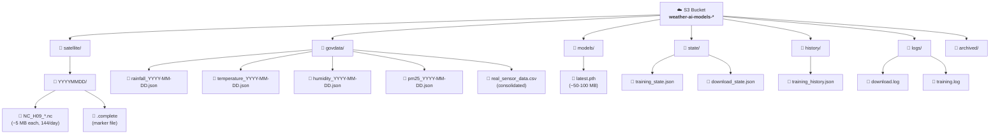
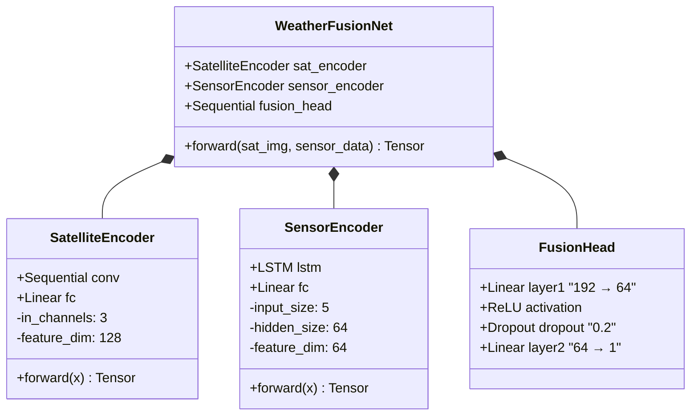
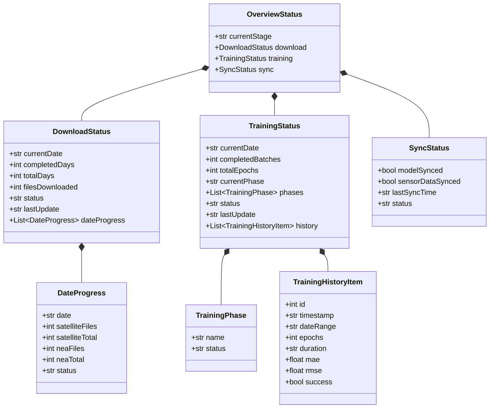
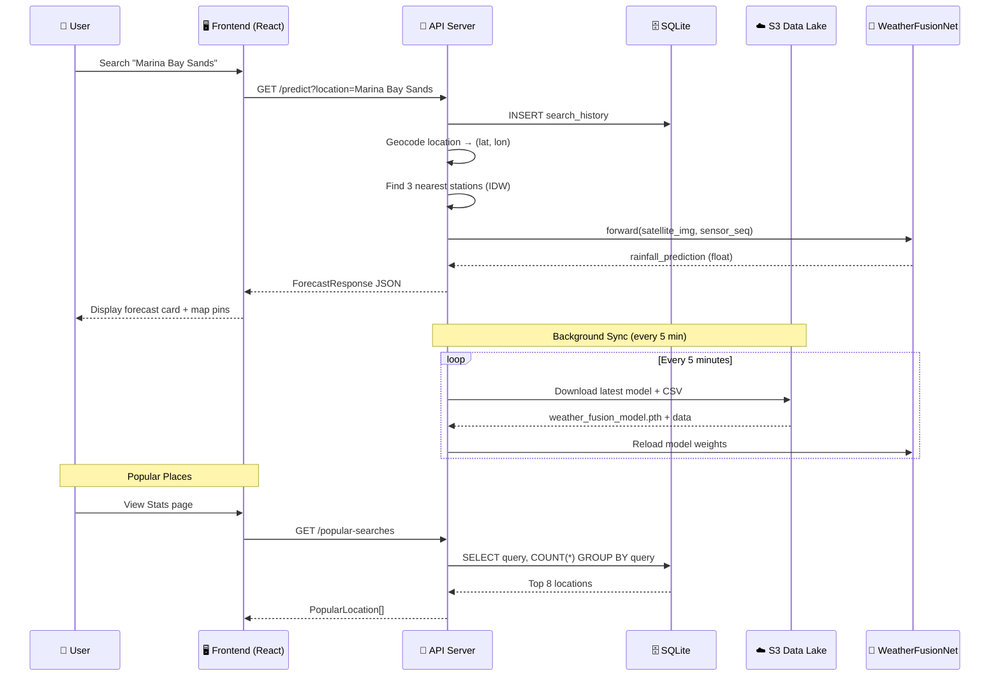

# Singapore Weather AI — Data Model & ER Diagram

> **Version**: v0.8 &nbsp; | &nbsp; **Updated**: 2026-02-09 &nbsp; | &nbsp; **Source**: `services/api/`, `frontend/src/`, S3 bucket structure

---

## Table of Contents

1. [System Overview](#1-system-overview)
2. [ER Diagram — Full System](#2-er-diagram--full-system)
3. [Persistent Storage (SQLite)](#3-persistent-storage-sqlite)
4. [S3 Data Lake Structure](#4-s3-data-lake-structure)
5. [ML Model Architecture](#5-ml-model-architecture)
6. [API Data Models (Pydantic)](#6-api-data-models-pydantic)
7. [Frontend Data Models (TypeScript)](#7-frontend-data-models-typescript)
8. [Data Flow Diagram](#8-data-flow-diagram)

---

## 1. System Overview

The Weather AI application uses a **multi-tier data model** spanning:

| Layer | Technology | Purpose |
|:---|:---|:---|
| **Persistent Storage** | SQLite (`weather.db`) | Search history, user analytics |
| **Object Storage** | AWS S3 | Satellite data, sensor data, models, state, logs |
| **ML Model** | PyTorch (.pth) | WeatherFusionNet trained weights |
| **API Layer** | FastAPI + Pydantic | Structured request/response schemas |
| **Frontend** | TypeScript interfaces | UI data contracts |

---

## 2. ER Diagram — Full System

```mermaid
erDiagram
    %% === Persistent Storage ===
    SEARCH_HISTORY {
        int id PK "Auto-increment"
        text query "Search text"
        text ip_address "Client IP (nullable)"
        datetime timestamp "DEFAULT CURRENT_TIMESTAMP"
    }

    %% === S3 Data Lake ===
    S3_SATELLITE_DATA {
        string bucket "weather-ai-models-*"
        string date_folder "satellite/YYYYMMDD/"
        string nc_file "NC_H09_*.nc (NetCDF)"
        string complete_marker ".complete flag"
    }

    S3_GOV_DATA {
        string bucket "weather-ai-models-*"
        string sensor_type "rainfall/temperature/humidity/pm25"
        string json_file "govdata/{type}_{date}.json"
        string csv_file "govdata/real_sensor_data.csv"
    }

    S3_MODELS {
        string bucket "weather-ai-models-*"
        string model_key "models/latest.pth"
        float file_size_mb "~50-100 MB"
    }

    S3_STATE {
        string training_state "state/training_state.json"
        string download_state "state/download_state.json"
    }

    S3_HISTORY {
        string history_file "history/training_history.json"
        int id "Training run ID"
        string timestamp "ISO 8601"
        bool success "Pass/Fail"
        float mae "Mean Absolute Error"
        float rmse "Root Mean Square Error"
    }

    %% === ML Model ===
    WEATHER_FUSION_NET {
        string satellite_encoder "SatelliteEncoder (CNN)"
        string sensor_encoder "SensorEncoder (LSTM)"
        string fusion_head "FC + Dropout + FC"
        int sat_channels "3 (RGB/IR)"
        int sensor_features "5"
        int prediction_dim "1 (rainfall mm)"
    }

    SATELLITE_ENCODER {
        string conv1 "Conv2d(3,16) + BN + ReLU"
        string conv2 "Conv2d(16,32) + BN + ReLU"
        string conv3 "Conv2d(32,64) + BN + ReLU"
        string pool "AdaptiveAvgPool2d(1,1)"
        string fc "Linear(64, 128)"
    }

    SENSOR_ENCODER {
        string lstm "LSTM(input=5, hidden=64)"
        string fc "Linear(64, 64)"
    }

    %% === API Response ===
    FORECAST_RESPONSE {
        string timestamp "Prediction time (ISO)"
        string location_query "User search text"
        float confidence "0.0 - 1.0"
        bool cloud_cover "Satellite cloud flag"
        string recommendation "Advice text"
        string status_color "green/yellow/red"
    }

    NEAREST_STATION {
        string id "Station ID (e.g. S50)"
        string name "Station name"
    }

    FORECAST_DATA {
        float rainfall_mm_next_10min "Predicted rainfall"
        string description "Rain/Clear status"
    }

    CURRENT_WEATHER {
        float temperature "Celsius (nullable)"
        float humidity "Percent (nullable)"
        float pm25 "ug/m3 (nullable)"
    }

    STATION {
        string id PK "e.g. S50"
        string name "e.g. Clementi"
        float latitude "WGS84"
        float longitude "WGS84"
    }

    %% === Monitor Models ===
    OVERVIEW_STATUS {
        string currentStage "download/training/sync/idle"
    }

    DOWNLOAD_STATUS {
        string currentDate "YYYY-MM-DD"
        int completedDays "Count"
        int totalDays "Target count"
        int filesDownloaded "Total files"
        string status "running/idle/error/completed"
        string lastUpdate "ISO timestamp"
    }

    DATE_PROGRESS {
        string date "YYYY-MM-DD"
        int satelliteFiles "Downloaded count"
        int satelliteTotal "144 (per day)"
        int neaFiles "Downloaded count"
        int neaTotal "4 (per day)"
        string status "pending/running/completed"
    }

    TRAINING_STATUS {
        string currentDate "Training date"
        int completedBatches "Batch count"
        int totalEpochs "Epoch count"
        string currentPhase "Phase name"
        string status "running/idle/completed/error"
        string lastUpdate "ISO timestamp"
    }

    TRAINING_PHASE {
        string name "Data Download/Preprocessing/Training/Model Sync"
        string status "pending/running/completed/error"
    }

    TRAINING_HISTORY_ITEM {
        int id PK "Auto-increment"
        string timestamp "ISO 8601"
        string dateRange "e.g. 2025-10-01 ~ 2025-10-03"
        int epochs "Training epochs"
        string duration "e.g. 2h 15m"
        float mae "Mean Absolute Error"
        float rmse "Root Mean Square Error"
        bool success "Pass/Fail"
    }

    SYNC_STATUS {
        bool modelSynced "Model file exists"
        bool sensorDataSynced "CSV file exists"
        string lastSyncTime "ISO timestamp"
        string status "synced/partial/unknown/error"
    }

    %% === Relationships ===
    FORECAST_RESPONSE ||--|| NEAREST_STATION : "has"
    FORECAST_RESPONSE ||--|| FORECAST_DATA : "contains"
    FORECAST_RESPONSE ||--|| CURRENT_WEATHER : "contains"
    FORECAST_RESPONSE }o--o{ STATION : "contributing_stations"

    OVERVIEW_STATUS ||--|| DOWNLOAD_STATUS : "has"
    OVERVIEW_STATUS ||--|| TRAINING_STATUS : "has"
    OVERVIEW_STATUS ||--|| SYNC_STATUS : "has"
    DOWNLOAD_STATUS ||--o{ DATE_PROGRESS : "contains"
    TRAINING_STATUS ||--o{ TRAINING_PHASE : "contains"
    TRAINING_STATUS ||--o{ TRAINING_HISTORY_ITEM : "contains"

    WEATHER_FUSION_NET ||--|| SATELLITE_ENCODER : "has"
    WEATHER_FUSION_NET ||--|| SENSOR_ENCODER : "has"

    S3_SATELLITE_DATA ||--o{ WEATHER_FUSION_NET : "feeds"
    S3_GOV_DATA ||--o{ WEATHER_FUSION_NET : "feeds"
    WEATHER_FUSION_NET ||--|| S3_MODELS : "produces"
    S3_STATE ||--|| TRAINING_STATUS : "serializes to"
    S3_HISTORY ||--o{ TRAINING_HISTORY_ITEM : "serializes to"

    SEARCH_HISTORY }o--|| FORECAST_RESPONSE : "triggers"
```



---

## 3. Persistent Storage (SQLite)

### 3.1 `search_history` Table

The only relational table in the system, stored in `weather.db` on the API server.

```sql
CREATE TABLE IF NOT EXISTS search_history (
    id          INTEGER PRIMARY KEY AUTOINCREMENT,
    query       TEXT NOT NULL,
    ip_address  TEXT,
    timestamp   DATETIME DEFAULT CURRENT_TIMESTAMP
);
```

**Purpose**: Tracks user search queries for the "Popular Places" analytics feature.

| Column | Type | Description |
|:---|:---|:---|
| `id` | INTEGER | Auto-incrementing primary key |
| `query` | TEXT | Free-text search query (e.g. "Marina Bay Sands") |
| `ip_address` | TEXT | Client IP address (nullable, not currently populated) |
| `timestamp` | DATETIME | Record creation time |

**Usage**:
- `INSERT` on every `/predict` (location name) and `/smart-query` call
- `SELECT ... GROUP BY query ORDER BY count DESC LIMIT 8` for popular places ranking

---

## 4. S3 Data Lake Structure

The S3 bucket `weather-ai-models-*` serves as the central data lake. All inter-server data exchange happens through S3.



### 4.1 Key Data Files

#### `training_state.json`

```json
{
  "status": "running",
  "currentDate": "2025-10-15",
  "currentPhase": "Training",
  "completedBatches": 12,
  "totalEpochs": 100,
  "lastUpdate": "2026-02-09T14:30:00",
  "phases": [
    { "name": "Data Download", "status": "completed" },
    { "name": "Preprocessing", "status": "completed" },
    { "name": "Training", "status": "running" },
    { "name": "Model Sync", "status": "pending" }
  ]
}
```

#### `training_history.json`

```json
[
  {
    "id": 1,
    "timestamp": "2026-02-08T10:30:00",
    "success": true,
    "duration_formatted": "2h 15m",
    "metrics": { "mae": 0.11009, "rmse": 0.39749 },
    "data_info": { "date_range": "2025-10-01 ~ 2025-10-03" },
    "training_config": { "epochs": 100 }
  }
]
```

#### `download_state.json`

```json
{
  "status": "downloading",
  "current_target_date": "2025-10-20",
  "last_updated": "2026-02-09T14:00:00"
}
```

---

## 5. ML Model Architecture

### 5.1 WeatherFusionNet — PyTorch Module Hierarchy



### 5.2 Input/Output Specification

| Component | Input Shape | Output Shape | Description |
|:---|:---|:---|:---|
| **SatelliteEncoder** | `(B, 3, H, W)` | `(B, 128)` | Satellite image → 128-dim feature vector |
| **SensorEncoder** | `(B, T, 5)` | `(B, 64)` | Sensor time series → 64-dim feature vector |
| **FusionHead** | `(B, 192)` | `(B, 1)` | Concatenated features → rainfall prediction |

- `B` = Batch size
- `H, W` = Satellite image height and width (variable, handled by AdaptiveAvgPool2d)
- `T` = Time steps (sequence length)
- `5` features = Temperature, Humidity, PM2.5, Rainfall, Wind Speed

### 5.3 Sensor Data Schema (`real_sensor_data.csv`)

| Column | Type | Description |
|:---|:---|:---|
| `timestamp` | datetime | Observation time |
| `sensor_id` | string | Station ID (e.g. "S50") |
| `temperature` | float | Celsius |
| `humidity` | float | Percent |
| `rainfall` | float | mm (cumulative) |
| `pm25` | float | µg/m³ |
| `wind_speed` | float | km/h |

---

## 6. API Data Models (Pydantic)

### 6.1 Prediction API

#### `GET /predict` Response

```python
{
    "timestamp": str,              # ISO 8601
    "location_query": str,         # User's original query
    "nearest_station": {
        "id": str,                 # e.g. "S50"
        "name": str                # e.g. "Clementi"
    },
    "contributing_stations": [str], # IDs of 3 nearest stations
    "forecast": {
        "rainfall_mm_next_10min": float,
        "description": str         # "Light Rain", "No Rain", etc.
    },
    "current_weather": {
        "temperature": float | None,
        "humidity": float | None,
        "pm25": float | None
    },
    "confidence": float,           # 0.0 - 1.0
    "cloud_cover": bool,           # From satellite analysis
    "recommendation": str,         # Advisory text
    "status_color": str,           # "green" | "yellow" | "red"
    "debug": str                   # Debug info (dev only)
}
```

### 6.2 Monitoring API

#### Overview Model Hierarchy



### 6.3 Other Endpoints

| Endpoint | Response Structure |
|:---|:---|
| `GET /stations` | `[{ id, name, location: { latitude, longitude } }]` |
| `GET /popular-searches` | `[{ id, name, count }]` |
| `GET /smart-query?q=...` | `{ verdict, summary, details: [...], points_analyzed, parsed }` |
| `GET /predict/path?query=...` | `{ points: [{ lat, lon, forecast: {...} }], parsed }` |
| `GET /health` | `{ status: "ok", version, service }` |
| `GET /monitor/logs/{type}` | `{ type, lines: [...], source, path, timestamp }` |

---

## 7. Frontend Data Models (TypeScript)

### 7.1 Core Interfaces

```typescript
// Prediction response from /predict
interface ForecastResult {
  timestamp: string;
  location_query: string;
  nearest_station: { id: string; name: string };
  contributing_stations?: string[];
  forecast: {
    rainfall_mm_next_10min: number;
    description: string;
  };
  current_weather: {
    temperature: number | null;
    humidity: number | null;
    pm25: number | null;
  };
}

// Weather station marker on the map
interface Station {
  id: string;
  name: string;
  location: { latitude: number; longitude: number };
}

// Popular places ranking
interface PopularLocation {
  id: number;
  name: string;
  count: number;
}
```

### 7.2 Monitor Interfaces

```typescript
// Full overview from /monitor/overview
interface OverviewStatus {
  currentStage: string;
  download: DownloadStatus;
  training: TrainingStatus;
  sync: SyncStatus;
}

interface DownloadStatus {
  currentDate: string | null;
  completedDays: number;
  totalDays: number;
  filesDownloaded: number;
  status: string;
  lastUpdate: string | null;
  dateProgress: DateProgress[];
}

interface DateProgress {
  date: string;
  satelliteFiles: number;
  satelliteTotal: number;
  neaFiles: number;
  neaTotal: number;
  status: string;
}

interface TrainingStatus {
  currentDate: string | null;
  completedBatches: number;
  totalEpochs: number;
  currentPhase: string;
  phases: TrainingPhase[];
  status: string;
  lastUpdate: string | null;
  history: TrainingHistoryItem[];
}

interface TrainingHistoryItem {
  id: number;
  timestamp: string;
  dateRange: string;
  epochs: number;
  duration: string;
  mae: number;
  rmse: number;
  success: boolean;
}
```

---

## 8. Data Flow Diagram


