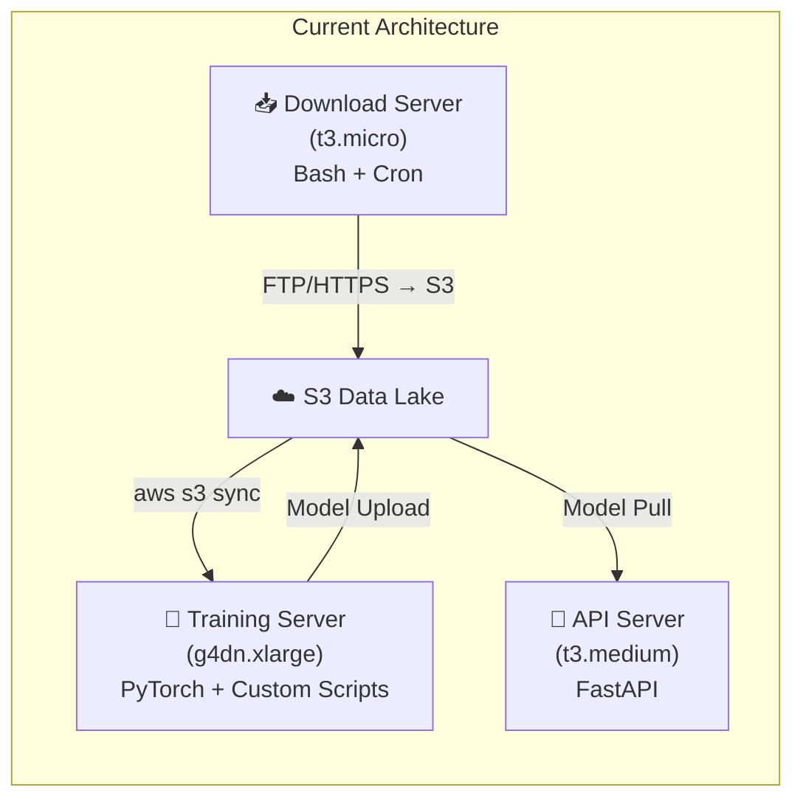
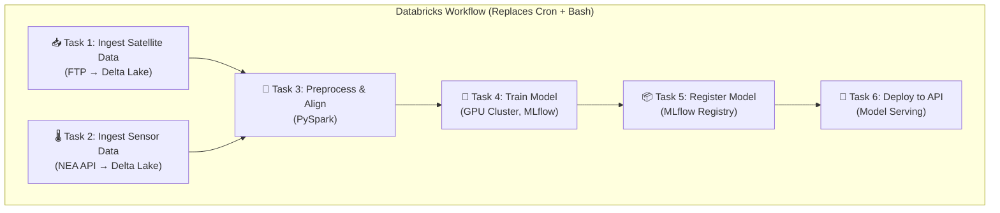
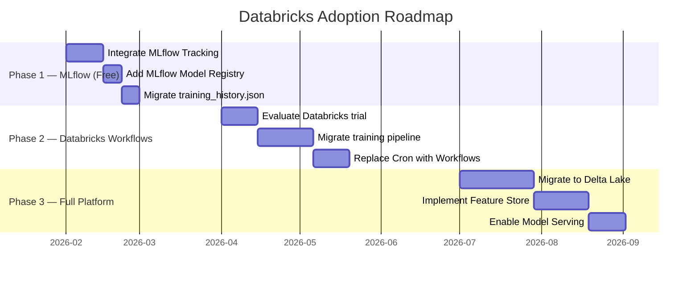

# Databricks Integration Feasibility Analysis

> **Version**: v1.0 &nbsp; | &nbsp; **Date**: 2026-02-09 &nbsp; | &nbsp; **Project**: Singapore Weather AI

---

## Table of Contents

1. [Executive Summary](#1-executive-summary)
2. [Current Architecture](#2-current-architecture)
3. [Databricks Integration Opportunities](#3-databricks-integration-opportunities)
4. [Cost Comparison](#4-cost-comparison)
5. [Trade-offs & Considerations](#5-trade-offs--considerations)
6. [Recommended Adoption Roadmap](#6-recommended-adoption-roadmap)
7. [Conclusion](#7-conclusion)

---

## 1. Executive Summary

Databricks can be integrated into the Weather AI project to enhance model training, data processing, and experiment management. However, given the current project scale (~700 MB satellite data/day, single GPU training), a **phased adoption** approach is recommended — starting with the open-source **MLflow** component before committing to the full Databricks platform.

---

## 2. Current Architecture



| Component | Technology | Pain Points |
|:---|:---|:---|
| Data Ingestion | Bash scripts + Cron | No retry logic, no DAG dependencies |
| Training | PyTorch + manual checkpoint | No experiment tracking, manual GPU management |
| Model Management | S3 `models/latest.pth` | No versioning, no A/B testing support |
| Scheduling | Cron + `training_scheduler.py` | No visibility, manual error recovery |

---

## 3. Databricks Integration Opportunities

### 3.1 Model Training — MLflow + GPU Clusters

| Current Approach | Databricks Alternative | Benefit |
|:---|:---|:---|
| Manual EC2 GPU instance management | **Databricks Clusters** with auto-start/stop | Eliminates idle GPU costs |
| Custom training loop + manual checkpoint | **MLflow Tracking** — auto-log params, metrics, artifacts | Full experiment history with zero extra code |
| `training_history.json` on S3 | **MLflow Experiment UI** | Visual comparison of runs, hyperparameter search |
| `models/latest.pth` on S3 | **MLflow Model Registry** | Version management, staging → production promotion |
| Manual `torch.cuda.is_available()` | **Databricks Runtime ML** | Pre-configured GPU drivers, CUDA, PyTorch |

#### Example: MLflow Integration (Minimal Code Change)

```python
import mlflow

# Only 3 lines added to existing training code
mlflow.set_experiment("weather-fusion-training")

with mlflow.start_run():
    mlflow.log_params({"epochs": 100, "lr": 0.001, "batch_size": 32})

    for epoch in range(100):
        train_loss = train_one_epoch(model, train_loader)
        val_loss = validate(model, val_loader)
        mlflow.log_metrics({"train_loss": train_loss, "val_loss": val_loss}, step=epoch)

    # Auto-log the trained model
    mlflow.pytorch.log_model(model, "weather_fusion_model")
```

### 3.2 Data Processing — Delta Lake + PySpark

| Current Approach | Databricks Alternative | Benefit |
|:---|:---|:---|
| Pandas on single machine | **PySpark / Delta Lake** | Distributed processing for large datasets |
| CSV/JSON flat files | **Delta Tables** | ACID transactions, schema evolution, time travel |
| Manual data alignment scripts | **Databricks Notebooks** | Interactive exploration + scheduled pipelines |
| `fetch_and_process_gov_data.py` via Cron | **Databricks Workflows** | Visual DAG, retry policies, alerting |

#### When Spark Becomes Necessary

| Data Scale | Pandas Sufficient? | Spark Recommended? |
|:---|:---|:---|
| < 1 GB/day (current) | ✅ Yes | ❌ Overkill |
| 1–10 GB/day | ⚠️ Marginal | ✅ Beneficial |
| > 10 GB/day | ❌ Too slow | ✅ Essential |

### 3.3 Workflow Orchestration — Databricks Workflows



### 3.4 Feature Store

| Current | Databricks Alternative |
|:---|:---|
| IDW interpolation computed at request time | **Feature Store** — precomputed and cached |
| Sensor data alignment in scattered scripts | Centralized feature definitions |
| No feature versioning | Feature versioning + lineage tracking |

---

## 4. Cost Comparison

### 4.1 Current AWS Costs (Monthly Estimate)

| Resource | Specification | Monthly Cost |
|:---|:---|:---|
| API Server | t3.medium (on-demand, 24/7) | ~$30 |
| Training Server | g4dn.xlarge (Spot, ~4h/day) | ~$15–20 |
| Download Server | t3.micro (on-demand, 24/7) | ~$8 |
| S3 Storage | ~50 GB | ~$1 |
| **Total** | | **~$55–60/month** |

### 4.2 Databricks Costs (Monthly Estimate)

| Resource | Specification | Monthly Cost |
|:---|:---|:---|
| API Server | t3.medium (unchanged) | ~$30 |
| Training Cluster | GPU cluster (~4h/day, auto-terminated) | ~$40–80 |
| Job Cluster | Data processing (~2h/day) | ~$15–25 |
| Databricks DBU | Platform licensing fee | ~$30–60 |
| S3 / Delta Lake | ~50 GB | ~$1 |
| **Total** | | **~$120–200/month** |

> [!WARNING]
> Databricks approximately **doubles** the infrastructure cost at current scale. The ROI improves significantly when data volume exceeds 10 GB/day or when multiple team members collaborate on model experimentation.

### 4.3 MLflow-Only Costs (Phase 1)

| Resource | Specification | Monthly Cost |
|:---|:---|:---|
| All current resources | Unchanged | ~$55–60 |
| MLflow Tracking Server | Runs on API Server (free, open-source) | $0 |
| **Total** | | **~$55–60/month** |

---

## 5. Trade-offs & Considerations

### 5.1 Advantages

| Advantage | Description |
|:---|:---|
| **Experiment Tracking** | Full visibility into training runs, hyperparameters, and metrics |
| **Auto-scaling** | GPU clusters spin up only when needed, auto-terminate after training |
| **Collaboration** | Multiple team members can run experiments simultaneously |
| **Model Governance** | Version control, staging/production lifecycle, approval workflows |
| **Managed Infrastructure** | No need to manage CUDA drivers, PyTorch versions, or GPU quotas |
| **Unity Catalog** | Centralized data governance and access control |

### 5.2 Disadvantages

| Disadvantage | Description |
|:---|:---|
| **Cost Increase** | ~2-3x higher infrastructure costs at current scale |
| **Complexity** | Additional platform layer increases architectural complexity |
| **Vendor Lock-in** | Delta Lake format, Databricks-specific APIs |
| **Learning Curve** | Team needs to learn Databricks platform, Spark, MLflow |
| **Overkill for Current Scale** | Daily data volume (~700 MB) doesn't justify distributed processing |
| **Network Dependencies** | Requires Databricks workspace access (cloud-hosted) |

### 5.3 Architecture Comparison

| Aspect | Current (EC2 + S3) | Databricks |
|:---|:---|:---|
| Simplicity | ⭐⭐⭐⭐⭐ | ⭐⭐⭐ |
| Scalability | ⭐⭐ | ⭐⭐⭐⭐⭐ |
| Cost Efficiency (small scale) | ⭐⭐⭐⭐⭐ | ⭐⭐ |
| Cost Efficiency (large scale) | ⭐⭐ | ⭐⭐⭐⭐ |
| Experiment Tracking | ⭐ | ⭐⭐⭐⭐⭐ |
| Team Collaboration | ⭐⭐ | ⭐⭐⭐⭐⭐ |
| Operational Overhead | ⭐⭐⭐ (manual) | ⭐⭐⭐⭐ (managed) |

---

## 6. Recommended Adoption Roadmap



### Phase 1: MLflow Integration (Immediate — Zero Cost)

**Goal**: Add experiment tracking and model versioning with no infrastructure changes.

- `pip install mlflow` on the Training Server
- Add MLflow logging to `train.py` (~10 lines of code)
- Use MLflow UI to replace manual `training_history.json`
- Store artifacts in existing S3 bucket

> [!TIP]
> Phase 1 can be completed in **1–2 days** with no cost increase. It provides immediate value and serves as a proof-of-concept for further Databricks adoption.

### Phase 2: Databricks Workflows (When Data Scale Grows)

**Trigger**: Daily data volume exceeds 5 GB or team size exceeds 2 people.

- Migrate training pipeline to Databricks Jobs
- Replace Bash/Cron orchestration with visual DAG workflows
- Use Databricks GPU clusters with auto-termination

### Phase 3: Full Platform Migration (Production Scale)

**Trigger**: Multi-region deployment or enterprise compliance requirements.

- Migrate S3 data to Delta Lake tables
- Implement Feature Store for precomputed features
- Enable Databricks Model Serving for the prediction API
- Integrate Unity Catalog for data governance

---

## 7. Conclusion

Databricks is a **viable but premature** choice for the current project scale. The recommended strategy is:

1. **Start now** with MLflow (free, open-source) for experiment tracking
2. **Evaluate later** when data volume or team size justifies the platform cost
3. **Migrate gradually** to minimize disruption and control costs

The current EC2 + S3 architecture remains the most cost-effective solution for the project's present needs, while MLflow integration provides the most impactful immediate improvement at zero additional cost.
