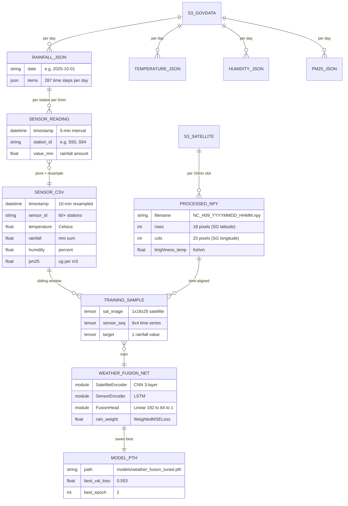
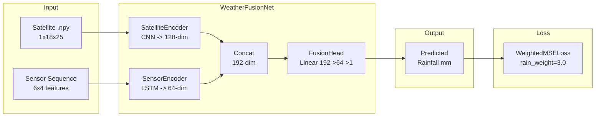
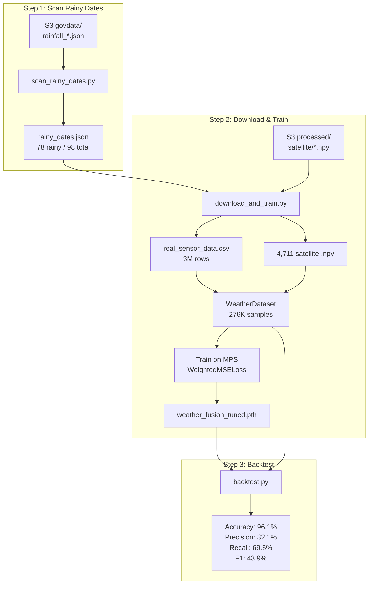

# Weather AI Model-Tuned: Data Model & Logic Flow

## Data Model (ER Diagram)

```mermaid
erDiagram
    S3_GOVDATA ||--o{ RAINFALL_JSON : "per day"
    S3_GOVDATA ||--o{ TEMPERATURE_JSON : "per day"
    S3_GOVDATA ||--o{ HUMIDITY_JSON : "per day"
    S3_GOVDATA ||--o{ PM25_JSON : "per day"

    RAINFALL_JSON {
        string date "e.g. 2025-10-01"
        json items "287 time steps per day"
    }

    RAINFALL_JSON ||--o{ SENSOR_READING : "per station per 5min"

    SENSOR_READING {
        datetime timestamp "5-min interval"
        string station_id "e.g. S50, S94"
        float value_mm "rainfall amount"
    }

    S3_SATELLITE ||--o{ PROCESSED_NPY : "per 10min slot"

    PROCESSED_NPY {
        string filename "NC_H09_YYYYMMDD_HHMM.npy"
        int rows "18 pixels (SG latitude)"
        int cols "25 pixels (SG longitude)"
        float brightness_temp "Kelvin"
    }

    SENSOR_READING }o--|| SENSOR_CSV : "pivot + resample"

    SENSOR_CSV {
        datetime timestamp "10-min resampled"
        string sensor_id "60+ stations"
        float temperature "Celsius"
        float rainfall "mm sum"
        float humidity "percent"
        float pm25 "ug per m3"
    }

    SENSOR_CSV ||--o{ TRAINING_SAMPLE : "sliding window"
    PROCESSED_NPY ||--o{ TRAINING_SAMPLE : "time-aligned"

    TRAINING_SAMPLE {
        tensor sat_image "1x18x25 satellite"
        tensor sensor_seq "6x4 time series"
        tensor target "1 rainfall value"
    }

    TRAINING_SAMPLE }o--|| WEATHER_FUSION_NET : "train"

    WEATHER_FUSION_NET {
        module SatelliteEncoder "CNN 3-layer"
        module SensorEncoder "LSTM"
        module FusionHead "Linear 192 to 64 to 1"
        float rain_weight "WeightedMSELoss"
    }

    WEATHER_FUSION_NET ||--|| MODEL_PTH : "saves best"

    MODEL_PTH {
        string path "models/weather_fusion_tuned.pth"
        float best_val_loss "0.553"
        int best_epoch "2"
    }
```

## Model Logic Flow

```mermaid
flowchart LR
    subgraph Input
        SAT["Satellite .npy<br/>1x18x25"]
        SEN["Sensor Sequence<br/>6x4 features"]
    end

    subgraph WeatherFusionNet
        SE["SatelliteEncoder<br/>CNN -> 128-dim"]
        LE["SensorEncoder<br/>LSTM -> 64-dim"]
        CAT["Concat<br/>192-dim"]
        FH["FusionHead<br/>Linear 192->64->1"]
    end

    subgraph Output
        PRED["Predicted<br/>Rainfall mm"]
    end

    SAT --> SE --> CAT
    SEN --> LE --> CAT
    CAT --> FH --> PRED

    subgraph Loss
        WL["WeightedMSELoss<br/>rain_weight=3.0"]
    end

    PRED --> WL
```

## Training Pipeline Flow

```mermaid
flowchart TB
    subgraph Step1["Step 1: Scan Rainy Dates"]
        S3G["S3 govdata/<br/>rainfall_*.json"] --> SCAN["scan_rainy_dates.py"]
        SCAN --> RD["rainy_dates.json<br/>78 rainy / 98 total"]
    end

    subgraph Step2["Step 2: Download & Train"]
        RD --> DL["download_and_train.py"]
        S3SAT["S3 processed/<br/>satellite/*.npy"] --> DL
        DL --> CSV["real_sensor_data.csv<br/>3M rows"]
        DL --> NPY["4,711 satellite .npy"]
        CSV --> DS["WeatherDataset<br/>276K samples"]
        NPY --> DS
        DS --> TRAIN["Train on MPS<br/>WeightedMSELoss"]
        TRAIN --> MODEL["weather_fusion_tuned.pth"]
    end

    subgraph Step3["Step 3: Backtest"]
        MODEL --> BT["backtest.py"]
        DS --> BT
        BT --> RESULTS["Accuracy: 96.1%<br/>Precision: 32.1%<br/>Recall: 69.5%<br/>F1: 43.9%"]
    end
```
