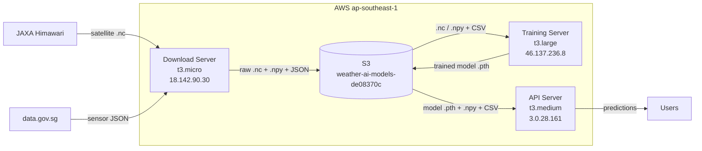
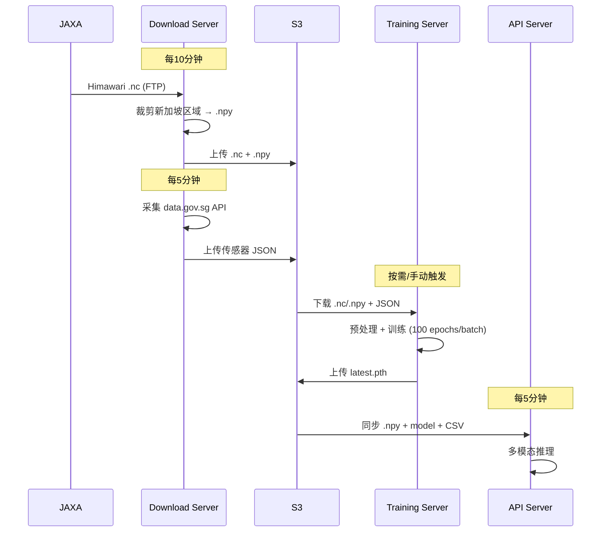

# Weather AI Server Infrastructure

> Last updated: 2026-02-14

## Architecture Overview



---

## Servers

### 1. Download Server — `18.142.90.30`

| Item | Value |
|------|-------|
| Instance | t3.micro (1 vCPU, 1GB RAM) |
| Disk | 8GB EBS |
| Hostname | ip-172-31-12-162 |
| IAM Role | weather-ai-download-role |
| Python | 3.10.12 (venv) |

**职责**: 实时下载 JAXA Himawari 卫星数据 + data.gov.sg 传感器数据，预处理后上传 S3。

**Systemd Service**:
```
weather-download.service  (Restart=always, RestartSec=30)
ExecStart: venv/bin/python3 download_manager.py
Log: ~/download_manager.log
```

**Crontab**:
```
* * * * * ~/push_download_log.sh >> /tmp/push_log.log 2>&1
```

**关键文件**:
| File | Purpose |
|------|---------|
| `download_manager.py` | 主调度器 — 实时下载 + 历史回填 + 政府数据 |
| `download_jaxa_data.py` | JAXA FTP 卫星数据下载 |
| `fetch_and_process_gov_data.py` | data.gov.sg API 数据采集+处理 |
| `cleanup_storage.py` | 本地磁盘清理 |
| `notification.py` | 邮件通知 |
| `bulk_download_to_s3_parallel.sh` | 批量并行下载脚本 |

**目录结构**:
```
~/weather-ai/
├── *.py, *.sh          # 脚本
├── .env                # 环境变量 (JAXA credentials, S3 config)
├── real_sensor_data.csv # 传感器数据
├── venv/               # Python 虚拟环境
├── Dockerfile          # 容器化配置
└── requirements.txt
```

---

### 2. Training Server — `46.137.236.8`

| Item | Value |
|------|-------|
| Instance | t3.large (2 vCPU, 8GB RAM) |
| Disk | 200GB EBS |
| Hostname | ip-172-31-20-248 |
| IAM Role | weather-ai-training-role |
| Python | 3.10.12 (venv) |

**职责**: 按天训练 WeatherFusionNet 模型（从 S3 下载数据 → 预处理 → 训练 → 上传模型到 S3）。

**Systemd Service**: 无（通过 crontab 触发 `training_scheduler.py`，或手动运行）

**Crontab**:
```
*/5 * * * * ~/push_training_log.sh >> /tmp/push_log.log 2>&1
```

**关键文件**:
| File | Purpose |
|------|---------|
| `training_scheduler.py` | 主调度器 — 按日期检查 S3 数据 → 下载 → 预处理 → 训练 → 上传 |
| `train_rolling_window.py` | 滚动窗口训练逻辑 |
| `weather_dataset.py` | PyTorch Dataset — 传感器+卫星数据对齐 |
| `weather_fusion_model.py` | WeatherFusionNet 模型定义 |
| `preprocess_images.py` | 原始 .nc → 裁剪新加坡区域 → .npy |
| `process_gov_data_from_s3.py` | 政府 JSON → real_sensor_data.csv |
| `sync_model_to_s3.sh` | 训练后上传模型到 S3 |
| `notification.py` | 训练成功/失败邮件通知 |

**目录结构**:
```
~/weather-ai/
├── *.py, *.sh            # 脚本
├── .env.production       # 生产环境变量
├── training_state.json   # 调度器状态 (last_processed_date, total_epochs 等)
├── training_metrics.json # 最近一批的训练指标
├── weather_fusion_model.pth  # 当前模型
├── satellite_data/       # 原始 .nc (训练时下载，训练后清理)
├── processed_data/       # 预处理 .npy (训练时生成，训练后清理)
├── govdata/              # 政府数据 JSON
├── model_backups/        # 模型备份 (每次训练前)
└── venv/
```

---

### 3. API Server — `3.0.28.161`

| Item | Value |
|------|-------|
| Instance | t3.medium (2 vCPU, 4GB RAM) |
| Disk | 20GB EBS |
| Hostname | ip-172-31-13-229 |
| IAM Role | weather-ai-api-role |
| Python | 3.10.12 (venv) |

**职责**: 提供天气预测 REST API + 前端静态文件服务。

**Systemd Service**:
```
weather-api.service  (Restart=always, RestartSec=10)
ExecStart: venv/bin/python3 api.py
Port: 8000
```

**Nginx**: 反向代理 80/443 → 8000

**Crontab**:
```
*/10 * * * * cd ~/weather-ai && ./fetch_latest_model.sh >> /var/log/model_sync.log 2>&1
```

**关键文件**:
| File | Purpose |
|------|---------|
| `api.py` | FastAPI 主服务 — 预测、搜索、监控、数据同步 |
| `predict.py` | 推理逻辑 — 集成预测 + Delaunay 三角化 + 云层分析 |
| `weather_fusion_model.py` | 模型定义 (与 training 共用) |
| `weather_dataset.py` | Dataset 工具函数 (latlon2xy) |
| `db.py` | SQLite 数据层 — 缓存、用户活动、预测记录 |
| `smart_query.py` | NLU 自然语言查询解析 |
| `geocoding.py` | 地理编码 (Nominatim + OneMap) |
| `monitor_api.py` | 监控仪表盘 API |
| `actual_collector.py` | 实际天气数据采集（对比预测准确性） |
| `perf-test.py` | 性能测试脚本 |

**目录结构**:
```
~/weather-ai/
├── *.py                    # 脚本
├── .env                    # 环境变量
├── weather_fusion_model.pth  # 从 S3 同步的最新模型
├── real_sensor_data.csv    # 传感器数据
├── processed_data/         # 预处理卫星 .npy (从 S3 同步)
├── satellite_data/         # 已弃用 (不再下载 raw .nc)
├── frontend/dist/          # React 前端构建产物
└── venv/
```

---

## S3 Bucket Structure

```
s3://weather-ai-models-de08370c/
├── satellite/{YYYYMMDD}/        # 原始卫星 .nc (~700MB/file, 144 files/day)
├── processed/satellite/{YYYYMMDD}/  # 预处理 .npy (~16KB/file)
├── govdata/                     # 政府数据 JSON (rainfall, temperature, humidity, pm25)
├── models/latest.pth            # 最新训练模型
├── state/training_state.json    # 训练进度状态
├── history/training_history.json # 训练历史记录
└── archived/                    # 已归档数据
```

---

## Data Flow



---

## SSH Access

```bash
# Download Server
ssh -i ~/.ssh/id_rsa ubuntu@18.142.90.30

# Training Server
ssh -i ~/.ssh/id_rsa ubuntu@46.137.236.8

# API Server
ssh -i ~/.ssh/id_rsa ubuntu@3.0.28.161
```
