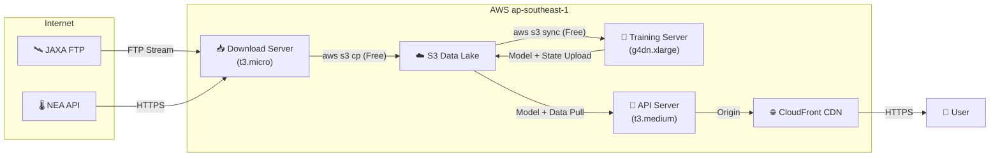
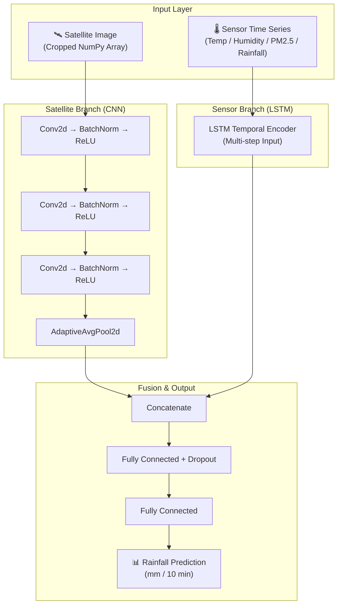

# Singapore Weather AI — Technology Stack Document

> **Version**: v0.8 &nbsp; | &nbsp; **Last Updated**: 2026-02-09 &nbsp; | &nbsp; **Region**: ap-southeast-1 (Singapore)

---

## Table of Contents

1. [Application Technology Stack](#1-application-technology-stack)
2. [AWS Infrastructure Requirements](#2-aws-infrastructure-requirements)
3. [Network Connectivity Requirements](#3-network-connectivity-requirements)
4. [Model Training Algorithm](#4-model-training-algorithm)
5. [Environment Setup & Configuration](#5-environment-setup--configuration)

---

## 1. Application Technology Stack

### 1.1 Programming Languages

| Language | Version | Purpose |
|:---|:---|:---|
| **Python** | ≥ 3.10 | Backend API, data processing, model training, automation scripts |
| **TypeScript** | ~5.9 | Frontend application, monitoring dashboard |
| **Bash** | 5.x | Deployment scripts, data download orchestration, Cron jobs |
| **HCL** | Terraform ≥ 1.0 | Infrastructure as Code (IaC) |

### 1.2 Backend Frameworks & Core Dependencies

| Library / Framework | Purpose |
|:---|:---|
| **FastAPI** + **Uvicorn** | High-concurrency REST API serving (100+ req/s) |
| **PyTorch** | Deep learning model training and inference |
| **Pandas** / **NumPy** / **SciPy** | Data processing, scientific computing, IDW spatial interpolation |
| **xarray** + **netCDF4** | Himawari-9 satellite NetCDF file parsing |
| **Boto3** | AWS SDK — S3 read/write, EC2 management |
| **Requests** | NEA government API data fetching |
| **Matplotlib** | Training metrics visualization, report chart generation |
| **tqdm** | Training progress bar |
| **google-generativeai** | Gemini API integration — Natural Language Understanding (NLU) smart query |

### 1.3 Frontend Frameworks & Core Dependencies

| Library / Framework | Version | Purpose |
|:---|:---|:---|
| **React** | 19.x | UI component framework |
| **Vite** | 6.x | Dev server & build tool |
| **React Router** | 7.x | SPA routing management |
| **Leaflet** + **React-Leaflet** | 1.9 / 5.0 | Interactive weather map |
| **Axios** | 1.13 | HTTP request client |

### 1.4 Testing Frameworks

| Layer | Tool | Purpose |
|:---|:---|:---|
| Backend unit tests | **pytest** + **httpx** | API endpoint tests, module tests |
| Frontend unit tests | **Vitest** + **Testing Library** | Component tests, coverage reports |
| Code quality | **ESLint** | TypeScript linting |

### 1.5 DevOps Toolchain

| Tool | Purpose |
|:---|:---|
| **Docker** / **Docker Compose** | Containerized deployment, local dev environment |
| **Terraform** (AWS Provider ~5.0) | Infrastructure automation |
| **Systemd** | API service daemon management |
| **rsync** / **scp** | Code deployment to EC2 |
| **Gmail SMTP** | Training status email notifications |

---

## 2. AWS Infrastructure Requirements

### 2.1 Compute Resources (EC2)

| Server Role | Instance Type | OS | Storage | Purpose |
|:---|:---|:---|:---|:---|
| **API Server** | `t3.medium` (2 vCPU / 4 GB) | Ubuntu 22.04 | 20 GB gp3 | FastAPI inference + React frontend hosting + monitoring dashboard |
| **Training Server** | `g4dn.xlarge` (4 vCPU / 16 GB / NVIDIA T4) | Ubuntu 22.04 | 200 GB gp3 | PyTorch model training (GPU-accelerated) |
| **Download Server** | `t3.micro` (2 vCPU / 1 GB) | Ubuntu 22.04 | 8 GB gp3 | JAXA FTP data download with streaming to S3 |

> [!IMPORTANT]
> The GPU instance (`g4dn.xlarge`) requires a pre-approved **"G and VT" vCPU quota** (defaults to 0). Request at least 4 vCPUs. **Spot Instances** are recommended to save 70–90% on costs.

### 2.2 Storage Services (S3)

| Bucket | Purpose | Access Mode |
|:---|:---|:---|
| `weather-ai-models-*` | Data lake — satellite data, model weights, training state, logs | Private, IAM role access |
| `weather-ai-frontend-*` | Frontend static asset hosting | Public read, static website hosting |

**S3 Directory Structure** (Data Lake):

```
weather-ai-models-de08370c/
├── models/                    # Trained models (.pth)
│   └── weather_fusion_model.pth
├── satellite/YYYYMMDD/        # Satellite NetCDF staging area
│   ├── NC_H09_*.nc
│   └── .complete              # Completion marker file
├── govdata/                   # NEA sensor JSON data
├── state/                     # Training state telemetry
│   └── training_state.json
├── history/                   # Historical training metrics
│   └── training_history.json
└── archived/                  # Archived raw satellite data
```

### 2.3 CDN (CloudFront)

| Configuration | Description |
|:---|:---|
| **Frontend Distribution** | S3 origin → HTTPS redirect → SPA 404 fallback to `/index.html` |
| **API Proxy** (optional) | `/api/*` behavior routing to EC2 backend, resolves Mixed Content issues |
| **Cache Policy** | Default TTL 3600s, Gzip compression enabled |

### 2.4 IAM Roles & Policies

| Role | Attached Policy | Bound Resource |
|:---|:---|:---|
| `weather-ai-training-role` | `AmazonS3FullAccess` (or custom read/write policy) | Training Server (EC2 Instance Profile) |
| `weather-ai-api-role` | `AmazonS3ReadOnlyAccess` | API Server (EC2 Instance Profile) |
| `weather-ai-download-role` | S3 `PutObject` + `ListBucket` | Download Server (EC2 Instance Profile) |

> [!TIP]
> In production, apply the principle of least privilege — replace `S3FullAccess` with a custom policy scoped to `weather-ai-models-*` resources only.

### 2.5 Other AWS Services

| Service | Purpose | Required? |
|:---|:---|:---|
| **Elastic IP (EIP)** | Fixed public IP for API Server, prevents IP changes on restart | Recommended |
| **Route 53** | DNS resolution (`api.example.com` → EC2) | Optional |
| **AWS Budgets** | Cost monitoring alerts (recommended $50/month budget) | Recommended |
| **Service Quotas** | GPU instance vCPU quota management | As needed |
| **EBS** | EC2 root volumes + Training Server 200 GB data volume (gp3) | Required |

> [!NOTE]
> The current architecture uses the **default VPC** and does not involve RDS or EKS. The database is a local SQLite on EC2; container orchestration is handled via Docker Compose. Upgrading to EKS would require additional VPC subnets, ALB, and ECR image repositories.

---

## 3. Network Connectivity Requirements

### 3.1 Security Group Rules (Inbound)

| Port | Protocol | Source | Purpose |
|:---|:---|:---|:---|
| **22** | TCP | Whitelisted IPs (`ssh_allowed_ips`) | SSH management access |
| **80** | TCP | `0.0.0.0/0` | HTTP access |
| **443** | TCP | `0.0.0.0/0` | HTTPS access |
| **8000** | TCP | `0.0.0.0/0` | FastAPI service port |

**Outbound**: All traffic allowed (`0.0.0.0/0`)

### 3.2 External Data Source Connections

| Direction | Protocol | Target | Purpose |
|:---|:---|:---|:---|
| Download Server → **JAXA FTP** | FTP (Port 21 + Passive) | `ftp.ptree.jaxa.jp` | Himawari-9 satellite data download |
| Download Server → **NEA API** | HTTPS (Port 443) | `api.data.gov.sg` | Real-time weather sensor data (Temp / Humidity / Rainfall / PM2.5) |
| API Server → **Gemini API** | HTTPS (Port 443) | `generativelanguage.googleapis.com` | NLU smart query |
| API Server → **Gmail SMTP** | TLS (Port 587) | `smtp.gmail.com` | Training status notification emails |

### 3.3 Internal AWS Data Flow



> [!IMPORTANT]
> **All AWS resources must be deployed in the same region (`ap-southeast-1`)** to ensure EC2 ↔ S3 data transfer is completely free. Cross-region transfer of 20 TB of satellite data could cost **$2,000+**.

### 3.4 FTP Connection Requirements

| Parameter | Value |
|:---|:---|
| **Server** | `ftp.ptree.jaxa.jp` |
| **Port** | 21 (control) + passive mode data ports |
| **Authentication** | Username / password (env vars `JAXA_USER` / `JAXA_PASS`) |
| **Protocol** | FTP (plaintext); security group outbound rules must allow FTP passive mode port range |
| **Concurrency** | Recommended `PARALLEL_JOBS=2` (t3.micro upper limit) |

---

## 4. Model Training Algorithm

### 4.1 Model Architecture — WeatherFusionNet

A **dual-branch fusion** deep learning architecture that jointly learns spatial features from satellite imagery and temporal features from ground sensor time series.



### 4.2 Training Strategy

| Parameter | Value | Description |
|:---|:---|:---|
| **Prediction Target** | Rainfall in the next 10 minutes (mm) | Regression task |
| **Data Split** | Train / Validation split | Temporal split |
| **Loss Function** | MSE Loss | Standard regression loss |
| **Optimizer** | Adam | Adaptive learning rate |
| **Epochs** | 100 (historical backfill) / 50+ (incremental updates) | Can reduce to 20–30 for historical batches |
| **Incremental Learning** | Checkpoint loading supported | Automatically resumes from previous training |
| **Early Stopping** | Implemented | Prevents overfitting |
| **Mixed Precision (AMP)** | Implemented | GPU training acceleration |
| **Learning Rate Scheduler** | Implemented | Dynamic learning rate adjustment |
| **GPU Auto-Detection** | `torch.cuda.is_available()` | Automatic CPU / GPU switching |

### 4.3 Evaluation Metrics

| Metric | Purpose |
|:---|:---|
| **MAE** (Mean Absolute Error) | Measures prediction deviation magnitude |
| **RMSE** (Root Mean Square Error) | Penalizes larger deviations more heavily |
| **Classification Accuracy** | Rain / No-Rain binary classification accuracy |

### 4.4 Data Processing Pipeline

1. **Satellite Preprocessing**: NetCDF → Spatial cropping (103.6°E–104.1°E, 1.15°N–1.50°N) → NumPy arrays
2. **Sensor Data Alignment**: NEA JSON → CSV conversion → Timestamp alignment (UTC/SGT) → 10-minute resampling
3. **Spatial Interpolation (Inference)**: Inverse Distance Weighting (IDW) — weighted average from the 3 nearest stations

### 4.5 Training Baseline Performance

| Data Date | Epochs | Best Val Loss | MAE | RMSE |
|:---|:---|:---|:---|:---|
| 2025-10-01 | 100 | 0.15799 | 0.11009 | 0.39749 |
| 2025-10-02 | 100 | — | 0.09871 | 0.52601 |

---

## 5. Environment Setup & Configuration

### 5.1 Development Environment Requirements

| Tool | Version | Installation |
|:---|:---|:---|
| Python | ≥ 3.10 | `brew install python@3.10` |
| Node.js | ≥ 18 LTS | `brew install node` |
| AWS CLI | v2 | `brew install awscli` |
| Terraform | ≥ 1.0 | `brew install terraform` |
| Docker / Docker Compose | Latest | Docker Desktop |

### 5.2 Backend Setup

```bash
# Clone the project
git clone https://github.com/goantigravity-bot/singapore-weather-ai.git weather-ai
cd weather-ai

# Create virtual environment
python3 -m venv venv
source venv/bin/activate

# Install dependencies (CPU inference)
pip install -r requirements.txt

# GPU training environment (additional step)
pip install torch torchvision --index-url https://download.pytorch.org/whl/cu118
```

### 5.3 Frontend Setup

```bash
cd frontend
npm install
npm run dev    # Development server
npm run build  # Production build
```

### 5.4 Environment Variables

| Variable | Purpose | Server |
|:---|:---|:---|
| `JAXA_USER` / `JAXA_PASS` | JAXA FTP login credentials | Download Server |
| `GEMINI_API_KEY` | Google Gemini API key | API Server |
| `SENDER_EMAIL` / `SENDER_PASSWORD` | Gmail SMTP notification sender | Training Server |
| `RECIPIENT_EMAIL` | Notification recipient | Training Server |
| `AWS_DEFAULT_REGION` | AWS region (ap-southeast-1) | All servers |

> [!CAUTION]
> In production, all sensitive credentials should be managed via **AWS Secrets Manager** or **EC2 Instance Profiles**. Never hardcode secrets in source code.

### 5.5 One-Click Infrastructure Deployment (Terraform)

```bash
cd terraform
cp terraform.tfvars.example terraform.tfvars
# Edit terraform.tfvars with your configuration

terraform init
terraform plan
terraform apply
```

Terraform will automatically provision the following resources:
- EC2 instance + EIP + Security Group + SSH Key Pair
- S3 bucket (frontend static hosting)
- CloudFront distribution (optional)
- Route 53 DNS records (optional)

### 5.6 Application Deployment

```bash
# Full deployment (backend + frontend + monitoring)
./deploy-all.sh --full

# Backend only
./deploy-all.sh --backend

# Frontend only
./deploy-all.sh --frontend
```

### 5.7 Cron Scheduled Tasks

| Frequency | Server | Script | Purpose |
|:---|:---|:---|:---|
| Every 10 minutes | API Server | `fetch_and_process_gov_data.py` | Sync latest NEA sensor data |
| Every 10 minutes | API Server | `fetch_latest_model.sh` | Pull latest model weights from S3 |
| Every minute | Download Server | `push_download_log.sh` | Push download logs to S3 for dashboard |
| Continuous | Training Server | `training_scheduler.py --continuous` | Batch training scheduler |
