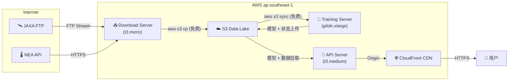
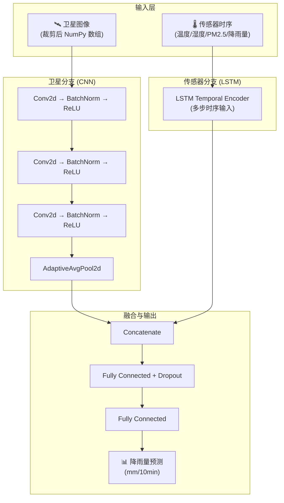

# Singapore Weather AI — 技术栈文档

> **版本**: v0.8 &nbsp; | &nbsp; **更新时间**: 2026-02-09 &nbsp; | &nbsp; **区域**: ap-southeast-1 (Singapore)

---

## 目录

1. [应用技术栈](#1-应用技术栈)
2. [AWS 基础设施需求](#2-aws-基础设施需求)
3. [网络连通性需求](#3-网络连通性需求)
4. [模型训练算法](#4-模型训练算法)
5. [环境搭建与配置](#5-环境搭建与配置)

---

## 1. 应用技术栈

### 1.1 编程语言

| 语言 | 版本 | 用途 |
|:---|:---|:---|
| **Python** | ≥ 3.10 | 后端 API、数据处理、模型训练、自动化脚本 |
| **TypeScript** | ~5.9 | 前端应用、监控仪表盘 |
| **Bash** | 5.x | 部署脚本、数据下载编排、Cron 任务 |
| **HCL** | Terraform ≥ 1.0 | 基础设施即代码 (IaC) |

### 1.2 后端框架与核心依赖

| 库 / 框架 | 用途 |
|:---|:---|
| **FastAPI** + **Uvicorn** | 高并发 REST API 服务 (100+ req/s) |
| **PyTorch** | 深度学习模型训练与推理 |
| **Pandas** / **NumPy** / **SciPy** | 数据处理、科学计算、IDW 空间插值 |
| **xarray** + **netCDF4** | Himawari-9 卫星 NetCDF 文件解析 |
| **Boto3** | AWS SDK — S3 读写、EC2 管理 |
| **Requests** | NEA 政府 API 数据获取 |
| **Matplotlib** | 训练指标可视化、报告图表生成 |
| **tqdm** | 训练进度条 |
| **google-generativeai** | Gemini API 集成 — 自然语言智能查询 (NLU) |

### 1.3 前端框架与核心依赖

| 库 / 框架 | 版本 | 用途 |
|:---|:---|:---|
| **React** | 19.x | UI 组件框架 |
| **Vite** | 6.x | 开发服务器 & 构建工具 |
| **React Router** | 7.x | SPA 路由管理 |
| **Leaflet** + **React-Leaflet** | 1.9 / 5.0 | 交互式天气地图 |
| **Axios** | 1.13 | HTTP 请求客户端 |

### 1.4 测试框架

| 层级 | 工具 | 用途 |
|:---|:---|:---|
| 后端单元测试 | **pytest** + **httpx** | API 端点测试、模块测试 |
| 前端单元测试 | **Vitest** + **Testing Library** | 组件测试、覆盖率报告 |
| 代码质量 | **ESLint** | TypeScript 代码规范检查 |

### 1.5 DevOps 工具链

| 工具 | 用途 |
|:---|:---|
| **Docker** / **Docker Compose** | 容器化部署、本地开发环境 |
| **Terraform** (AWS Provider ~5.0) | 基础设施自动化配置 |
| **Systemd** | API 服务守护进程管理 |
| **rsync** / **scp** | 代码部署到 EC2 |
| **Gmail SMTP** | 训练状态邮件通知 |

---

## 2. AWS 基础设施需求

### 2.1 计算资源 (EC2)

| 服务器角色 | 实例类型 | OS | 存储 | 用途 |
|:---|:---|:---|:---|:---|
| **API Server** | `t3.medium` (2 vCPU / 4 GB) | Ubuntu 22.04 | 20 GB gp3 | FastAPI 推理服务 + React 前端托管 + 监控仪表盘 |
| **Training Server** | `g4dn.xlarge` (4 vCPU / 16 GB / NVIDIA T4) | Ubuntu 22.04 | 200 GB gp3 | PyTorch 模型训练 (GPU 加速) |
| **Download Server** | `t3.micro` (2 vCPU / 1 GB) | Ubuntu 22.04 | 8 GB gp3 | JAXA FTP 数据下载并流式传输至 S3 |

> [!IMPORTANT]
> GPU 实例 (`g4dn.xlarge`) 需要预先申请 **"G and VT" vCPU 配额**（默认为 0）。建议申请至少 4 个 vCPU。推荐使用 **Spot Instance** 以节约 70-90% 费用。

### 2.2 存储服务 (S3)

| 存储桶 | 用途 | 访问模式 |
|:---|:---|:---|
| `weather-ai-models-*` | 数据湖 — 卫星数据、模型权重、训练状态、日志 | 私有，IAM 角色访问 |
| `weather-ai-frontend-*` | 前端静态资源托管 | 公有读，静态网站托管 |

**S3 目录结构** (数据湖):

```
weather-ai-models-de08370c/
├── models/                    # 训练模型 (.pth)
│   └── weather_fusion_model.pth
├── satellite/YYYYMMDD/        # 卫星 NetCDF 暂存区
│   ├── NC_H09_*.nc
│   └── .complete              # 完成标记文件
├── govdata/                   # NEA 传感器 JSON 数据
├── state/                     # 训练状态遥测
│   └── training_state.json
├── history/                   # 历史训练指标汇总
│   └── training_history.json
└── archived/                  # 已归档卫星原始数据
```

### 2.3 CDN (CloudFront)

| 配置项 | 说明 |
|:---|:---|
| **前端分发** | S3 源 → HTTPS 重定向 → SPA 404 回退 `/index.html` |
| **API 代理** (可选) | `/api/*` 行为路由至 EC2 后端，解决 Mixed Content 问题 |
| **缓存策略** | 默认 TTL 3600s，启用 Gzip 压缩 |

### 2.4 IAM 角色与策略

| 角色 | 附加策略 | 绑定资源 |
|:---|:---|:---|
| `weather-ai-training-role` | `AmazonS3FullAccess`（或自定义读写策略） | Training Server (EC2 Instance Profile) |
| `weather-ai-api-role` | `AmazonS3ReadOnlyAccess` | API Server (EC2 Instance Profile) |
| `weather-ai-download-role` | S3 `PutObject` + `ListBucket` | Download Server (EC2 Instance Profile) |

> [!TIP]
> 生产环境应使用最小权限原则，将 `S3FullAccess` 替换为仅限 `weather-ai-models-*` 资源的自定义策略。

### 2.5 其他 AWS 服务

| 服务 | 用途 | 是否必需 |
|:---|:---|:---|
| **Elastic IP (EIP)** | API Server 固定公网 IP，避免重启后 IP 变更 | 推荐 |
| **Route 53** | DNS 解析 (`api.example.com` → EC2) | 可选 |
| **AWS Budgets** | 成本监控告警（建议设置 $50/月限额） | 推荐 |
| **Service Quotas** | GPU 实例 vCPU 配额管理 | 视需求 |
| **EBS** | EC2 根卷 + Training Server 200 GB 数据卷 (gp3) | 必需 |

> [!NOTE]
> 当前架构使用 **默认 VPC**，暂不涉及 RDS、EKS。数据库使用 EC2 本地 SQLite，容器编排暂通过 Docker Compose 实现。如需升级至 EKS 部署，需额外配置 VPC 子网、ALB 及 ECR 镜像仓库。

---

## 3. 网络连通性需求

### 3.1 安全组规则 (Inbound)

| 端口 | 协议 | 来源 | 用途 |
|:---|:---|:---|:---|
| **22** | TCP | 白名单 IP (`ssh_allowed_ips`) | SSH 管理访问 |
| **80** | TCP | `0.0.0.0/0` | HTTP 访问 |
| **443** | TCP | `0.0.0.0/0` | HTTPS 访问 |
| **8000** | TCP | `0.0.0.0/0` | FastAPI 服务端口 |

**Outbound**: 全部允许 (`0.0.0.0/0`)

### 3.2 外部数据源连接

| 连接方向 | 协议 | 目标 | 用途 |
|:---|:---|:---|:---|
| Download Server → **JAXA FTP** | FTP (Port 21 + Passive) | `ftp.ptree.jaxa.jp` | Himawari-9 卫星数据下载 |
| Download Server → **NEA API** | HTTPS (Port 443) | `api.data.gov.sg` | 实时气象传感器数据 (温度/湿度/降雨量/PM2.5) |
| API Server → **Gemini API** | HTTPS (Port 443) | `generativelanguage.googleapis.com` | NLU 智能查询 |
| API Server → **Gmail SMTP** | TLS (Port 587) | `smtp.gmail.com` | 训练状态通知邮件 |

### 3.3 内部 AWS 数据流



> [!IMPORTANT]
> **所有 AWS 资源必须部署在同一区域 (`ap-southeast-1`)**，以确保 EC2 ↔ S3 数据传输完全免费。跨区域传输 20 TB 卫星数据的费用可高达 **$2,000+**。

### 3.4 FTP 连接要求

| 参数 | 值 |
|:---|:---|
| **服务器** | `ftp.ptree.jaxa.jp` |
| **端口** | 21 (控制) + 被动模式数据端口 |
| **认证** | 用户名/密码（环境变量 `JAXA_USER` / `JAXA_PASS`） |
| **协议** | FTP (纯文本)，需确保安全组出站规则允许 FTP 被动模式端口范围 |
| **并发** | 推荐 `PARALLEL_JOBS=2`（t3.micro 上限） |

---

## 4. 模型训练算法

### 4.1 模型架构 — WeatherFusionNet

采用 **双分支融合** 深度学习架构，将卫星图像空间特征与地面传感器时序特征进行联合学习。



### 4.2 训练策略

| 参数 | 值 | 说明 |
|:---|:---|:---|
| **预测目标** | 未来 10 分钟降雨量 (mm) | 回归任务 |
| **数据分割** | Train / Validation split | 按时间序列划分 |
| **损失函数** | MSE Loss | 回归任务标准损失 |
| **优化器** | Adam | 自适应学习率 |
| **Epoch 数** | 100 (历史回填) / 50+ (增量更新) | 历史可降至 20-30 |
| **增量学习** | 支持 Checkpoint 加载 | 自动继续上一轮训练 |
| **Early Stopping** | 已实现 | 防止过拟合 |
| **Mixed Precision (AMP)** | 已实现 | GPU 训练加速 |
| **Learning Rate Scheduler** | 已实现 | 动态调整学习率 |
| **GPU 自动检测** | `torch.cuda.is_available()` | 自动切换 CPU/GPU |

### 4.3 评估指标

| 指标 | 用途 |
|:---|:---|
| **MAE** (Mean Absolute Error) | 预测偏差幅度 |
| **RMSE** (Root Mean Square Error) | 对大偏差的惩罚评估 |
| **Classification Accuracy** | 有雨/无雨 二分类准确率 |

### 4.4 数据处理流程

1. **卫星数据预处理**: NetCDF → 空间裁剪 (103.6°E–104.1°E, 1.15°N–1.50°N) → NumPy 数组
2. **传感器数据对齐**: NEA JSON → CSV 转换 → 时间戳对齐 (UTC/SGT) → 10 分钟重采样
3. **空间插值 (推理)**: 反距离加权 (IDW) — 基于最近 3 个站点的加权平均

### 4.5 训练基线性能

| 数据日期 | Epochs | Best Val Loss | MAE | RMSE |
|:---|:---|:---|:---|:---|
| 2025-10-01 | 100 | 0.15799 | 0.11009 | 0.39749 |
| 2025-10-02 | 100 | — | 0.09871 | 0.52601 |

---

## 5. 环境搭建与配置

### 5.1 开发环境要求

| 工具 | 版本 | 安装方式 |
|:---|:---|:---|
| Python | ≥ 3.10 | `brew install python@3.10` |
| Node.js | ≥ 18 LTS | `brew install node` |
| AWS CLI | v2 | `brew install awscli` |
| Terraform | ≥ 1.0 | `brew install terraform` |
| Docker / Docker Compose | Latest | Docker Desktop |

### 5.2 后端环境搭建

```bash
# 克隆项目
git clone https://github.com/goantigravity-bot/singapore-weather-ai.git weather-ai
cd weather-ai

# 创建虚拟环境
python3 -m venv venv
source venv/bin/activate

# 安装依赖（CPU 推理）
pip install -r requirements.txt

# GPU 训练环境（额外步骤）
pip install torch torchvision --index-url https://download.pytorch.org/whl/cu118
```

### 5.3 前端环境搭建

```bash
cd frontend
npm install
npm run dev    # 开发服务器
npm run build  # 生产构建
```

### 5.4 环境变量配置

| 变量名 | 用途 | 所在服务器 |
|:---|:---|:---|
| `JAXA_USER` / `JAXA_PASS` | JAXA FTP 登录凭证 | Download Server |
| `GEMINI_API_KEY` | Google Gemini API 密钥 | API Server |
| `SENDER_EMAIL` / `SENDER_PASSWORD` | Gmail SMTP 通知邮箱 | Training Server |
| `RECIPIENT_EMAIL` | 通知接收邮箱 | Training Server |
| `AWS_DEFAULT_REGION` | AWS 区域 (ap-southeast-1) | 全部服务器 |

> [!CAUTION]
> 生产环境中，所有敏感信息应通过 **AWS Secrets Manager** 或 **EC2 Instance Profile** 管理，禁止在代码中硬编码。

### 5.5 基础设施一键部署 (Terraform)

```bash
cd terraform
cp terraform.tfvars.example terraform.tfvars
# 编辑 terraform.tfvars 配置参数

terraform init
terraform plan
terraform apply
```

Terraform 将自动创建以下资源：
- EC2 实例 + EIP + 安全组 + SSH 密钥对
- S3 存储桶 (前端静态托管)
- CloudFront 分发 (可选)
- Route 53 DNS 记录 (可选)

### 5.6 应用部署

```bash
# 一键部署（后端 + 前端 + 监控）
./deploy-all.sh --full

# 仅部署后端
./deploy-all.sh --backend

# 仅部署前端
./deploy-all.sh --frontend
```

### 5.7 Cron 定时任务

| 频率 | 服务器 | 脚本 | 用途 |
|:---|:---|:---|:---|
| 每 10 分钟 | API Server | `fetch_and_process_gov_data.py` | 同步最新 NEA 传感器数据 |
| 每 10 分钟 | API Server | `fetch_latest_model.sh` | 从 S3 拉取最新模型权重 |
| 每分钟 | Download Server | `push_download_log.sh` | 推送下载日志至 S3 供仪表盘使用 |
| 持续运行 | Training Server | `training_scheduler.py --continuous` | 批量训练调度器 |
