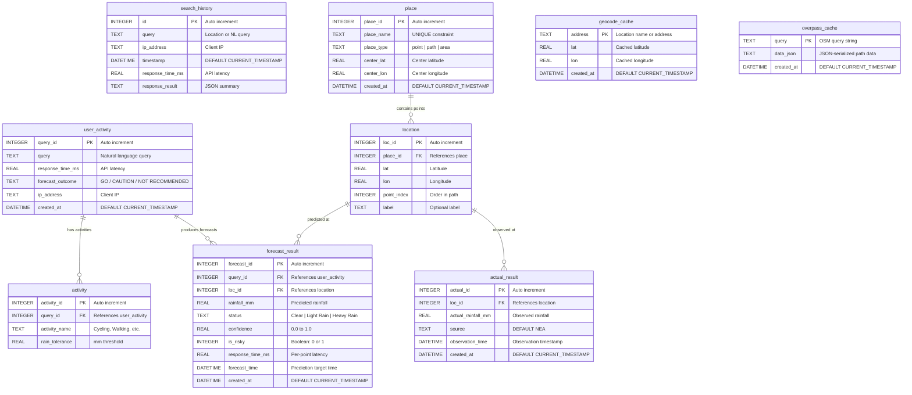
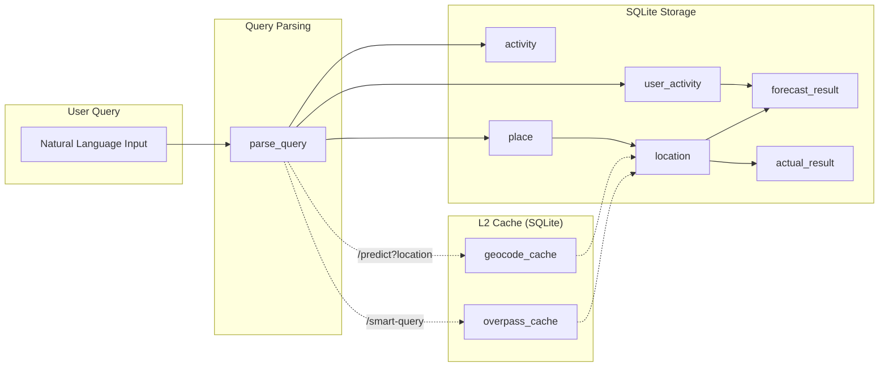

# Data Storage Schema — ER Diagram

**Generated**: 2026-02-13 | **Database**: SQLite (weather.db) | **Module**: `services/api/db.py`

This diagram covers the 9-table structured data storage schema used by the Weather AI platform to track user queries, forecast predictions, actual weather outcomes, and cross-worker shared caches.

## Entity-Relationship Diagram

## Table Descriptions

| Table | Purpose | Key Relationships |
|-------|---------|-------------------|
| `search_history` | Legacy table — raw search logging for popular searches aggregation | Standalone |
| `user_activity` | Structured query record — stores each user query with outcome | → activity, → forecast_result |
| `place` | Geographic entity — a named point, path, or area (deduplicated) | → location |
| `location` | Individual coordinate point belonging to a place | → forecast_result, → actual_result |
| `activity` | Detected outdoor activity with rain tolerance threshold | ← user_activity |
| `forecast_result` | AI prediction result per query per location point | ← user_activity, ← location |
| `actual_result` | Real-world observed rainfall from NEA for accuracy tracking | ← location |
| `geocode_cache` | L2 shared cache — Nominatim geocoding results (cross-worker, persistent) | Standalone |
| `overpass_cache` | L2 shared cache — OSM path data as JSON (cross-worker, persistent) | Standalone |

## Indexes

| Index | Table | Column | Purpose |
|-------|-------|--------|---------|
| `idx_location_place` | location | place_id | Fast lookup of points within a place |
| `idx_forecast_query` | forecast_result | query_id | All forecasts for a query |
| `idx_forecast_loc` | forecast_result | loc_id | Forecasts at a specific location |
| `idx_actual_loc` | actual_result | loc_id | Actuals at a specific location |
| `idx_actual_time` | actual_result | observation_time | Time-range queries on observations |

## Data Flow

