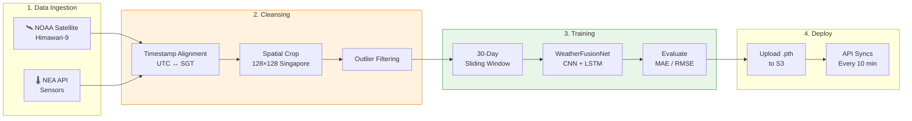

# Singapore Weather AI — Model Tuning, Data Cleansing & Pipeline

> **Version**: 1.0 &nbsp; | &nbsp; **Consolidated**: 2026-02-16

---

## 1. Training Pipeline Overview



---

## 2. Data Sources

### 2.1 Satellite Data

#### 数据源演变

| 阶段 | 数据源 | 格式 | 问题 | 时间 |
|------|--------|------|------|------|
| v1 | **JAXA FTP** (`ftp.ptree.jaxa.jp`) | NC 全盘 ~700MB | 跨洋下载慢、FTP 连接不稳定、需 JAXA 账号 | 2025-10 ~ 2026-02 |
| v2 | **NOAA ISatSS** (`noaa-himawari9/AHI-L2-FLDK-ISatSS/`) | NC L2 ~3MB | S3 同区域快，但 NC 文件体积大（10.1TB 存储费 $53/月） | 2026-02 |
| **v3** | **AWS Open Data L1b** (`noaa-himawari8/9/AHI-L1b-FLDK/`) | HSD .bz2 + satpy | ✅ 仅下 Segment S05，3 通道，6KB/文件 | **2026-02-17 ~** |

#### 当前方案（v3）对比

| Property | v1/v2 (已弃用) | **v3 (当前)** |
|----------|------------|---------------|
| Source | JAXA FTP / NOAA ISatSS | **AWS Open Data L1b HSD** |
| Bands | C13 单通道 | **B08 (水汽) + B11 (云相态) + B13 (红外)** |
| Resolution | 128×128 crop | **41×37 原始分辨率** |
| Frequency | 10 min | 10 min |
| Format | .nc (~3MB) → .npy (~64KB) | **.bz2 → satpy → .npy (~6KB)** |
| Segment | 全盘 | **S05 only (Singapore)** |
| 处理流程 | netCDF4 crop | **satpy + get_lonlats 像素切片** |
| 模型输入 | crop 32×32 patch per station | **全图 41×37 + coord 定位** |

> 详见 [data-source-progress.md](file:///Users/jinhui/development/tools/claude-skill/docs/data-source-progress.md) 和 [architecture-decisions.md](file:///Users/jinhui/development/tools/claude-skill/docs/architecture-decisions.md)

### 2.2 NEA Government Sensor Data

| API Endpoint | Data Type | Frequency |
|---|---|---|
| `/environment/rainfall` | Rainfall (mm) | 5 min |
| `/environment/air-temperature` | Temperature (°C) | 1 min |
| `/environment/relative-humidity` | Humidity (%) | 1 min |
| `/environment/pm25` | PM2.5 (μg/m³) | 1 hour |

### 2.3 Sensor CSV Schema (`real_sensor_data.csv`)

| Column | Type | Description |
|---|---|---|
| `timestamp` | datetime | Observation time |
| `sensor_id` | string | Station ID (e.g. "S50") |
| `temperature` | float | Celsius |
| `humidity` | float | Percent |
| `rainfall` | float | mm (cumulative) |
| `pm25` | float | μg/m³ |
| `wind_speed` | float | km/h |

---

## 3. Data Cleansing & Alignment

### 3.1 Satellite Data Processing

```
旧: Raw .nc → netCDF4 extract TBB → spatial crop (128×128) → normalize → .npy
新: HSD .bz2 → satpy 解析 → get_lonlats 像素切片 (41×37) → 3× .npy → S3
```

**Key considerations**:

| Issue | Solution |
|---|---|
| Himawari-8 vs 9 bucket 切换 | 2022 年前用 H8, 之后 H9 |
| satpy resample 全盘超时 | 改用 `get_lonlats()` + 直接数组切片 |
| boto3 并发 client 线程安全 | 主线程预创建 client 池 |
| 8 workers OOM (8GB 服务器) | 停旧服务后恢复 8 workers |
| OpenMP 冲突 (torch + satpy) | `KMP_DUPLICATE_LIB_OK=TRUE` |

### 3.2 Timestamp Alignment Strategy

| Source | Native Frequency | Alignment |
|---|---|---|
| Satellite | 10-min UTC | Resample to 10-min intervals |
| NEA sensors | 1-5 min SGT | Resample to 10-min, convert to UTC |

**Time zone**: 卫星文件名 = **UTC**，传感器 CSV = **SGT (UTC+8)**。`prepare_station_data.py` 查找时减 8 小时。

### 3.3 Missing Data Handling

| Pattern | Cause | Mitigation |
|---|---|---|
| Overnight sensor gaps | NEA API returns sparse nighttime data | Pad with nearest available value |
| Incomplete daily .npy | Download interrupted mid-day | No `.complete` marker → re-download whole day |
| S3 partial preprocessed | Only 12/144 .npy files (narrow window) | Delete incomplete .npy, force full re-preprocess |

---

## 4. Model Architecture — WeatherFusionNet

### 4.1 Dual-Branch Fusion

| Branch | Architecture | Input | Output |
|---|---|---|---|
| **Satellite** | 3× Conv2d + BatchNorm + ReLU + AdaptiveAvgPool | `(B, 3, 41, 37)` | `(B, 128)` |
| **Sensor** | LSTM(in=7, hidden=128) + FC | `(B, 6, 7)` | `(B, 64)` |
| **Fusion** | FC(198→64) + ReLU + Dropout(0.2) + FC(64→1) | `(B, 198)` | `(B, 1)` → rainfall mm |

### 4.2 Training Configuration

| Parameter | Value | Notes |
|---|---|---|
| Target | 10-min rainfall (mm) | Regression task |
| Loss | MSE | Standard regression loss |
| Optimizer | Adam | Adaptive learning rate |
| Initial Epochs | 30 (from scratch) | First training |
| Incremental Epochs | 5 (fine-tune) | Daily retraining |
| Early Stopping | Patience=10 | Stop if val loss plateaus |
| Mixed Precision (AMP) | ✅ Enabled | GPU acceleration |
| LR Scheduler | ✅ Enabled | Dynamic adjustment |
| Batch Size | 4 | |

### 4.3 Incremental Learning

```python
if os.path.exists("weather_fusion_model.pth"):
    # Fine-tune mode: load existing, train 5 epochs
    model.load_state_dict(torch.load(MODEL_SAVE_PATH))
    EPOCHS = EPOCHS_INCREMENTAL  # 5
else:
    # Full training: 30 epochs from scratch
    EPOCHS = EPOCHS_INITIAL  # 30
```

> [!WARNING]
> **Catastrophic forgetting risk**: Model may lose old patterns during incremental learning. Recommend full retraining once per month.

---

## 5. Training Optimization

### 5.1 Sliding Window

30-day window limits training data volume, keeping training time stable regardless of accumulated data size.

| Period | Without Window | With 30-Day Window |
|---|---|---|
| First month | 5-10 min | 5-10 min |
| 3 months | 2-3 hours | 5-10 min |
| 6 months | 5-7 hours | 5-10 min |

**Trade-off**: Fast training, focuses on recent weather patterns. May miss long-term seasonal signals (acceptable for tropical Singapore).

### 5.2 Performance Benchmarks

| Scenario | Before | After | Improvement |
|---|---|---|---|
| Initial training | 45-60 min | 15-20 min | 3× |
| Daily incremental | 45-60 min | 5-10 min | 6-8× |
| After 3 months | 5-7 hours | 5-10 min | 30-84× |

### 5.3 Training Scheduler (`training_scheduler.py`)

Day-by-day batch training with:
- S3 data readiness check (`.complete` marker)
- Download → Preprocess → Train → Sync workflow
- Real-time state sync to S3 for monitoring dashboard
- Auto-retry on failure
- Email notification on completion/failure

## 6. Model Iteration Experiments

> 共执行 6 轮优化实验 | 设备：Mac (CPU) + EC2 g4dn.xlarge (GPU)

### 6.1 Training Data Volume Evolution

#### 为什么需要更多数据？

| 阶段 | 数据量 | 时间跨度 | 问题 / 动机 |
|------|--------|----------|-------------|
| 初始 | ~3 个月 | 2025-10 ~ 2026-01 | 快速验证模型可行性，但只覆盖东北季风季 |
| 扩展到 1 年 | ~12 个月 | 2024-02 ~ 2026-02 | 覆盖全年季节（东北季风 + 西南季风 + 季风间期），但罕见强降雨事件样本不足 |
| 扩展到 2 年 | ~24 个月 | 2023-01 ~ 2026-02 | 捕捉年际变化（如 ENSO 影响），增加极端天气样本 |
| **扩展到 6 年** | **~72 个月** | **2020-01 ~ 2026-02** | ✅ 覆盖完整 ENSO 周期、多次强降雨事件、Himawari-8→9 卫星切换 |

#### 数据量对模型的影响

```
3 个月:  样本少 → 模型过拟合 → 对未见过的天气模式泛化差
1 年:    覆盖季节性 → 但 La Niña/El Niño 年的降雨模式差异大
2 年:    开始捕捉年际变化 → 但 5.0mm 暴雨仍然稀缺（占比 ~2%）
6 年:    ✅ ENSO 完整周期 (~3-7 年) → 暴雨样本数 ×6 → 模型更鲁棒
```

> **关键洞察**: 新加坡降雨受 ENSO 和 MJO 影响显著。仅 1 年数据可能只覆盖 La Niña 干旱期或 El Niño 多雨期，模型在另一种气候态下表现会大幅下降。6 年数据确保两种气候态都被学到。

#### R1-R4 实验时的数据（1 年）

| Item | Value |
|------|-------|
| Satellite | 2,384 frames Himawari-9 Band 13 (128×128 IR TBB) |
| Sensor | 755,550 rows (69 stations, 401 days × rain ±30min window) |
| Time span | 2024-02-15 ~ 2026-02-04 |
| Samples | 395,561 (26.5% rain / 73.5% dry) |
| Mixed moments | 93.6% — same timestamp has ~16 raining + ~43 dry stations |

#### 下一轮实验（6 年 × 3 通道）

| Item | 预估值 |
|------|--------|
| Satellite | ~970K frames × 3 bands = ~2.9M 文件 |
| Sensor | ~4.5M rows (69 stations × 6 年) |
| Time span | 2020-01-01 ~ 2026-02-16 |
| 预估 Samples | ~2.4M (×6 当前) |

### 6.2 Iteration Results (0.1mm threshold)

| Metric | Baseline | R1: +Attention | R2: +DeepCNN | R3: +Residual | **R4: Patch** ✅ |
|--------|----------|----------------|-------------|---------------|--------------|
| **Val Loss** | 1.258 | 0.800 | 0.859 | 1.013 | **0.980** |
| **MAE (mm)** | 0.431 | 0.414 | 0.446 | 0.544 | **0.406** ✅ |
| **RMSE (mm)** | 1.205 | 1.111 | **1.076** | 1.115 | 1.096 |
| **Precision** | 34.9% | 35.3% | 33.9% | 31.1% | **39.2%** ✅ |
| **Recall** | 97.7% | **99.6%** | 99.2% | 100.0% | 97.0% |
| **F1** | 51.5% | 52.1% | 50.5% | 47.4% | **55.8%** ✅ |
| **TN** | 109 | 107 | 78 | 5 | **192** ✅ |
| FP | 477 | 479 | 508 | 581 | **394** ✅ |
| Training time | 510s | 538s | 665s | 2063s | **88s** ✅ |
| Parameters | 122,657 | 122,722 | 352,930 | 174,130 | 122,850 |

---

### 6.3 Each Round Details

#### Baseline: Original WeatherFusionNet

```
SatelliteEncoder: Conv(1→16) → Conv(16→32) → Conv(32→64) → GAP → FC(64→128)
SensorEncoder:    LSTM(7→128) → FC(128→64)
Fusion:           Concat(192) → FC(192→64) → Dropout(0.2) → FC(64→1)
```

GAP treats all spatial positions equally — cloud noise from edges causes high FP (477).

#### R1: Spatial Attention ✅

Added `SpatialAttention` (1×1 Conv + Sigmoid) to replace `AdaptiveAvgPool2d`. Model learns to focus on cloudy regions.

```python
class SpatialAttention(nn.Module):
    def __init__(self, in_channels):
        self.attn = nn.Sequential(nn.Conv2d(in_channels, 1, 1), nn.Sigmoid())
    def forward(self, x):
        return (x * self.attn(x)).mean(dim=[2, 3])
```

- Val Loss: 1.258 → **0.800** (-36%)
- Heavy rain prediction range: 7.1mm → **12.9mm**

#### R2: Deeper CNN (3→5 layers) ❌

Deepened CNN from 3 layers (16→32→64) to 5 layers (16→32→64→128→128). Attention channel 64→128.

- RMSE slightly improved (1.076), but Precision dropped (33.9%)
- Val Loss oscillated up to **2.75** (extremely unstable)
- **Conclusion: 2,384 samples cannot support 352K-parameter deep network**

#### R3: Residual Blocks ❌

Replaced Conv+BN+ReLU with ResidualBlock (dual Conv + skip connection).

- TN dropped to **5** — model predicts nearly everything as rain
- Training time 2063s (3.8× slower than R1)
- **Conclusion: 3-layer CNN too shallow for gradient vanishing; Residual adds no value**

#### R4: Local Patch + Coordinate Embedding ✅ Best

**Core change**: Instead of full 128×128 satellite image, crop **32×32 patch** (~14km) centered on each station's pixel coordinate. Add 2D normalized coordinates to fusion layer.

```
Each sample:
├── Satellite: 32×32 patch (cropped from 128×128 full image)
├── Sensor: 7-dim time series (temp/rain/humidity/PM2.5/wind/wind_sin/wind_cos)
├── Coordinates: 2-dim normalized position (px/128, py/128)
└── Label: next 10-min rainfall (mm)
```

**Why it works**: Same timestamp, 60 stations crop different patches → natural rain/dry contrastive samples. Model sees only "the cloud directly above this station".

**Modified files**: `weather_dataset.py` (lat/lon→pixel+crop), `weather_fusion_model.py` (192→194 dim), `train_direct.py`, `evaluate.py`

#### Failed Experiments

| Experiment | Base | Change | Precision | Conclusion |
|---|---|---|---|---|
| R5: +Dropout | R4 | Dropout2d(0.2) in each CNN layer | 34.0% ❌ | 32×32 too small, dropout drops critical texture |
| R5b: 48×48 Patch | R4 | PATCH_SIZE 32→48 | 34.3% ❌ | Larger patch introduces noise |

---

### 6.4 Rain Threshold Evolution

#### 阶段 1: 0.1mm — 初始基线

最初使用气象学标准 0.1mm/10min 定义"降雨"。

| 指标 | 值 | 问题 |
|------|-----|------|
| Rain 比例 | 30.3% | 毛毛雨也算降雨，样本偏多 |
| F1 | 46.6% | Precision 极低 |
| FP | 477 | **假阳性泛滥** — 模型把干天预测为雨 |

**结论**: 0.1mm 太敏感，微量凝露也触发，对用户无实际意义。

#### 阶段 2: 5.0mm — 尝试后放弃

直接跳到 5.0mm/10min（中到大雨），但训练数据严重不足。

| 指标 | 0.1mm | 5.0mm | 问题 |
|------|-------|-------|------|
| Rain 比例 | 30.3% | **2.0%** | 正样本太少 |
| F1 | 46.6% | **35.7%** | 严重下降 |

**结论**: 新加坡大雨占比仅 2%，样本严重不平衡，模型无法学习。需要寻找中间值。

#### 阶段 3: 1.0mm — 最终选择 ✅

回退到 1.0mm/10min ≈ 用户能感知到需要带伞的雨量。

| 指标 | 0.1mm | 5.0mm | **1.0mm** |
|------|-------|-------|----------|
| Rain 比例 | 30.3% | 2.0% | **13.0%** |
| Precision | 34.9% | — | **61.8%** |
| Recall | 97.7% | — | 61.3% |
| **F1** | 46.6% | 35.7% | **61.5%** ✅ |
| FP | 477 | — | **42** |

**结论**: Precision/Recall 平衡最佳，误报减少 91%。

#### 最终决策

> **选择 1.0mm** — 0.1mm 太敏感，5.0mm 样本不足，1.0mm 兼顾实用性和模型可学性。

**1.0mm threshold comparison** (all models using 32×32 patch):

| Model | Precision | Recall | **F1** | MAE | FP | Time | Params |
|---|---|---|---|---|---|---|---|
| Baseline | 62.2% | 50.5% | 55.7% | 0.517 | 34 | 79s | 123K |
| R1: +Attention | 57.7% | 57.7% | 57.7% | 0.494 | 47 | 80s | 123K |
| R2: +DeepCNN | 57.7% | 54.1% | 55.8% | 0.532 | 44 | 120s | 353K |
| R3: +Residual | 48.6% | 62.2% | 54.5% | 0.597 | 73 | 209s | 211K |
| **R4: Patch+Coord** | **61.8%** | **61.3%** | **61.5%** ✅ | **0.498** | **42** | **80s** | 123K |

### 6.5 Conclusion

**R4 (Local Patch + Coordinate Embedding) is the current best model** — highest F1 at both 0.1mm and 1.0mm thresholds, fastest training (88s), smallest parameter count (123K).

---

## 7. Next Steps & Improvement Directions

### 7.1 Architecture Improvements

| Priority | Improvement | Expected Effect |
|---|---|---|
| 🥇 | **LR Scheduler** (Cosine / Step) | Fine-grained late-stage training |
| 🥈 | **Multi-frame temporal patches** (consecutive satellite frames) | Predict cloud arrival time |
| 🥉 | **Coordinate-guided attention** (full image + coord-conditioned attention) | See approaching clouds from distance |

### 7.2 Data & Training Strategy

| Area | Current | Suggested |
|---|---|---|
| Data Volume | 30-day sliding window | Extend to 60-90 days |
| Feature Engineering | Basic sat + sensor | Add temporal features (hour, day-of-week), lag features |
| Ensemble | Single model | RF + NN + XGBoost voting |
| Loss Function | MSE | Weighted loss: higher weight for heavy rain |
| Validation | Random split | Time-series cross-validation |
| Rain-Day Strategy | Equal sampling | Weighted sampling: prioritize rainy-day data |
| Spatial Modeling | IDW interpolation | GNN for inter-station relationships |

