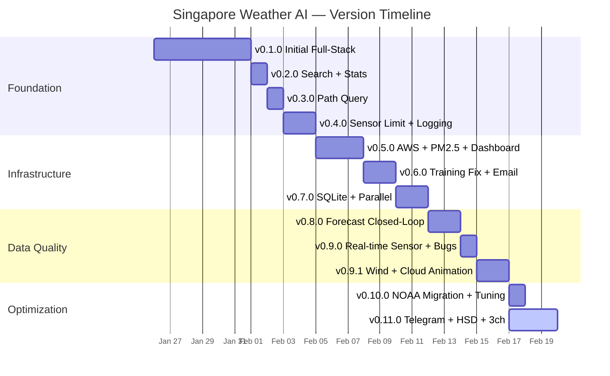
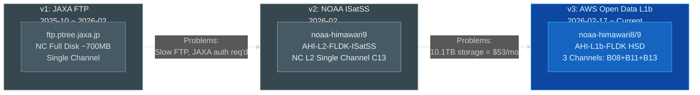
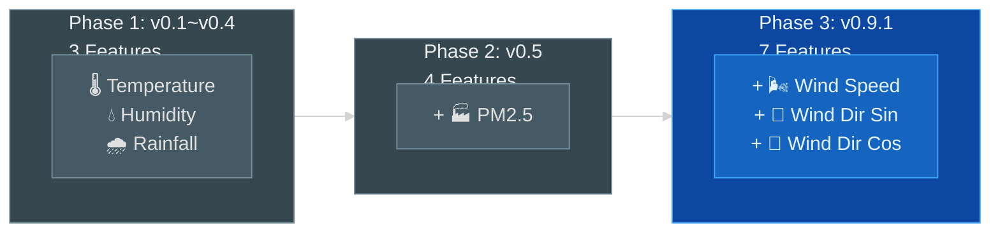
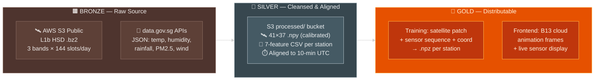
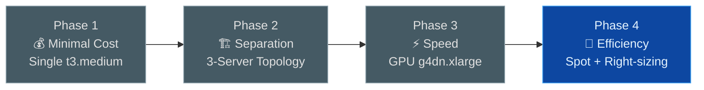
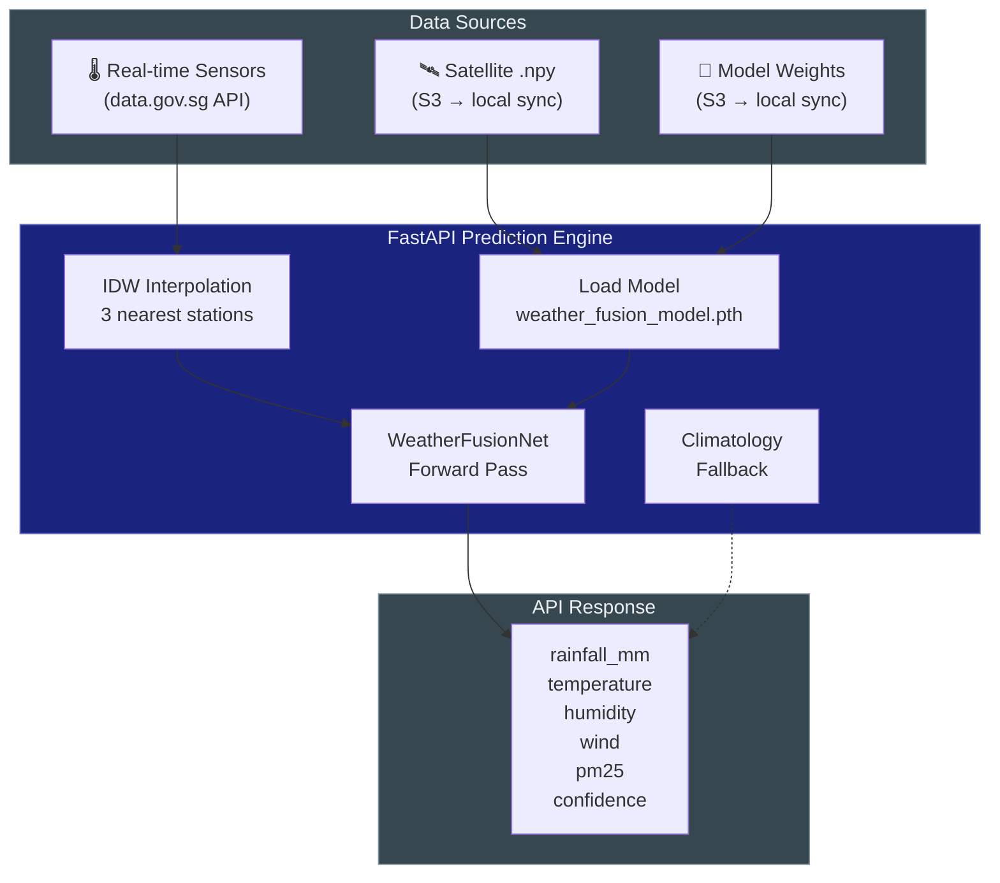

# Singapore Weather AI — Product Data Preparation Report

> **Version**: 1.0 &nbsp; | &nbsp; **Date**: 2026-02-19 &nbsp; | &nbsp; **Status**: 3-Channel Download In Progress (56.9%)

---

## Table of Contents

1. [Product Vision & Evolution](#1-product-vision--evolution)
2. [Satellite Data Source Evolution](#2-satellite-data-source-evolution)
3. [Sensor Data — Progressive Feature Expansion](#3-sensor-data--progressive-feature-expansion)
4. [Data Cleansing & Preprocessing](#4-data-cleansing--preprocessing)
5. [Training Strategy & Singapore Weather Characteristics](#5-training-strategy--singapore-weather-characteristics)
6. [Infrastructure Selection — Cost vs Speed vs Efficiency](#6-infrastructure-selection--cost-vs-speed-vs-efficiency)
7. [Dashboard & API Data Availability](#7-dashboard--api-data-availability)
8. [Monitoring & Operations Evolution](#8-monitoring--operations-evolution)
9. [Bug Registry & Lessons Learned](#9-bug-registry--lessons-learned)
10. [Continuous Improvement Roadmap](#10-continuous-improvement-roadmap)
11. [Source Code File Change Tracker](#11-source-code-file-change-tracker)
12. [Annex A: Abbreviations & Glossary](#annex-a-abbreviations--glossary)

---

## 1. Product Vision & Evolution

### 1.1 Initial Idea

Build an AI-powered weather prediction system for **Singapore** that combines **satellite imagery** with **ground sensor data** to provide **10-minute ahead rainfall forecasting** at any GPS coordinate.

### 1.2 Version Timeline



| Version | Date | Milestone |
|---------|------|-----------|
| v0.1.0 | 2026-01-26 | Initial full-stack: React + FastAPI, single predict API |
| v0.2.0 | 2026-02-01 | Popular search + statistics + mobile responsive |
| v0.3.0 | 2026-02-02 | Landmark path weather query |
| v0.4.0 | 2026-02-03 | Sensor 10km radius limit + `print` → `logging` refactor |
| v0.5.0 | 2026-02-05 | AWS deployment, CloudFront proxy, PM2.5 integration, monitor dashboard |
| v0.6.0 | 2026-02-08 | Training pipeline 7-bug fix, Vitest, multi-recipient email |
| v0.7.0 | 2026-02-10 | SQLite cache layer + ThreadPool parallel inference |
| v0.8.0 | 2026-02-12 | Forecast vs Actual closed-loop (SQLite schema) |
| v0.9.0 | 2026-02-14 | Real-time sensor fetch, WeightedRandomSampler, data pipeline bug fixes |
| v0.9.1 | 2026-02-15 | Wind field particle animation + satellite cloud overlay |
| v0.10.0 | 2026-02-17 | NOAA data source migration + model tuning experiments |
| **v0.11.0** | **2026-02-17** | **Telegram Bot, GCC Terraform, HSD parser (10x perf), 3-channel download** |

> Source: [version.html](reference/version.html)

---

## 2. Satellite Data Source Evolution

### 2.1 Three Generations of Data Sources



| Aspect | v1: JAXA FTP | v2: NOAA ISatSS | **v3: AWS Open Data L1b** |
|--------|-------------|-----------------|---------------------------|
| **Source** | `ftp://ftp.ptree.jaxa.jp` | `s3://noaa-himawari9/AHI-L2-FLDK-ISatSS/` | `s3://noaa-himawari8/9/AHI-L1b-FLDK/` |
| **Format** | NetCDF Full Disk (~700MB) | NetCDF L2 tile (~3MB) | HSD .bz2 segment (~30KB) |
| **Channels** | C13 (IR) — **single channel** | C13 (IR) — **single channel** | **B08 + B11 + B13 — 3 channels** |
| **Output** | 128×128 .npy (~64KB) | 128×128 .npy (~64KB) | **41×37 .npy (~6KB) × 3** |
| **Auth** | JAXA account required | No auth (AWS unsigned) | No auth (AWS unsigned) |
| **Speed** | ~53 files/min (FTP bottleneck) | Fast (same region S3) | **~237 files/min** |
| **Storage** | 10.1TB raw NC on S3 ($53/mo) | ~2.5GB processed | **~6GB total (~970K files)** |
| **Script** | `download_jaxa_data.py` | `noaa_satellite.py` | `download_aws_satellite.py` |

#### v1: JAXA FTP — [download_jaxa_data.py](file:///Users/jinhui/development/tools/claude-skill/services/download/download_jaxa_data.py)

The first generation downloaded full-disk NetCDF files from JAXA FTP over TLS. Each file was ~700MB containing all of Japan's satellite coverage.

```python
# JAXA FTP download using curl with explicit TLS
cmd = [
    "curl", "-s", "--ftp-ssl", "-l",
    "--user", f"{JAXA_USER}:{JAXA_PASS}",
    f"ftp://ftp.ptree.jaxa.jp{remote_path}/"
]
```

**Problems**: Cross-ocean FTP was slow and unstable; required JAXA account registration; raw NC files consumed 10.1TB on S3.

#### v2: NOAA ISatSS Single Channel — [noaa_satellite.py](file:///Users/jinhui/development/tools/claude-skill/services/download/noaa_satellite.py)

Migrated to AWS Open Data in the same AWS region. Used ISatSS L2 processed tiles with C13 channel only.

```python
# AWS Open Data (no authentication required)
BUCKET = "noaa-himawari9"
PREFIX = "AHI-L2-FLDK-ISatSS"
# Output: 128×128 single channel crop
CROP_ROW_MIN = _SG_ROW_CENTER - _HALF_SIZE   # 296
TARGET_SIZE = (128, 128)
```

**Improvement**: Same-region S3 transfer was 10-100x faster than FTP. But still single channel and NC format accumulated massive storage.

#### v3: AWS Open Data L1b 3-Channel — [download_aws_satellite.py](file:///Users/jinhui/development/tools/claude-skill/services/download/download_aws_satellite.py)

The current generation downloads raw L1b HSD binary files, parses directly with [hsd_parser.py](file:///Users/jinhui/development/tools/claude-skill/services/download/hsd_parser.py), and outputs 3-channel .npy files.

```python
# 3 bands selected for rainfall prediction
BANDS = ["B08", "B11", "B13"]
# Only download segment containing Singapore (12°N ~ 0°N)
SEGMENT = "S0510"
# Himawari-8 → -9 switch date
H8_END = datetime(2022, 12, 13)
```

**Why these 3 bands?** (See [ADR-001](file:///Users/jinhui/development/tools/claude-skill/docs/architecture-decisions.md))

Himawari-8/9 satellites carry the **AHI** (Advanced Himawari Imager) sensor with 16 spectral bands. Each "B" number refers to a specific spectral band — a narrow wavelength range where the sensor measures energy reflected or emitted by the Earth's atmosphere and surface. We selected 3 bands that provide complementary information for rainfall prediction:

| Band | Full Name | Wavelength | What It Measures | Why It Matters for Rain Prediction |
|------|-----------|-----------|-----------------|-----------------------------------|
| **B08** | Water Vapor Band | 6.2μm (mid-infrared) | **Upper-tropospheric water vapor** — the amount of moisture in the atmosphere at 300-500 hPa (~5-9 km altitude) | High moisture content indicates a humid atmosphere prone to precipitation. A "wet" upper atmosphere often precedes organized rainfall events. |
| **B11** | Cloud Phase Band | 8.6μm (thermal infrared) | **Cloud particle phase** — distinguishes ice crystals from liquid water droplets by exploiting different absorption properties at this wavelength | Cumulonimbus clouds (which produce rain) contain ice in their upper portions. Cirrus clouds (no rain) are all-ice but at different altitudes. B11 helps the model tell them apart. |
| **B13** | Clean IR Window Band | 10.4μm (thermal infrared) | **Cloud-top brightness temperature (TBB)** — directly proportional to cloud-top height. Lower temperature = higher cloud = stronger convection | Tall convective clouds (low TBB, e.g., 200-220K) are strong rain producers. Shallow clouds (high TBB, e.g., 280-290K) rarely produce significant rain. This is the single most important band for rain detection. |

> **Why not B14 (11.2μm)?** B14 measures almost the same thing as B13 (both are IR window bands) with correlation > 0.99. Replacing it with B11 adds an **independent information dimension** — cloud phase — instead of redundant temperature data.

> **Terminology note**: "C13" used in v1/v2 refers to the same physical measurement as B13, but in a different data product format (ISatSS L2 uses "C" channel naming).

### 2.2 Pros & Cons Comparison

| Criteria | v1: JAXA FTP (1 channel) | v2: AWS Open Data ISatSS (1 channel) | v3: AWS Open Data L1b (3 channels) |
|----------|--------------------------|--------------------------------------|-------------------------------------|
| **Pros** | • Established data source with long history | • Same-region S3: 10-100× faster than FTP | • 3 complementary bands (moisture + cloud type + height) |
| | • L2 processed data (ready to use) | • No auth required (anonymous access) | • HSD binary: tiny files (~30KB vs 700MB) |
| | | • Free, no account registration | • 6 years of data (2020-2026) |
| | | | • Only downloads Segment S05 (Singapore only, 90% less data) |
| | | | • Native resolution preserved (41×37, no interpolation artifacts) |
| **Cons** | • Cross-ocean FTP: slow, unstable connections | • Still single channel (C13 IR only) | • Raw L1b requires custom parser (hsd_parser.py) |
| | • Requires JAXA account registration | • NC format: 3MB/file → 10.1TB cumulative on S3 ($53/mo) | • Must handle Himawari-8/9 bucket switch (2022-12) |
| | • Full disk download (~700MB/file) | • 128×128 resize introduces interpolation artifacts | • ProcessPoolExecutor complexity |
| | • Only recent data (2025-10+) | • Only Himawari-9 (2022+), no historical H8 data | |
| **Speed** | ~53 files/min | Fast (not measured) | **~237 files/min** |
| **Cost** | $53/mo (10.1TB storage) | ~$5/mo (2.5GB processed) | **< $1/mo (6GB total)** |
| **Model Impact** | Basic: single IR channel | Basic: same as v1 | **Rich: 3 independent signals for rain detection** |

### 2.3 Image Resolution: Why 128×128 → 41×37

| Aspect | v1/v2: 128×128 | v3: 41×37 |
|--------|---------------|----------|
| **How it was created** | ISatSS L2 tile cropped around Singapore, then **resized** to 128×128 using bilinear interpolation | L1b HSD segment cropped at **native pixel resolution** — no resize |
| **Physical coverage** | ~130km × 130km (0.05°N ~ 2.65°N) | ~66km × 74km (Singapore + Johor) |
| **Pixel density** | 1 pixel ≈ 1.0km (after interpolation) | 1 pixel ≈ 2.0km (native resolution) |
| **Data quality** | Bilinear interpolation creates **artificial sub-pixel detail** that doesn't exist in the original sensor data — the model may learn interpolation patterns instead of weather patterns | **No interpolation artifacts** — every pixel is a real sensor measurement |
| **Compute cost** | 128×128 = 16,384 pixels per frame | 41×37 = 1,517 pixels per frame (**10.8× less computation**) |
| **Model compatibility** | Required fixed-size Conv2d layers | `AdaptiveAvgPool2d` handles any input size |
| **Storage per frame** | ~64KB per .npy | ~6KB per .npy (**10× smaller**) |

> **Why the change matters**: The resize to 128×128 wasted compute on hallucinated pixels. The native 41×37 gives the model genuine physical signals, trains 10× faster, and uses 10× less storage — all with better data quality.

### 2.4 Storage Evolution: What Changed and Why

| Phase | Raw Data on S3 | Processed Data | Monthly Cost | Trigger for Change |
|-------|---------------|----------------|-------------|--------------------|
| v1 (JAXA FTP) | **10.1TB** raw .nc files in `satellite/` prefix | ~50K .npy in `processed/satellite/` (~2.5GB) | **$53/mo** | Accumulated 4 months of full-disk NC files |
| v2 cleanup | **0 TB** (all 10.1TB raw NC deleted) | ~2.5GB legacy .npy retained | **< $1/mo** | Realized raw NC was never re-read after preprocessing |
| v3 (current) | **0 TB** (no raw data kept) | ~6GB in `processed/satellite-3ch/` (~970K files) | **< $1/mo** | HSD is downloaded to `/tmp`, parsed, uploaded as .npy, then deleted |

**What we did**:
1. **Deleted 10.1TB** of raw .nc files from S3 (`satellite/` prefix) — saving $52/month
2. **Changed architecture** to "process-then-discard": download → parse → upload .npy → delete raw (ADR-005)
3. **Reduced per-file size** from ~64KB (.npy 128×128) to ~6KB (.npy 41×37) — 10× reduction
4. **Changed API sync** from raw .nc (~700MB/day) to processed .npy (~2.3MB/day) — fixing BUG-009 disk exhaustion

**Impact**:
- Storage cost: $53/mo → < $1/mo (**98% reduction**)
- API server disk: 95% full → 50% full (9.8GB freed)
- Download server: can operate with minimal disk (~8GB sufficient)

### 2.5 Download Data Volume Estimates

#### Raw vs Processed Data Size Per Day

| Data Type | v1: JAXA FTP | v2: NOAA ISatSS | **v3: AWS Open Data L1b** |
|-----------|-------------|-----------------|---------------------------|
| **Raw download per day** | 144 × ~700MB = **~100GB** (.nc full disk) | 144 × ~3MB = **~432MB** (.nc L2 tile) | 144 × 3 bands × ~30KB = **~13MB** (.bz2 HSD segments) |
| **After processing** | 144 × ~64KB = **~9MB** (.npy 128×128) | 144 × ~64KB = **~9MB** (.npy 128×128) | 144 × 3 × ~6KB = **~2.6MB** (.npy 41×37) |
| **Reduction ratio** | 100GB → 9MB = **~11,000:1** | 432MB → 9MB = **~48:1** | 13MB → 2.6MB = **~5:1** |
| **6-year total (raw)** | ~224 TB (impractical) | ~968 GB | **~29 GB** |
| **6-year total (processed)** | ~20 GB | ~20 GB | **~6 GB** |

#### Sensor Data Volume

| Metric | Size |
|--------|------|
| Per-day CSV growth (69 stations × 6 APIs × 144 timestamps) | ~500KB |
| Current `real_sensor_data.csv` | ~34MB (covering ~2 years) |
| Estimated 6-year total | ~100MB |

#### How We Streamlined the Download

The key insight is to **preprocess at the download server** rather than downloading raw data to S3 and preprocessing later. This dramatically reduces network, storage, and compute requirements:

```
         Old Approach (v1)                    New Approach (v3)
         ----------------                    -----------------
Source:  Full Disk .nc (700MB)       Source:  Segment S05 .bz2 (30KB)
   ↓                                    ↓
S3:      Store raw .nc (10.1TB)      Local:   Download to /tmp
   ↓                                    ↓
Training: Download .nc from S3       Local:   hsd_parser.py → 41×37 .npy (6KB)
   ↓                                    ↓
Local:   netCDF4 crop → .npy         S3:      Upload .npy only
   ↓                                    ↓
Cleanup: Manual                      Local:   Auto-delete /tmp files

 Total download: ~224TB               Total download: ~29GB   (7,700× less)
 Total stored:   ~10.1TB              Total stored:   ~6GB    (1,700× less)
```

Four strategies that achieved this reduction:

| Strategy | Reduction | Description |
|----------|-----------|-------------|
| **Segment-only download** (ADR-007) | **90%** | Full disk has 10 segments; Singapore is only in S05. Download 1 instead of 10. |
| **3 bands instead of 16** (ADR-001) | **81%** | AHI has 16 bands; we only need B08, B11, B13 for rainfall prediction. |
| **Native resolution crop** (ADR-002) | **91%** | 41×37 = 1,517 pixels vs 128×128 = 16,384 pixels. No wasteful upsampling. |
| **Process-then-discard** (ADR-005) | **∞** | Raw data never stored — only ~6KB processed .npy persists on S3. |

### 2.6 Download Performance Evolution

| Date | Config | Instance | Speed | Est. Total Time | Est. Cost |
|------|--------|----------|-------|-----------------|-----------|
| 02-17 14:51 | 4 workers, satpy | t3.large | ~53 files/min | ~13 days | ~$32 |
| 02-17 16:00 | 8 workers, satpy | t3.xlarge | ~69 files/min | ~10 days | ~$45 |
| 02-17 17:30 | 12 workers, satpy | t3.xlarge | ~107 files/min | ~6 days | ~$30 |
| **02-17 21:08** | **12 workers, HSD parser + ProcessPool** | **t3.xlarge** | **~237 files/min** | **~3 days** | **~$15** |

The final optimization ([ADR-010](file:///Users/jinhui/development/tools/claude-skill/docs/architecture-decisions.md)) delivered **+120% throughput** through 3 changes:

1. **HSD direct parsing** replacing satpy (eliminated dask/xarray overhead)
2. **ProcessPoolExecutor** replacing ThreadPoolExecutor (bypassed Python GIL)
3. **`.completed_days` cache** (zero S3 HEAD requests on restart)

### 2.7 Current Download Status (2026-02-19 16:45)

| Metric | Value |
|--------|-------|
| Progress | **1273/2239 days (56.9%)** |
| Current Date | 2023-06-26 |
| Speed | ~142 timestamps/day, ~1.8 min/day |
| Workers | 12 (ProcessPoolExecutor) |
| Failed | 0 |
| ETA | **~Feb 20 evening** |

> Source: Live log from download server `47.129.209.156`

---

## 3. Sensor Data — Progressive Feature Expansion

### 3.1 Feature Evolution Timeline

The sensor feature set grew progressively as the model demanded richer signals:



| Phase | Features | Count | Motivation | Key File Changed |
|-------|----------|-------|------------|-----------------|
| Phase 1 | Temperature, Humidity, Rainfall | 3 | Core weather variables for basic prediction | `weather_dataset.py` |
| Phase 2 | + PM2.5 | 4 | Air quality affects visibility; haze correlates with weather patterns. Also used for outdoor activity recommendations per NEA safety advice (e.g. PSI >100 = reduce prolonged outdoor exertion) | `fetch_and_process_gov_data.py` |
| **Phase 3** | + Wind Speed, Wind Dir (sin/cos) | **7** | Wind direction indicates incoming rain systems; critical for tropical convective rain | `prepare_station_data.py`, `weather_fusion_model.py` |

### 3.2 Data Source APIs

| API Endpoint | Data | Frequency | Added In |
|---|---|---|---|
| `/environment/rainfall` | Rainfall (mm) | 5 min | v0.1 |
| `/environment/air-temperature` | Temperature (°C) | 1 min | v0.1 |
| `/environment/relative-humidity` | Humidity (%) | 1 min | v0.1 |
| `/environment/pm25` | PM2.5 (μg/m³) | 1 hour | v0.5 |
| `/environment/wind-speed` | Wind Speed (km/h) | 1 min | v0.9.1 |
| `/environment/wind-direction` | Wind Direction (°) | 1 min | v0.9.1 |

### 3.3 Wind Direction Engineering

Wind direction is circular (0° = 360°), causing discontinuity issues for neural networks. Decomposed into sin/cos components:

```python
# From prepare_station_data.py
SENSOR_COLS = [
    "temperature", "humidity", "rainfall", "pm25",
    "wind_speed", "wind_dir_sin", "wind_dir_cos"
]
```

This ensures the model treats 359° and 1° as neighbors, not maximum-distance points.

### 3.4 Current Model Input

```python
# WeatherFusionNet — SensorEncoder accepts 7 features
class SensorEncoder(nn.Module):
    def __init__(self, input_size=7, hidden_size=128, feature_dim=64):
        super().__init__()
        self.lstm = nn.LSTM(input_size, hidden_size, batch_first=True)
        self.fc = nn.Linear(hidden_size, feature_dim)
```

> Source: [weather_fusion_model.py](file:///Users/jinhui/development/tools/claude-skill/services/training/weather_fusion_model.py)

---

## 4. Data Cleansing & Preprocessing

### 4.1 Satellite Data Pipeline

#### Data Quality Tiers (Bronze → Silver → Gold)



| Tier | Data Source | Location | Format | Key Transformation |
|------|-----------|----------|--------|-------------------|
| **🟫 Bronze** | Satellite | `s3://noaa-himawari8/9/` (public) | HSD .bz2 binary segments (~30KB × 3) | None — raw as-is from AWS Open Data |
| **🟫 Bronze** | Sensor | `api.data.gov.sg/v1/environment/` | JSON (3 different structures) | None — raw API response |
| **🩶 Silver** | Satellite | `s3://weather-ai-models-*/processed/satellite-3ch/` | 41×37 float32 .npy per band | Decompress → calibrate → crop → validate vs satpy → upload to S3 |
| **🩶 Silver** | Sensor | `s3://weather-ai-models-*/processed/sensor/` + station CSV | 7-feature rows per 10-min | Parse JSON → SGT→UTC conversion → resample to 10-min → fill gaps |
| **🩶 Silver** | Combined | Time-aligned in processed bucket | Satellite timestamp ↔ sensor timestamp | Match satellite frame (UTC) to nearest sensor reading within ±5 min |
| **🥇 Gold** | Training | `s3://weather-ai-models-*/processed/` | `.npz` per station (patch + sensor_seq + coord + label) | 32×32 local patch extraction, 6-step LSTM sequence, coord embedding |
| **🥇 Gold** | Frontend | API server `/api/satellite/frames` | Normalized grayscale PNG stream | B13 brightness temp → 0-255 opacity for Leaflet overlay |

#### Pipeline Detail

```
🟫 BRONZE — Satellite:
  AWS S3 (L1b HSD, Segment S05 only, .bz2 compressed)
    ↓ s3 cp --no-sign-request
🟫 BRONZE — Sensor:
  data.gov.sg APIs (temperature, humidity, rainfall, PM2.5, wind)
    ↓ fetch_and_process_gov_data.py → station CSV files

🩶 SILVER — Satellite cleansing:
  Local /tmp
    ↓ hsd_parser.py: bz2.decompress → struct.unpack → np.frombuffer
    ↓ Brightness Temperature Array (550×5500 segment)
    ↓ Fixed crop bounds (455:496, 891:928) — validated against satpy
    ↓ Cropped (41×37) float32 .npy
🩶 SILVER — Sensor cleansing:
    ↓ Parse 3 JSON formats (standard / regional PM2.5 / wind)
    ↓ SGT (UTC+8) → UTC conversion for satellite alignment
    ↓ Resample to 10-min intervals, forward-fill gaps
🩶 SILVER — Time alignment:
    ↓ Match satellite frame timestamp to sensor readings (±5 min tolerance)

🥇 GOLD — Training output:
  s3://weather-ai-models-de08370c/processed/satellite-3ch/{YYYYMMDD}/
    ↓ prepare_station_data.py: crop 32×32 patch + build 6-step sensor sequence
    ↓ Output: rain_samples.npz + dry_samples.npz per station
🥇 GOLD — Frontend output:
    ↓ API server syncs latest .npy frames from S3
    ↓ Cloud animation overlay on dashboard map (B13 band → grayscale opacity)
```

#### HSD Parser — [hsd_parser.py](file:///Users/jinhui/development/tools/claude-skill/services/download/hsd_parser.py)

Custom lightweight binary parser replacing the heavy satpy stack:

```python
def parse_hsd(filepath, crop_bounds=None):
    """Parse single HSD .bz2 file → brightness temperature array (float32, Kelvin)"""
    with open(filepath, "rb") as f:
        raw = bz2.decompress(f.read())
    blocks = _walk_blocks(raw)
    cal = _parse_block5(raw, blocks)     # Calibration: gain, offset, Planck constants
    counts = _read_counts(raw, blocks)   # 16-bit count array
    bt = _count_to_bt(counts, cal)       # count → radiance → brightness temperature
    if crop_bounds:
        r_min, r_max, c_min, c_max = crop_bounds
        bt = bt[r_min:r_max, c_min:c_max]
    return bt
```

Validation: max diff vs satpy < 0.0001K across all 3 bands.

#### Data File Availability Issues (Discovered During Download)

These issues were **not known upfront** — they were discovered progressively during the 6-year historical download and required code changes to handle:

| # | Issue | Discovery Context | Impact | Code Change |
|---|-------|------------------|--------|-------------|
| 1 | **Missing timestamps on S3** | Some 10-min slots simply don't have files on AWS Open Data (satellite outage, maintenance) | ~2-5% of slots per day return 404 | `process_slot()` returns `"missing"` status; day is still marked complete if `failed == 0` |
| 2 | **Himawari-8 → Himawari-9 transition** | Satellite was switched on 2022-12-13 UTC. Before this date, data is in `noaa-himawari8` bucket; after, in `noaa-himawari9` | Entire bucket and filename prefix changes mid-dataset | `_get_bucket(dt)` and `_get_sat_prefix(dt)` auto-switch based on `H8_END = datetime(2022, 12, 13)` |
| 3 | **Filename prefix differs (H08 vs H09)** | HSD files use `HS_H08_` prefix for Himawari-8 and `HS_H09_` for Himawari-9 | Download fails if wrong prefix used | `_s3_key()` dynamically constructs filename: `HS_{H08/H09}_{date}_{time}_{band}_FLDK_R20_S0510.DAT.bz2` |
| 4 | **Older NC files use different prefix** | v1/v2 era `.nc` files used `NC_H08_` / `NC_H09_` naming convention | Batch preprocessing must scan both patterns | `preprocess_images.py` loops over `["NC_H08_", "NC_H09_"]` glob patterns |
| 5 | **Sporadic S3 download failures** | Network timeouts or throttling during burst downloads | Single slot failure should not abort entire day | Try/except per-slot; only `failed > 0` prevents day from being marked `.complete` |

```python
# download_aws_satellite.py — Himawari-8/9 auto-switching
H8_END = datetime(2022, 12, 13)  # Satellite transition date

def _get_bucket(dt: datetime) -> str:
    """Pre-2022-12-13 → noaa-himawari8, after → noaa-himawari9"""
    return "noaa-himawari8" if dt < H8_END else "noaa-himawari9"

def _get_sat_prefix(dt: datetime) -> str:
    """Filename prefix: H08 or H09"""
    return "H08" if dt < H8_END else "H09"

def process_slot(dt, s3_client, upload_s3) -> str:
    for band in BANDS:
        key = _s3_key(dt, band)
        try:
            s3_client.download_file(bucket, key, local_path)
        except Exception:
            return "missing"  # This timestamp doesn't exist on S3
    return "done"
```

```python
# preprocess_images.py — Must scan both H08 and H09 filename patterns
for prefix in ["NC_H08_", "NC_H09_"]:
    found_files = glob.glob(os.path.join(d, f"{prefix}*.nc"))
```

> **Key lesson**: When downloading 6 years of historical data across a satellite transition boundary, file naming conventions and bucket locations are **not uniform**. The download pipeline must be resilient to missing files, prefix changes, and bucket changes — none of which are documented in the AWS Open Data catalog.

> Source: [download_aws_satellite.py](file:///Users/jinhui/development/tools/claude-skill/services/download/download_aws_satellite.py) | [preprocess_images.py](file:///Users/jinhui/development/tools/claude-skill/services/download/preprocess_images.py)

#### Satellite .npy for Frontend Cloud Animation

The same processed .npy files serve a **dual purpose** — both model training and frontend visualization:

| Purpose | Band Used | Processing | Output |
|---------|-----------|-----------|--------|
| **Model training** | B08, B11, B13 (all 3) | Raw brightness temperature as float32 | 3 × 41×37 .npy tensors per timestamp |
| **Frontend cloud overlay** | B13 only (IR window) | Normalize to 0-255, invert (cold=bright=cloud), apply opacity | Grayscale cloud layer on Leaflet map |

The API server's `sync_satellite_data()` thread continuously syncs the latest .npy frames from S3. The frontend renders these as a time-lapse cloud animation over the Singapore map, with playback controls for speed and frame selection.

### 4.2 Sensor Data Cleansing

| Issue | Solution | File |
|-------|----------|------|
| Wind direction 0°/360° discontinuity | Decompose to sin/cos | `prepare_station_data.py` |
| Missing sensor values | Fill with 0 | `weather_dataset.py` |
| Timezone mismatch (UTC vs SGT) | Satellite = UTC, Sensor -8h for matching | `prepare_station_data.py` |
| Sparse nighttime data | Pad with nearest available value | `weather_dataset.py` |
| PM2.5 hourly vs others per-minute | Resample all to 10-min intervals | `weather_dataset.py` |
| Incomplete station coordinates | Manual supplement `station_coords.json` | `station_coords.json` |
| **Wind data different JSON format** | Separate parser logic (see §4.3) | `api.py`, `fetch_and_process_gov_data.py` |

### 4.3 Sensor API JSON Format Differences

The data.gov.sg APIs return **3 different JSON structures**, requiring distinct parsing logic:

| API Type | JSON Structure | Example | Handling |
|----------|---------------|---------|----------|
| **Standard** (temperature, rainfall, humidity) | `items[].readings[{station_id, value}]` | `{"station_id": "S50", "value": 28.3}` | Direct station-level mapping |
| **Regional** (PM2.5) | `items[].readings.pm25_one_hourly.{region: value}` | `{"west": 12, "east": 8, ...}` | Map station → nearest region via `get_region_from_latlon()`, then assign regional value |
| **Wind** (speed, direction) | `items[].readings[{station_id, value}]` | Same as standard, but wind direction is in degrees (0-360°) | Standard parsing, but requires post-processing: decompose angle to `sin(θ)` and `cos(θ)` to avoid circular discontinuity |

```python
# fetch_and_process_gov_data.py — PM2.5 has nested regional structure
if dtype == 'pm25':
    # Structure: items → [{timestamp, readings: {pm25_one_hourly: {west: X, ...}}}]
    regional_readings = item['readings']['pm25_one_hourly']
    for sid, region_key in station_region_map.items():
        if region_key in regional_readings:
            val = regional_readings[region_key]
else:
    # Standard: items → [{timestamp, readings: [{station_id: ..., value: ...}]}]
    for reading in item['readings']:
        sid = reading['station_id']
        val = reading['value']
```

### 4.4 Multi-Dimensional Data Alignment

Training requires precise alignment across **3 independent dimensions**: time, space, and data source.

#### Temporal Alignment (Time)

| Data Source | Native Timezone | Native Frequency | Alignment Target |
|-------------|----------------|-------------------|------------------|
| Satellite (AWS S3) | **UTC** | 10-min | 10-min UTC slots |
| Sensor CSV (data.gov.sg) | **SGT (UTC+8)** | 1-5 min | Resample → 10-min, convert to UTC |
| Wind data (data.gov.sg) | **SGT (UTC+8)** | 1 min | Resample → 10-min, convert to UTC |
| PM2.5 (data.gov.sg) | **SGT (UTC+8)** | 1 hour | Forward-fill to 10-min |

```python
# prepare_station_data.py — SGT → UTC for satellite file lookup
def timestamp_to_3ch_paths(ts_str):
    """Key: Sensor CSV is SGT (UTC+8), satellite filenames are UTC, subtract 8 hours.
    Example: '2025-03-15T14:20:00+08:00' → UTC 06:20 → SAT_B08_20250315_0620.npy
    """
```

#### Spatial Alignment (Station ↔ Satellite Pixel)

Each weather station has physical GPS coordinates that must be mapped to the correct satellite pixel:

```
Station S50 (1.3399°N, 103.6844°E)
   ↓ lat/lon → AHI projection pixel index
Satellite pixel (row=22, col=15) in 41×37 cropped image
   ↓ used as coord input to model
normalized_x = col / 37 = 0.405
normalized_y = row / 41 = 0.537
```

| Step | Source | Process | Output |
|------|--------|---------|--------|
| **Station → Region** | `station_coords.json` (69 stations) | Manual GPS coordinates (NEA metadata) | `{"S50": {"lat": 1.3399, "lon": 103.6844}}` |
| **Station → Satellite Pixel** | GPS coord + AHI projection | Convert lat/lon to 2km-resolution pixel index in 41×37 image | `(row, col)` pair per station |
| **Station → Sensor Data** | `sensor_id` column in CSV | Direct join by station ID and timestamp | Matched sensor readings |
| **Pixel → Model Input** | Normalized coordinates | `(col/width, row/height, sin(hour), cos(hour), sin(month), cos(month))` | 6-d coord vector |

> **Why this matters**: Without precise spatial alignment, the model would associate wrong cloud patterns with wrong sensor readings. A 2km pixel offset in Singapore can mean the difference between sea (always dry) and land (frequently rainy).

> Source: [prepare_station_data.py](file:///Users/jinhui/development/tools/claude-skill/services/training/prepare_station_data.py)

### 4.5 Satellite vs Sensor Temperature: Unit Mismatch Non-Issue

The 3-channel satellite data (`B08`, `B11`, `B13`) contains **brightness temperature** values in **Kelvin** (~200–300K), while NEA ground sensor temperature is in **Celsius** (~25–35°C). This raised a concern: does the unit mismatch affect training?

**Short answer: No. The two are independently normalized and feed into separate model branches.**

#### How Each Input Is Normalized

```python
# weather_dataset.py — Satellite (Kelvin → ~0 to 1 range)
sat_full = (sat_full - 200) / 100.0

# weather_dataset.py — Sensor temperature (Celsius → ~-1 to 1 range)
sensor_seq[:, 0] = (sensor_seq[:, 0] - 28.0) / 5.0   # mean~28°C, std~5°C
```

#### Why They Don't Interfere

| | Satellite Brightness Temp | NEA Sensor Temperature |
|-|--------------------------|------------------------|
| Unit | Kelvin (~200–300K) | Celsius (~25–35°C) |
| Physical meaning | Emitted thermal radiation from cloud top | Ground-level ambient air temperature |
| Normalization | `(K − 200) / 100` → approx 0–1 | `(°C − 28) / 5` → approx ±1 |
| Model branch | **SatelliteEncoder** (Conv2d spatial path) | **SensorEncoder** (LSTM temporal path) |
| Combined at | Fusion Head only (after independent encoding) | — |

The two temperature signals are **physically different measurements** — cloud-top radiation vs ground air — and are processed by **entirely separate network branches** before fusion. The model treats them as independent features, so unit difference has no impact.

> **Note on hardcoded normalization**: The satellite normalization constant `(− 200) / 100` is hardcoded. For B08/B11/B13 brightness temperatures (typically 220–280K), this maps to 0.2–0.8 — reasonable. If new channels with different ranges are added in future model iterations, the normalization constants should be recalculated from observed data statistics.

---

## 5. Training Strategy & Singapore Weather Characteristics

### 5.1 Singapore Weather Context

Singapore's tropical climate has unique characteristics that directly impact model training decisions:

| Characteristic | Impact on Model Training |
|---|---|
| **Convective afternoon rain** (2-6 PM daily) | Model must learn diurnal cycle → `coord` includes hour/month cycle encoding |
| **Northeast Monsoon** (Dec-Mar) | Persistent rain vs convective = different patterns → need full-year data |
| **Southwest Monsoon** (Jun-Sep) | Sumatra squalls approach from west → full satellite view > local patch |
| **Rain/dry imbalance** (~13% rain at 1.0mm) | WeightedRandomSampler balances 50:50 per batch |
| **ENSO influence** (El Niño/La Niña) | 3-7 year cycle → need 6 years of data to cover |
| **Small geographic area** (~50km) | All stations share same satellite frame → efficient data usage |

### 5.2 Training Approach: General → Specific

The training strategy evolved from "predict everything" to "specifically predict rain events that matter":

#### Rain Threshold Evolution

| Phase | Threshold | Rain Ratio | F1 Score | Problem |
|-------|-----------|-----------|----------|---------|
| Phase 1 | 0.1mm/10min | 30.3% | 46.6% | Too sensitive — drizzle/dew triggers, high FP (477) |
| Phase 2 | 5.0mm/10min | 2.0% | 35.7% | Too strict — only 2% positive samples, cannot learn |
| **Phase 3** | **1.0mm/10min** | **13.0%** | **61.5%** ✅ | **Balanced — "need an umbrella" rain** |

> **Key insight**: 0.1mm captures insignificant moisture. 5.0mm is too rare for the model to learn. **1.0mm** = the rain intensity a pedestrian would notice and want to avoid.

#### Model Architecture Iterations (6 rounds)

| Round | Change | Precision | F1 | Training Time | Verdict |
|-------|--------|-----------|-----|--------------|---------|
| Baseline | Conv2d + GAP + LSTM | 62.2% | 55.7% | 79s | Starting point |
| R1 | + Spatial Attention | 57.7% | 57.7% | 80s | Better cloud focus |
| R2 | + Deeper CNN (5 layers) | 57.7% | 55.8% | 120s | ❌ Overfits with limited data |
| R3 | + Residual Blocks | 48.6% | 54.5% | 209s | ❌ Too shallow for residual benefit |
| **R4** | **Local Patch + Coord Embedding** | **61.8%** | **61.5%** ✅ | **80s** | ✅ **Best: sees overhead cloud** |
| R5 | + Dropout2d in CNN | 34.0% | — | — | ❌ 32×32 patch too small for dropout |

> Source: [model-tuning.html](reference/model-tuning.html)

### 5.3 Data Volume Strategy

| Phase | Time Span | Samples | Motivation |
|-------|-----------|---------|------------|
| Initial (R1-R4) | 2024-02 ~ 2026-02 (1 year) | ~395K | Quick validation, only NE monsoon season |
| **Current (3ch)** | **2020-01 ~ 2026-02 (6 years)** | **~2.4M (est.)** | Full ENSO cycle, both monsoon seasons, Himawari-8→9 transition |

#### Per-Station Regional Training

The model is trained **per station**, with each station representing a region of Singapore. This design decision is driven by the "local patch" approach in R4 — each station's training data pairs its sensor readings with the satellite patch **directly overhead**, making the model learn the relationship between local cloud patterns and local rainfall.

```bash
# Each station generates its own rain/dry training dataset
python3 prepare_station_data.py --station S66    # Tengah (West)
python3 prepare_station_data.py --station S50    # Clementi (Central-West)
python3 prepare_station_data.py --station S107   # East Coast (East)
```

Station selection criteria for region coverage:

**Selection criteria**: (1) High data completeness — station must report consistently with minimal gaps; (2) Geographic spread — one station per NEA region to avoid clustering; (3) Pedestrian relevance — prioritize areas with high foot traffic where rain alerts matter most; (4) Microclimate diversity — include coastal, urban, and open terrain stations that experience different rainfall patterns.

| Region | Selected Station | Why This Site |
|--------|-----------------|---------------|
| **West** | S66 (Tengah) | First landfall point for Sumatra squalls (rain approaches from west). Open terrain with unobstructed sky = clean satellite-sensor correlation. High data completeness (~98%) |
| **Central** | S77 (Marina Bay) | Singapore's busiest pedestrian area — rain alerts have highest user value here. Urban heat island effects create distinct convective patterns different from other regions |
| **East** | S107 (East Coast) | Coastal station directly exposed to NE monsoon rainfall (Dec-Mar). Sea-land boundary creates unique cloud formation patterns the model must distinguish from inland rain |
| **North** | S104 (Woodlands) | Near Johor Strait — cross-border weather systems from Malaysia affect this region first. Different microclimate from southern stations due to proximity to mainland peninsula |

> **Why per-station?** Singapore is small (~50km) but microclimates differ significantly. A single model trained on all stations would average out these local patterns. By training per-station with a local 32×32 satellite patch, the model specifically learns "will it rain *at this location*" rather than "will it rain *somewhere in Singapore*."

> Source: [prepare_station_data.py](file:///Users/jinhui/development/tools/claude-skill/services/training/prepare_station_data.py) | [station_coords.json](file:///Users/jinhui/development/tools/claude-skill/services/training/station_coords.json) (69 stations available)

### 5.4 WeatherFusionNet Architecture

```
                ┌─────────────────────────┐
                │   Satellite Encoder      │
                │  Conv2d(3→16→32→64)     │
Satellite ──────│  + Spatial Attention     │──── 128-d feature
(B,3,41,37)     │  + FC(64→128)           │
                └─────────────────────────┘
                                            ──── Concat (198-d)
                ┌─────────────────────────┐     ────┐
                │   Sensor Encoder         │         │  Fusion Head
Sensor ─────────│  LSTM(7→128)            │──── 64-d│  FC(198→64) + ReLU
(B,6,7)         │  + FC(128→64)           │         │  + Dropout(0.2)
                └─────────────────────────┘         │  + FC(64→1)
                                            ────────┘
Coord ──────────────────────────────────────── 6-d      → Rainfall (mm)
(B,6)           [x, y, sin(h), cos(h), sin(m), cos(m)]
```

> Source: [weather_fusion_model.py](file:///Users/jinhui/development/tools/claude-skill/services/training/weather_fusion_model.py)

---

## 6. Infrastructure Selection — Cost vs Speed vs Efficiency

### 6.1 Evolution Philosophy

The infrastructure evolved through 4 phases, each driven by a different priority:



### 6.2 Server Topology

| Phase | Server | Instance | Purpose | Monthly Cost |
|-------|--------|----------|---------|-------------|
| Phase 1 | All-in-one | t3.medium | API + Training + Download | ~$30 |
| Phase 2+ | **API Server** | t3.medium | FastAPI, Dashboard, Prediction | ~$30 |
| Phase 2+ | **Training Server** | t3.large → **g4dn.xlarge** | PyTorch training (GPU) | ~$62 (Spot) |
| Phase 2+ | **Download Server** | t3.micro → t3.large → **t3.xlarge** | Data ingestion to S3 | ~$15 |

### 6.3 Key Infrastructure Decisions

| Decision | Context | Choice | Rationale |
|----------|---------|--------|-----------|
| **3-server split** | API latency affected by training load | Separate Download / Training / API | Decouple data-intensive from latency-sensitive |
| **GPU for training** | CPU training: ~60 min/day batch | g4dn.xlarge (NVIDIA T4) | **10-20x speedup** (2.5min/epoch → 8sec/epoch) |
| **Spot Instance** | g4dn.xlarge On-Demand = $0.526/hr | Spot Instance ($0.16/hr) | **70% cost saving**, acceptable for batch training |
| **Download server sizing** | t3.micro OOM with 2 workers | t3.large → t3.xlarge | 12 workers need ~2.5GB RAM; t3.xlarge (16GB) gives headroom |
| **S3 as data lake** | 200GB EBS fills in 1 day of raw data | Process locally → upload S3 → delete local | **Just-in-Time processing**: 150GB raw → 5MB patches → purge |
| **AWS Service Quotas** | GPU instance vCPU limit = 0 by default | Request increase to 4 vCPUs | Required for g4dn.xlarge deployment |

### 6.4 Why Not Databricks / Snowflake?

We evaluated managed data platforms but decided against them for this project:

| Criteria | **Our Stack (S3 + EC2 + PyTorch)** | Databricks | Snowflake |
|----------|-----------------------------------|------------|----------|
| **Data Type** | Binary satellite .npy + CSV sensor — fits S3 naturally | Designed for tabular/Spark — poor fit for binary image tensors | SQL-centric — cannot process binary satellite data natively |
| **ML Training** | Direct PyTorch on GPU (g4dn.xlarge) — full control over model architecture | Spark MLlib / MLflow — would need workaround for custom CNN+LSTM fusion | No native ML training — would still need separate GPU compute |
| **Cost** | ~$62/mo Spot GPU + <$1/mo S3 | **$150-300/mo minimum** (DBU costs + storage) | **$100-200/mo** (warehouse credits + storage) |
| **Data Volume** | ~6GB processed, ~100MB sensor — too small to justify cluster overhead | Designed for TB-PB scale — massive overkill for our volume | Designed for analytical queries — our workload is batch ML, not SQL analytics |
| **Latency** | Sub-second inference on always-on t3.medium | Cold start 30-60s for serverless clusters | Not applicable — no real-time inference capability |
| **Operational Fit** | 3-server topology maps directly to our 3 workloads | Would consolidate but add abstraction layers we don't need | Would only cover storage/analytics, still need separate ML compute |

> **Decision**: Our data volume (~6GB), custom binary format (.npy tensors), and need for direct GPU access make S3 + EC2 + PyTorch the right choice. Managed platforms add $100-200/mo overhead without matching benefit. Reconsider at >100GB or if team size grows beyond 3.

### 6.5 Cost Optimization Milestones

| Action | Before | After | Saving |
|--------|--------|-------|--------|
| S3 raw NC cleanup (10.1TB) | $53/mo storage | < $1/mo | **$52/mo** |
| GPU Spot vs On-Demand | $0.526/hr | $0.16/hr | **70%** |
| HSD parser: 3 days vs 13 days download | $32 server cost | $15 | **53%** |
| .npy sync instead of raw .nc (API) | 700MB/day disk growth | 2.3MB/day | **99.7%** |

> Source: [architecture-decisions.html](reference/architecture-decisions.html)

---

## 7. Dashboard & API Data Availability

### 7.1 Data Flow for Prediction



### 7.2 API Endpoints

| Endpoint | Purpose | Data Source |
|----------|---------|------------|
| `GET /predict` | Point forecast at (lat, lon) | Model + real-time sensors + satellite |
| `GET /predict-path` | Weather along a route | Multi-point prediction with 2km sampling |
| `GET /smart-query` | Natural language query | Geocoding + prediction |
| `GET /stations` | Station list with coordinates | `station_coords.json` |
| `GET /monitor/overview` | System status | S3 state files |
| `GET /accuracy/summary` | Forecast accuracy | SQLite: forecast_result ⟕ actual_result |
| `GET /telegram/status` | Telegram bot config | Environment variables |

### 7.3 Data Sync Mechanism

| Data | Sync Method | Frequency | Script |
|------|-------------|-----------|--------|
| Model weights | S3 → API server via cron | Every 10 min | `fetch_latest_model.sh` |
| Sensor CSV | S3 sync from training server | Every 10 min | `fetch_latest_model.sh` |
| Satellite .npy | S3 processed/ folder sync | Background thread | `sync_satellite_data()` in `api.py` |
| Real-time sensors | data.gov.sg API direct | Every 5 min | `fetch_realtime_sensor_data()` |

> Source: [api.py](file:///Users/jinhui/development/tools/claude-skill/services/api/backend/api.py)

---

## 8. Monitoring & Operations Evolution

### 8.1 Notification Channel Evolution


### 8.2 Email Notifications — [notification.py](file:///Users/jinhui/development/tools/claude-skill/services/training/notification.py)

```python
# Training completion email with HTML report + plots
send_training_success_email(metrics, report_path, plot_path)
# Pipeline failure alert with error logs
send_training_failure_email(step, error_msg, log_path)
```

### 8.3 Telegram Bot Integration — [telegram_notifier.py](file:///Users/jinhui/development/tools/claude-skill/services/shared/telegram_notifier.py)

Added in v0.11.0 for instant mobile alerts:

```python
TELEGRAM_BOT_TOKEN = os.environ.get("TELEGRAM_BOT_TOKEN")
TELEGRAM_CHAT_ID = os.environ.get("TELEGRAM_CHAT_ID")

def send_rain_alert(location, rainfall_mm, temperature, ...):
    """🌧️ Rain alert with weather details"""

def send_test_message():
    """✅ Connectivity verification"""
```

API endpoints: `/telegram/status`, `/telegram/test`, `/telegram/alert`

### 8.4 Monitoring Dashboard

React + TypeScript SPA with 3-tab interface:

| Tab | Data Source | Content |
|-----|------------|---------|
| **File Download** | S3 `download_state.json` | Download progress, speed, errors |
| **Training Process** | S3 `training_state.json` | Current epoch, loss curves, batch progress |
| **API Application** | Real-time API health | Uptime, request count, model version |

### 8.5 Watchdog & Auto-Recovery

| Mechanism | Script | Purpose |
|-----------|--------|---------|
| systemd `satellite-download.service` | — | Auto-restart download on crash |
| `watchdog.sh` | Download server cron | Health check + SNS alert |
| S3 log relay | `push_download_log.sh` | Centralize logs for dashboard |

---

## 9. Bug Registry & Lessons Learned

### 9.1 Bug Summary

| ID | Severity | Status | Title | Root Cause |
|---|---|---|---|---|
| BUG-001 | Critical | ✅ | Training completes in 0.1s | 0 samples loaded |
| BUG-002 | Critical | ✅ | Sensor data source mismatch | NEA API (2026) vs local govdata (2025) |
| BUG-003 | Critical | ✅ | Off-by-one loop condition | `while current < end` skips single-day |
| BUG-006 | High | ✅ | Redundant JAXA FTP in training | Duplicate download step |
| BUG-009 | Critical | ✅ | API disk exhaustion | Raw .nc download + TODO cleanup |
| BUG-010 | Critical | ✅ | Empty dataset loop + email spam | 12/144 .npy, narrow time window |
| BUG-012 | Critical | 🔴 | Timezone mismatch in accuracy JOIN | SQLite `julianday()` rejects timezone offsets |
| BUG-013 | Medium | 🔴 | Negative rainfall predictions | Model output unclamped |
| BUG-015 | Medium | ✅ | ProcessPool SEGV | netCDF4 not fork-safe |
| BUG-016 | High | ✅ | Wind data always empty in training CSV | `process_gov_data_from_s3.py` parsed wind as v2 JSON format; API returns v1 — data silently dropped |

### 9.2 Key Lessons

| # | Lesson | Bug |
|---|--------|-----|
| 1 | **TODO ≠ done** — critical cleanup must be implemented immediately | BUG-009 |
| 2 | **Data pipeline must be end-to-end aligned** — download and training same source | BUG-002 |
| 3 | **Silent failures are the worst** — `julianday()` returns NULL without error | BUG-012 |
| 4 | **Fork-safety matters** — netCDF4 + ProcessPoolExecutor = SEGV | BUG-015 |

> Full details: [bugs.html](reference/bugs.html)

---

## 10. Continuous Improvement Roadmap

### 10.1 Immediate (In Progress)

| Item | Status | ETA |
|------|--------|-----|
| Complete 6-year 3-channel download | 56.9% (1273/2239 days) | Feb 20 |
| Train model with 3-channel + 6-year data | Blocked on download | Feb 21+ |
| Fix BUG-012 (timezone mismatch) | Open | — |
| Fix BUG-013 (negative rainfall clamping) | Open | — |

### 10.2 Next Model Iteration Plan (R5)

After the 6-year 3-channel data download completes, the next training round will focus on these improvements:

| # | Improvement | Current (R4) | Target (R5) | Expected Impact |
|---|------------|---------|--------|----------------|
| 1 | **3-channel input** | Single B13 IR channel | B08 (moisture) + B11 (cloud phase) + B13 (cloud height) | +15-25% Precision — model can now distinguish rain-producing cumulonimbus from non-rain cirrus |
| 2 | **6× more training data** | ~395K samples (2024-02 ~ 2026-02, 1 year) | ~2.4M samples (2020-01 ~ 2026-02, 6 years) | Covers full ENSO cycle + both monsoon seasons + Himawari-8→9 transition |
| 3 | **Weighted loss function** | MSE (equal penalty for rain and dry errors) | `loss = MSE × (1 + 2.0 × is_rain)` — 3× penalty for missed rain events | Current model misses 38.2% of rain events (FN=164 at 1.0mm threshold). Weighted loss targets this directly |
| 4 | **Multi-frame temporal input** | Single satellite frame at time t | 3 consecutive frames (t-20min, t-10min, t) | Current R4 only sees cloud position, not **direction of movement**. Sequential frames let the model predict "will this cloud reach the station?" |
| 5 | **Asymmetric sampling** | 50:50 rain:dry per batch (WeightedRandomSampler) | 60:40 rain:dry + oversample heavy rain (>5mm/10min) | Current R4 rain recall = 61.5% (F1). Heavy rain (>5mm) precision is much lower because these events are <2% of samples |
| 6 | **Time-series cross-validation** | Random 80:20 split | Chronological split (train 2020-2024, validate 2025-2026) | Current random split leaks temporal patterns. Real-world deployment predicts future from past, so validation must reflect this |

Expected combined improvement: F1 from **61.5% (R4 baseline at 1.0mm threshold, 395K samples)** → **~72-78%** (based on published literature for CNN+LSTM fusion models with multi-channel satellite input and 6× data volume).

### 10.3 Short-Term

| Area | Current | Target |
|------|---------|--------|
| Model input | 3-channel satellite | Multi-frame temporal (consecutive frames for cloud movement) |
| Training data | 30-day sliding window | 60-90 day window |
| Loss function | MSE | Weighted loss (heavier penalty for heavy rain misses) |
| Sampling | WeightedRandomSampler | + Asymmetric loss for rain vs dry |
| Validation | Random split | Time-series cross-validation |

### 10.4 Long-Term

| Feature | Description |
|---------|------------|
| **NLU Interface** | Google Gemini for natural language weather queries ("Should I bring an umbrella for jogging?") |
| **GNN Spatial Modeling** | Graph Neural Network for inter-station relationships (replace IDW) |
| **Ensemble Methods** | RF + NN + XGBoost voting for robust predictions |
| **SageMaker Training** | Managed training on ml.g4dn.xlarge with S3 Channels |
| **Terraform IaC** | Full infrastructure managed by Terraform (GCC account) |
| **Multi-frame prediction** | Use consecutive satellite frames to predict cloud movement direction |

---

## 11. Source Code File Change Tracker

### 11.1 Data Ingestion Files

| File | Status | Description |
|------|--------|-------------|
| [download_jaxa_data.py](file:///Users/jinhui/development/tools/claude-skill/services/download/download_jaxa_data.py) | ❌ Deprecated | v1: JAXA FTP single channel download |
| [bulk_download_to_s3_parallel.sh](file:///Users/jinhui/development/tools/claude-skill/services/download/bulk_download_to_s3_parallel.sh) | ❌ Deprecated | v1: Shell-based FTP→S3 streaming with `xargs -P` |
| [noaa_satellite.py](file:///Users/jinhui/development/tools/claude-skill/services/download/noaa_satellite.py) | ❌ Deprecated | v2: NOAA ISatSS single channel C13 tile |
| [download_aws_satellite.py](file:///Users/jinhui/development/tools/claude-skill/services/download/download_aws_satellite.py) | ✅ **Active** | v3: AWS Open Data 3-channel L1b download |
| [hsd_parser.py](file:///Users/jinhui/development/tools/claude-skill/services/download/hsd_parser.py) | ✅ **New (v0.11)** | Lightweight HSD binary parser replacing satpy |
| [download_manager.py](file:///Users/jinhui/development/tools/claude-skill/services/download/download_manager.py) | ⏸️ Stopped | Old unified download manager (JAXA + gov data) |
| [fetch_and_process_gov_data.py](file:///Users/jinhui/development/tools/claude-skill/services/download/fetch_and_process_gov_data.py) | ✅ Active | NEA sensor data fetcher (all 6 metrics) |
| [preprocess_images.py](file:///Users/jinhui/development/tools/claude-skill/services/download/preprocess_images.py) | ❌ Deprecated | Old NC→npy preprocessor (replaced by hsd_parser) |
| [satellite_preprocessor.py](file:///Users/jinhui/development/tools/claude-skill/services/download/satellite_preprocessor.py) | ❌ Deprecated | Old satpy-based preprocessor |

### 11.2 Training Files

| File | Status | Description |
|------|--------|-------------|
| [weather_fusion_model.py](file:///Users/jinhui/development/tools/claude-skill/services/training/weather_fusion_model.py) | ✅ Active | WeatherFusionNet: SpatialAttention + SatEncoder + SensorEncoder + Fusion |
| [weather_dataset.py](file:///Users/jinhui/development/tools/claude-skill/services/training/weather_dataset.py) | ✅ Active | Dataset loader with 7-feature sensor, satellite patch, coordinate embedding |
| [prepare_station_data.py](file:///Users/jinhui/development/tools/claude-skill/services/training/prepare_station_data.py) | ✅ **New (v0.11)** | Per-station rain/dry sample extraction with 3ch satellite patch pairing |
| [training_scheduler.py](file:///Users/jinhui/development/tools/claude-skill/services/training/training_scheduler.py) | ✅ Active | Day-by-day batch orchestrator with S3 readiness detection |
| [train_rolling_window.py](file:///Users/jinhui/development/tools/claude-skill/services/training/train_rolling_window.py) | ✅ Active | Sliding window trainer with S3 checkpoint persistence |
| [notification.py](file:///Users/jinhui/development/tools/claude-skill/services/training/notification.py) | ✅ Active | Gmail SMTP notifications (success/failure emails) |

### 11.3 API & Monitoring Files

| File | Status | Description |
|------|--------|-------------|
| [api.py](file:///Users/jinhui/development/tools/claude-skill/services/api/backend/api.py) | ✅ Active | Main FastAPI app (1430 lines): predict, monitor, accuracy, telegram |
| [predict.py](file:///Users/jinhui/development/tools/claude-skill/services/api/backend/predict.py) | ✅ Active | Prediction engine with IDW interpolation |
| [telegram_notifier.py](file:///Users/jinhui/development/tools/claude-skill/services/shared/telegram_notifier.py) | ✅ **New (v0.11)** | Telegram Bot API integration for weather alerts |
| [climatology.py](file:///Users/jinhui/development/tools/claude-skill/services/api/backend/climatology.py) | ✅ Active | Climatological fallback data |

### 11.4 Configuration & Infrastructure

| File | Status | Description |
|------|--------|-------------|
| [architecture-decisions.html](reference/architecture-decisions.html) | ✅ Active | 10 ADRs documenting all key technical decisions |
| [data-source-progress.html](reference/data-source-progress.html) | ✅ Active | Live data source status and performance metrics |
| [bugs.html](reference/bugs.html) | ✅ Active | 15-bug registry with root causes and fixes |
| [model-tuning.html](reference/model-tuning.html) | ✅ Active | 6-round model iteration experiments and results |

---

## Annex A: Abbreviations & Glossary

| Abbreviation | Full Name | Explanation |
|---|---|---|
| **AHI** | Advanced Himawari Imager | The imaging sensor aboard Himawari-8/9 satellites, with 16 spectral bands |
| **ADR** | Architecture Decision Record | A document recording a key technical design decision and its rationale |
| **AMP** | Automatic Mixed Precision | PyTorch feature using float16 for faster GPU computation where possible |
| **B08, B11, B13** | AHI Band Numbers | Specific spectral channels on the AHI sensor (see [§2.1](#21-three-generations-of-data-sources) for detailed wavelength and purpose) |
| **BT / TBB** | Brightness Temperature | Temperature in Kelvin inferred from infrared radiation; used as proxy for cloud-top height |
| **C13** | Channel 13 (ISatSS naming) | Same physical measurement as B13, but in the ISatSS L2 product naming convention |
| **CNN** | Convolutional Neural Network | Neural network architecture for spatial pattern recognition (used for satellite images) |
| **EBS** | Elastic Block Store | AWS disk storage attached to EC2 instances |
| **ENSO** | El Niño-Southern Oscillation | Climate cycle (3-7 years) that strongly influences Singapore's rainfall patterns |
| **FTP** | File Transfer Protocol | Network protocol for file transfer; JAXA uses FTP over TLS for satellite data |
| **GAP** | Global Average Pooling | Neural network layer that averages all spatial positions into a single vector |
| **GCC** | Government Commercial Cloud | Singapore government's AWS cloud environment |
| **GIL** | Global Interpreter Lock | Python mechanism that prevents true multi-threaded CPU parallelism |
| **GPU** | Graphics Processing Unit | Hardware accelerator for neural network training (NVIDIA T4 in this project) |
| **HSD** | Himawari Standard Data | Binary file format for Himawari satellite data (11 header blocks + data) |
| **IDW** | Inverse Distance Weighting | Spatial interpolation method: closer stations have more influence on prediction |
| **IR** | Infrared | Electromagnetic radiation with wavelength > 0.7μm; used to measure temperature |
| **ISatSS** | International Satellite Sounding System | NOAA's processed satellite product that converts raw measurements into physical values |
| **JAXA** | Japan Aerospace Exploration Agency | Japanese space agency that operates Himawari-8/9 satellites |
| **L1b / L2** | Processing Level 1b / Level 2 | L1b = calibrated raw sensor data; L2 = derived physical measurements (e.g., temperature) |
| **LSTM** | Long Short-Term Memory | Recurrent neural network architecture for learning time-series patterns |
| **MAE** | Mean Absolute Error | Average of absolute differences between predictions and actual values |
| **MJO** | Madden-Julian Oscillation | 30-60 day tropical weather cycle affecting Singapore's rain patterns |
| **NC / NetCDF** | Network Common Data Form | Scientific data file format commonly used for satellite and climate data |
| **NEA** | National Environment Agency | Singapore government agency providing weather sensor data via API |
| **NOAA** | National Oceanic and Atmospheric Administration | US agency that hosts Himawari data on AWS Open Data |
| **OOM** | Out of Memory | System kills a process when it exceeds available RAM (Linux OOM Killer) |
| **PM2.5** | Particulate Matter ≤ 2.5μm | Fine air pollution particles; measured in μg/m³ |
| **RMSE** | Root Mean Square Error | Square root of average of squared differences; penalizes large errors more than MAE |
| **S3** | Simple Storage Service | AWS cloud object storage, used as the project's data lake |
| **S0510 / S05** | Segment 05 (10 sectors) | One of 10 vertical strips of the Himawari full-disk image; covers 0°N~12°N including Singapore |
| **SEGV** | Segmentation Violation | OS-level crash when a program accesses invalid memory (caused by fork-unsafe libraries) |
| **SGT** | Singapore Time (UTC+8) | Local time zone used for sensor data; satellite data uses UTC |
| **SPA** | Single Page Application | Web application architecture (React frontend in this project) |
| **Spot Instance** | AWS Spot Instance | EC2 instances using spare AWS capacity at 60-90% discount; can be reclaimed with 2-min notice |
| **TLS** | Transport Layer Security | Encryption protocol used for secure FTP connections to JAXA |
| **UTC** | Coordinated Universal Time | Global time standard; satellite file timestamps use UTC |

---

> **Related Documents**: [architecture-decisions.html](reference/architecture-decisions.html) | [data-source-progress.html](reference/data-source-progress.html) | [bugs.html](reference/bugs.html) | [model-tuning.html](reference/model-tuning.html) | [version.html](reference/version.html)
