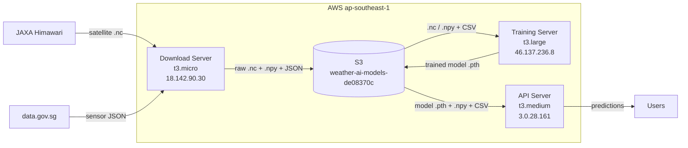
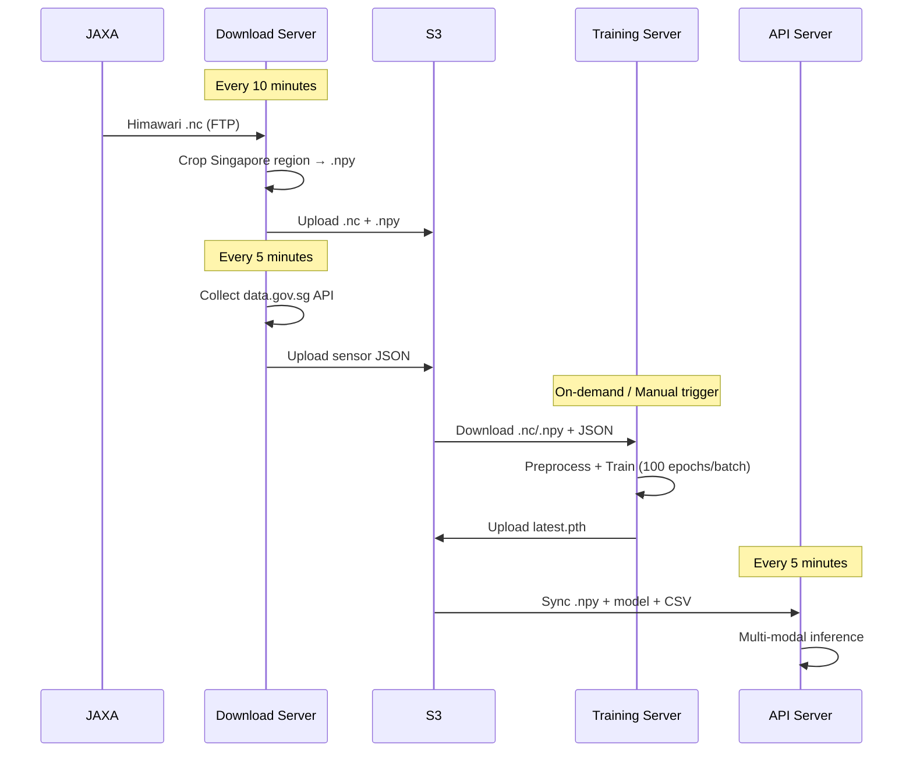

# Weather AI Server Infrastructure

> Last updated: 2026-02-14

## Architecture Overview



---

## Servers

### 1. Download Server — `18.142.90.30`

| Item | Value |
|------|-------|
| Instance | t3.micro (1 vCPU, 1GB RAM) |
| Disk | 8GB EBS |
| Hostname | ip-172-31-12-162 |
| IAM Role | weather-ai-download-role |
| Python | 3.10.12 (venv) |

**Role**: Real-time download of JAXA Himawari satellite data + data.gov.sg sensor data, preprocessing and upload to S3.

**Systemd Service**:
```
weather-download.service  (Restart=always, RestartSec=30)
ExecStart: venv/bin/python3 download_manager.py
Log: ~/download_manager.log
```

**Crontab**:
```
* * * * * ~/push_download_log.sh >> /tmp/push_log.log 2>&1
```

**Key Files**:
| File | Purpose |
|------|---------|
| `download_manager.py` | Main scheduler — real-time download + historical backfill + gov data |
| `download_jaxa_data.py` | JAXA FTP satellite data download |
| `fetch_and_process_gov_data.py` | data.gov.sg API data collection + processing |
| `cleanup_storage.py` | Local disk cleanup |
| `notification.py` | Email notifications |
| `bulk_download_to_s3_parallel.sh` | Bulk parallel download script |

**Directory Structure**:
```
~/weather-ai/
├── *.py, *.sh          # Scripts
├── .env                # Environment variables (JAXA credentials, S3 config)
├── real_sensor_data.csv # Sensor data
├── venv/               # Python virtual environment
├── Dockerfile          # Container config
└── requirements.txt
```

---

### 2. Training Server — `46.137.236.8`

| Item | Value |
|------|-------|
| Instance | t3.large (2 vCPU, 8GB RAM) |
| Disk | 200GB EBS |
| Hostname | ip-172-31-20-248 |
| IAM Role | weather-ai-training-role |
| Python | 3.10.12 (venv) |

**Role**: Daily training of WeatherFusionNet model (download data from S3 → preprocess → train → upload model to S3).

**Systemd Service**: None (triggered via crontab `training_scheduler.py` or manually)

**Crontab**:
```
*/5 * * * * ~/push_training_log.sh >> /tmp/push_log.log 2>&1
```

**Key Files**:
| File | Purpose |
|------|---------|
| `training_scheduler.py` | Main scheduler — check S3 data by date → download → preprocess → train → upload |
| `train_rolling_window.py` | Rolling window training logic |
| `weather_dataset.py` | PyTorch Dataset — sensor + satellite data alignment |
| `weather_fusion_model.py` | WeatherFusionNet model definition |
| `preprocess_images.py` | Raw .nc → crop Singapore region → .npy |
| `process_gov_data_from_s3.py` | Gov JSON → real_sensor_data.csv |
| `sync_model_to_s3.sh` | Upload model to S3 after training |
| `notification.py` | Training success/failure email notifications |

**Directory Structure**:
```
~/weather-ai/
├── *.py, *.sh            # Scripts
├── .env.production       # Production environment variables
├── training_state.json   # Scheduler state (last_processed_date, total_epochs, etc.)
├── training_metrics.json # Latest batch training metrics
├── weather_fusion_model.pth  # Current model
├── satellite_data/       # Raw .nc (downloaded during training, cleaned after)
├── processed_data/       # Preprocessed .npy (generated during training, cleaned after)
├── govdata/              # Government data JSON
├── model_backups/        # Model backups (before each training)
└── venv/
```

---

### 3. API Server — `3.0.28.161`

| Item | Value |
|------|-------|
| Instance | t3.medium (2 vCPU, 4GB RAM) |
| Disk | 20GB EBS |
| Hostname | ip-172-31-13-229 |
| IAM Role | weather-ai-api-role |
| Python | 3.10.12 (venv) |

**Role**: Weather prediction REST API + frontend static file serving.

**Systemd Service**:
```
weather-api.service  (Restart=always, RestartSec=10)
ExecStart: venv/bin/python3 api.py
Port: 8000
```

**Nginx**: Reverse proxy 80/443 → 8000

**Crontab**:
```
*/10 * * * * cd ~/weather-ai && ./fetch_latest_model.sh >> /var/log/model_sync.log 2>&1
```

**Key Files**:
| File | Purpose |
|------|---------|
| `api.py` | FastAPI main service — prediction, search, monitoring, data sync |
| `predict.py` | Inference logic — ensemble prediction + Delaunay triangulation + cloud analysis |
| `weather_fusion_model.py` | Model definition (shared with training) |
| `weather_dataset.py` | Dataset utilities (latlon2xy) |
| `db.py` | SQLite data layer — caching, user activity, prediction records |
| `smart_query.py` | NLU natural language query parsing |
| `geocoding.py` | Geocoding (Nominatim + OneMap) |
| `monitor_api.py` | Monitoring dashboard API |
| `actual_collector.py` | Actual weather data collection (for prediction accuracy comparison) |
| `perf-test.py` | Performance test script |

**Directory Structure**:
```
~/weather-ai/
├── *.py                    # Scripts
├── .env                    # Environment variables
├── weather_fusion_model.pth  # Latest model synced from S3
├── real_sensor_data.csv    # Sensor data
├── processed_data/         # Preprocessed satellite .npy (synced from S3)
├── satellite_data/         # Deprecated (no longer downloads raw .nc)
├── frontend/dist/          # React frontend build artifacts
└── venv/
```

---

## S3 Bucket Structure

```
s3://weather-ai-models-de08370c/
├── satellite/{YYYYMMDD}/        # Raw satellite .nc (~700MB/file, 144 files/day)
├── processed/satellite/{YYYYMMDD}/  # Preprocessed .npy (~16KB/file)
├── govdata/                     # Government data JSON (rainfall, temperature, humidity, pm25)
├── models/latest.pth            # Latest trained model
├── state/training_state.json    # Training progress state
├── history/training_history.json # Training history records
└── archived/                    # Archived data
```

---

## Data Flow



---

## SSH Access

```bash
# Download Server
ssh -i ~/.ssh/id_rsa ubuntu@18.142.90.30

# Training Server
ssh -i ~/.ssh/id_rsa ubuntu@46.137.236.8

# API Server
ssh -i ~/.ssh/id_rsa ubuntu@3.0.28.161
```

---

## Health Check

```bash
# Check all servers
./scripts/server-health-check.sh all

# Check individual server
./scripts/server-health-check.sh download
./scripts/server-health-check.sh training
./scripts/server-health-check.sh api
```
