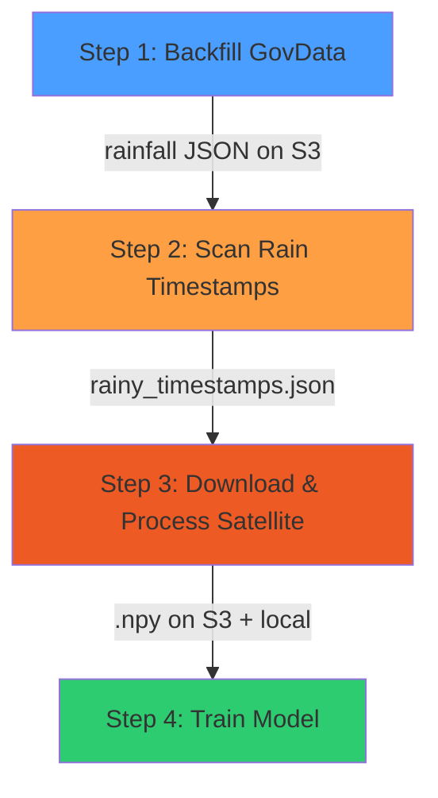

# Rain-Focused Training Data Pipeline

> 目标：只采集**雨天时段**的传感器+卫星数据，以训练高质量降雨预测模型。

## Pipeline Overview



---

## Step 1: Backfill Sensor Data to S3

**脚本**: `backfill-govdata.sh`  
**运行环境**: 下载服务器 (`13.214.203.173`)  
**数据源**: data.gov.sg API  

### 输入
- 日期范围 (e.g. `2024-02-15` ~ `2025-09-30`)

### 处理逻辑
1. 对范围内每一天，调用 6 个 API:
   - v1: `rainfall`, `air-temperature`, `relative-humidity`, `pm25`
   - v2: `wind-speed`, `wind-direction`
2. 用 `curl | aws s3 cp -` 流式上传，不占本地磁盘
3. 已存在于 S3 的文件自动跳过

### 输出
- S3: `s3://weather-ai-models-de08370c/govdata/{api}_{YYYY-MM-DD}.json`
- 每天 6 个 JSON 文件

---

## Step 2: Scan Rain Timestamps

**脚本**: `scan_rainy_timestamps.py`  
**运行环境**: 本地 Mac 或下载服务器  
**数据源**: S3 上的 `govdata/rainfall_*.json`

### 输入
- S3 上所有 `govdata/rainfall_YYYY-MM-DD.json`

### 处理逻辑
1. 列出 S3 上所有 `rainfall_` 前缀的日期
2. 过滤：跳过**已有 processed .npy** 的日期（不重复处理）
3. 对每天的 JSON:
   - 遍历每个 5 分钟 reading
   - 若**任意站点** rainfall > **5.0mm** → 标记该时段为"有雨"
   - 对齐到 **10 分钟间隔**（匹配卫星数据 `HHMM` 格式）
4. 汇总有雨日期 + 雨时段列表

### 输出
- 本地: `data/rainy_timestamps.json`
  ```json
  {
    "dates_to_process": 200,
    "total_rainy_slots": 5000,
    "days": [
      {
        "date": "2024-03-15",
        "date_compact": "20240315",
        "total_rainfall_mm": 45.2,
        "rainy_slots": ["0830","0840","0850","0900"],
        "rainy_slot_count": 4
      }
    ]
  }
  ```

---

## Step 3: Download & Process Satellite Data

**脚本**: `process_satellite_rainy.py`  
**运行环境**: 下载服务器（需 EBS ≥ 50GB）  
**数据源**: JAXA FTP → 直接下载到服务器

### 输入
- `data/rainy_timestamps.json` 中的日期 + 雨时段清单

### 处理逻辑 (逐日、逐时段循环)
1. 对每个雨时段 `HHMM`:
   - 检查 S3 `processed/satellite/{YYYYMMDD}/` 是否已有 `.npy` → 跳过
   - 从 **JAXA FTP** 下载对应 `.nc` 文件到本地 (~700MB)
   - 调用 `satellite_preprocessor.crop_nc_to_npy()` 裁剪新加坡区域 → `.npy` (64×64, ~16KB)
   - 上传 `.npy` 到 S3 `processed/satellite/{YYYYMMDD}/`
   - **立即删除**本地 `.nc` 文件释放空间
   - ⚠️ **不上传原始 .nc 到 S3**（节省 ~$39/月存储费）
2. 记录处理进度到 `data/daily_process_state.json`（可断点续传）

### 输出
- S3: `s3://…/processed/satellite/{YYYYMMDD}/{filename}.npy` (仅 .npy)
- 本地: `data/satellite/{filename}.npy`

### 磁盘需求
| 场景 | 大小 |
|------|------|
| 同时 1 个 .nc 在磁盘 | ~700 MB |
| 累积 .npy (2547 slots) | ~40 MB |
| 安全余量 | ~5 GB |
| **推荐 EBS** | **50 GB** |

---

## Step 4: Train Model

**脚本**: `process_and_train_daily.py --train-once` 或 `download_and_train.py`  
**运行环境**: GPU 实例 或 本地 Mac (MPS)

### 输入
- 本地 `data/satellite/*.npy` (卫星图)
- 本地 `data/real_sensor_data.csv` (传感器数据)

### 处理逻辑
1. 加载 `WeatherDataset`（匹配卫星+传感器时间戳）
2. 80/20 分割 train/val
3. `WeightedRandomSampler` 平衡雨/旱样本
4. `WeightedMSELoss` (rain_weight=3.0) 训练 `WeatherFusionNet`
5. Early stopping (patience=10)
6. 保存最优模型到 `models/weather_fusion_tuned.pth`

---

## 数据流总图

```
data.gov.sg API ──────→ S3 govdata/rainfall_*.json
                                    │
                              scan_rainy_timestamps.py
                                    │
                          rainy_timestamps.json
                                    │
JAXA FTP ──→ 下载服务器 ──→ preprocess (.nc→.npy)
                                    │
                           ┌────────┴────────┐
                      S3 processed/       local data/
                      satellite/*.npy     satellite/*.npy
                  (不保留原始 .nc)              │
                                     download_and_train.py
                                               │
                                      weather_fusion_tuned.pth
```
